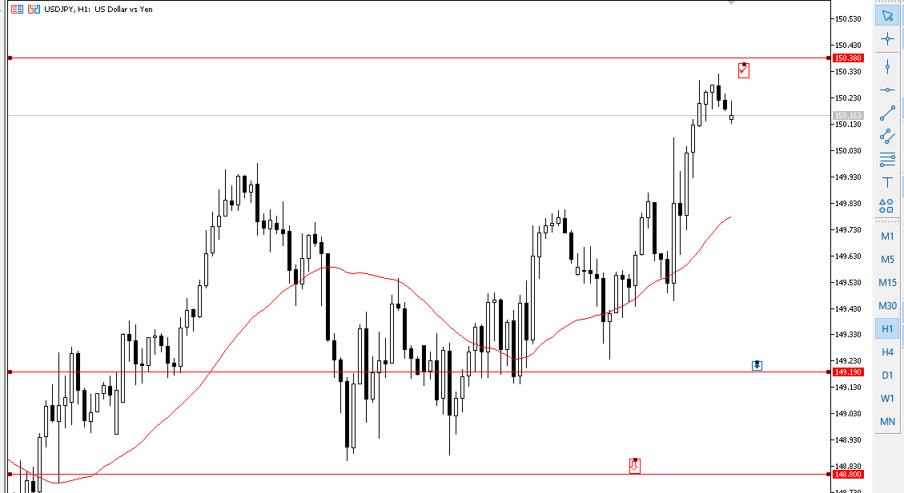

# USDJPY Stratejisi

AŞağıdaki kod yukarı çıkacağı tahmin edilen bir piyasa için, önce aşağıya düşüşü, beklenen dip noktasından geri dönüp satın alma yapılması planlanan yukarıdaki çizgiyi geçince alım yapan ve daha üst bir noktayı kırması ile satışı gerçekleştiren kod parçacığıdır.

```

//+------------------------------------------------------------------+
//|                                          USDJPY_Strategy.mq5     |
//|                         Created by User                          |
//|            Long pozisyon açma ve belirlenen seviyede kapatma     |
//+------------------------------------------------------------------+

#include <Trade\Trade.mqh>  // CTrade sınıfı için gerekli

// CTrade sınıfı nesnesi oluştur
CTrade trade;

// Global değişkenler
double entry_price = 0.0;      // Alış fiyatı (ilk pozisyon açma)
double stop_loss = 0.0;        // Stop loss seviyesi
double take_profit = 150.380;  // Take profit seviyesi
double risk_percent = 0.05;    // Riski %5 ile sınırlıyoruz
double balance = 0.0;          // Hesap bakiyesi
double lots = 0.0;             // İşlemde kullanılacak lot miktarı

// Giriş sinyali seviyeleri
double trigger_level_1 = 148.800;  // Fiyatın geri çekileceği seviye
double trigger_level_2 = 149.190;  // Yeniden yükselmeye başladığı seviye

//+------------------------------------------------------------------+
//| OnTick fonksiyonu                                                 |
//| Her fiyat güncellemesinde kontrol yapar                           |
//+------------------------------------------------------------------+
void OnTick()
  {
   // Hesap bakiyesini al
   balance = AccountInfoDouble(ACCOUNT_BALANCE);
   
   // Fiyatı kontrol et
   double current_price = SymbolInfoDouble(Symbol(), SYMBOL_BID);

   // Eğer fiyat 148.800 seviyesine gerilerse ve yukarı hareket eder, alış yap
   if (current_price <= trigger_level_1)
     {
      // Fiyat 149.190'ı geçerse alış pozisyonu aç
      if (current_price >= trigger_level_2 && entry_price == 0.0)
        {
         // Lot hesaplama (Risk yönetimi ile)
         double risk_amount = balance * risk_percent;
         double stop_loss_pips = trigger_level_2 - trigger_level_1;
         lots = CalculateLotSize(risk_amount, stop_loss_pips);

         // Alış pozisyonu aç
         entry_price = current_price;
         stop_loss = trigger_level_1; // Stop loss, riskli seviyede
         
         // Market fiyatıyla long pozisyon aç
         trade.Buy(lots, Symbol(), entry_price, stop_loss, take_profit);
         Print("Long pozisyon açıldı: ", lots, " lot @ ", entry_price);
        }
     }

   // Fiyat 150.380 seviyesini geçerse pozisyonu kapat
   if (entry_price > 0.0 && current_price >= take_profit)
     {
      CloseAllPositions();
      Print("Pozisyon kapatıldı. Fiyat: ", current_price);
     }
  }

//+------------------------------------------------------------------+
//| Risk yönetimi ile lot büyüklüğünü hesaplama                       |
//+------------------------------------------------------------------+
double CalculateLotSize(double risk_amount, double stop_loss_pips)
  {
   double pip_value = SymbolInfoDouble(Symbol(), SYMBOL_TRADE_TICK_VALUE);
   double lot_size = risk_amount / (stop_loss_pips * pip_value);
   return NormalizeDouble(lot_size, 2); // Lot büyüklüğünü normalize et (2 ondalık)
  }

//+------------------------------------------------------------------+
//| Tüm pozisyonları kapat                                            |
//+------------------------------------------------------------------+
void CloseAllPositions()
  {
   for (int i = PositionsTotal() - 1; i >= 0; i--)
     {
      ulong ticket = PositionGetTicket(i);
      trade.PositionClose(ticket);
     }
   entry_price = 0.0; // Pozisyonu sıfırla
  }

```

