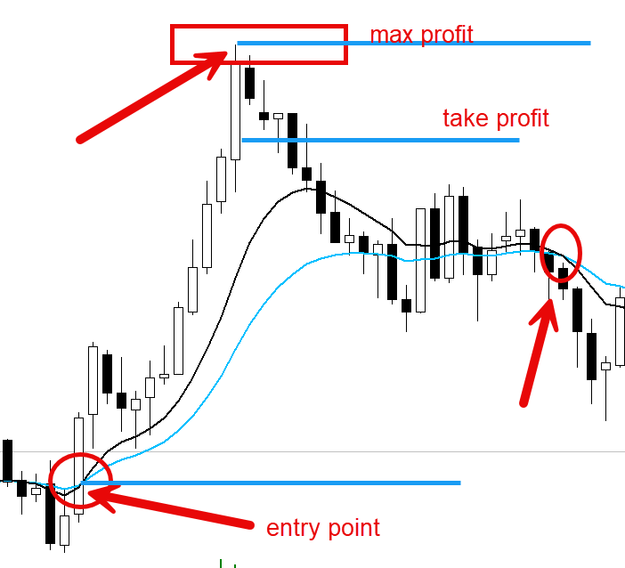
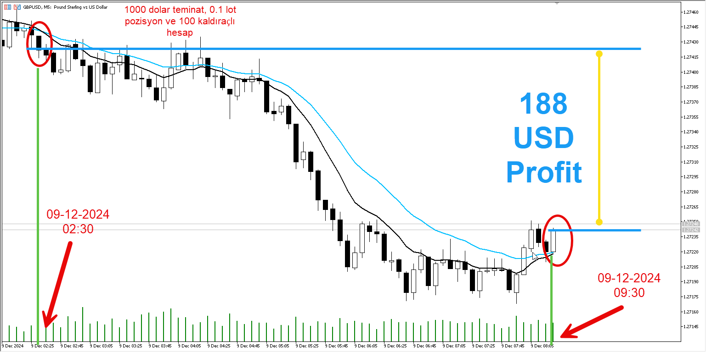

# **Ema 10 Ema 20 Cross Strategy**

Bu stratejide iki ema çizgisini birbirini yukarı ya da aşağı yönlü kestiği anda al sat emirlerinin otomasyonu ile yapılan robot yazılımının inceleesi yapılır. Aşağıda tüm kurallar tanımlanmıştır.

## **Kurallar**

1. Ne olursa olsun gece 11:00 tüm hesaplar kapatılır. Satın alma yapılmaz.
2. Satın alma için gece 02:00'den sonra oluşacak kesişimler beklenir.
3. Her 10 saniyede bir o andaki gelir hesaplanır. Profit negatifse kabul edilebilir max zarar ve daha yüksek zarar oluşmuşsa pozisyon kapatılır. 
`input double _maxLost=5;` işleminde 5 dolar ve üzerindeki zararda pozisyon kapatılır. 
(Her pozisyon için 100 dolarlık işlemde max zarar 3-5 dolar alınabilir - input ile risk yüzdesine ayarlanabilir. Açılan pozisyondaki teminat bu rakamlarla hesaplanacak tutar kadar risk hesaplanıp kontrol edilebilir.)
4. Açık hesaplarda her 10 saniyede bir her pozisyonun  için kar maximum seviyesi hesaplanır. 
O andaki profit max kardan %X kadar aşağıya inmişse pozisyon kapatılır. `input double _maxProfitLossPercent=20;` değeri ile max kardan %20 aşağı indiğinde pozisyon kapatılır. Eğer değer 0 ise, kardan zarar kontrolü yapılmaz. Bu durumda keşisimler ile pozisyon kapatılır.
Buradaki X yine input ile kardan zarar yüzdesine ayarlanabilir.
5. EMA 10 ve EMA 20 arasında kesişimler olursa, pozisyon kapatılır ve yeni alım emirleri uygulanır.

Bu işlem için en uygun zaman dilimi 5 dakikalık peryotda çalışılmalıdır. Gün içerisinde özellikle dalgalı piyasalarda 2-3 defa derin hareketler oluşur. Bu hareketler yüksek gelirler elde edilmesini sağlar. EMA yerine 3EMA gibi kullanılacak algoritmalar karı arttırırken, gin içerisinde çok fazla alış satım pozisyonunun ortay çıkmasına neden olacaktır. Her yanlış açılan pozisyon kayıplara neden olur. Bu nedenle EMA yerine SMA bile kullanabilir ve hatalı pozisyonların en aza indirilmesi sağlanabilir.

Eğer saatlik ya da 4 saatlik periyotta çalışma istenirse, kardan zarar 0'a çekilmelidir ki, erke pozisyon kapatmaları durumları oluşmasın. Aksi durumda yeniden açılış için kesişim bazen günler sürebilir. 

Diğer önemli bir kural ise, eğer pozisyon herhangibir nedenden dolayı kapandığında, kesişim haricinde pozisyona girilmemeli ve risk alınmamalıdır.

İyi bir piyasada 5 dakalık zaman dilimlerind günde en az 2-3 pozison oluşmaktadır. İyui bir piyasa tarifi ile EURUSD, GBPUSD, USDJPY gibi büyük piyasalar ele alınmalı. Hacmi geniş olan bu piyasalarda emirler çok hızlı uygulanabilir. Sığ piyasalara bu algoritma ile girilmemelidir.

100 kaldıraçlı piyasalarda 1000 dolarlık bir hesap açıldığında 0.1 lot ile işleme girilerek, günlük 300-500 dolar gelir elde edilebileceği görülür. POzisyondaki yüksek kar girilen piyasanın dalgalı olması ile ilgililidir. Ne kadar dalgalı piyasa ise, kar o kadar yükselecektir. 

Dalgalı piyasa volatalite olan piyasa demektir. Hızlıca [volatile piyasaları bu linkten](https://marketmilk.babypips.com/currency-volatility) inceleyebilirsiniz. 5 dakikalık seçimle o gün hangi piyasalarda yer alacağınız belirleyebilirsiniz.

Pazartesi forex pazar açılışı ile birlikte gece 02:30 gibi keşisim yakalanmış ve pozisyon açılmıştır. 

Saat 09:30 gibi keşisim yeniden gerçekleşmiş ve açık pozisyon kapatılmıştır. 

BU saatler arasında piyasa daha karlı pozisyona inse bile, bizim için %30 kardan zarar oluşmadığı için pozisyon daha erken saatlerde kapatılmamıştır. Zaten normal bir günde bile en az 3 piyasa hareketi gözlemlenir. Sabah suları (EUR, GBP için) piyasa sabah 10:00 sularına kadar bir hareket halindedir. Bu saatlerde Japonya borasası etkin handedir. Sabah 10:00 Londra borsası açılır ve saat 15:00'e kadar bu bırsa etkin haldedir. Saat 15:00 gibi Amerika borsası açıldığı anda kaos mutlaka başlar. ÇÜnkü dünyadaki para rezevinin %74'ü Amerika forex pazarının elindedir ve tüm piyasayı derin şekilde etkiler.

Bu açıklamalar eşliğinde saat 10'a kadar bir hareket görürüz, saat 15'e kadar aynı hareket desteklenebilir ya da tersine dönebilir. Saat 15'den sonra ağırlıklı olarak piyasa ters hareket eder ve dolar kendini korumaya alır. Eğer o gün dolar için sıkıntılı bir günse aynı hareketler yukarı doğru hareketlenmeye devam edebilir. Eğer o gün açılan pozisyon sürekli yukarı hareket ediyor ve bizim için %30 kardan zarar pozisyonları oluşmadan hareket aynı yönlü devam ediyorsa, bizim  için elmas değerinde bir kazanç oluşur. Eğer dalgalı bir piyasa ise, yine de çok yüksek karlar elde edilebilir. Dalgalı piyasa, gün içerisinde 3-5 defa yeni satın alma pozisyonlarının çıkmasını sağlar.

Ne olursa olsun algoritmanın kurallarını değiştirmeyin. Günde size ortalama %20 üzerinde kar asğlayacak harika bir iş algoritmanın sahibisiniz.

Yani 1000 dolar teminat ile günde 200 dolar ve 22 günde 4400 dolar üzerinde kar. Ay sonunda karınızın %70'ini koruma hesabınıza çekin, kalan parayı işlem hesabınızda yeni işlem açma değeri haline getirin. Bunu haftalıkda yapabilirsiniz, ancak fazla iştahlı olmayın. Kararlı olun. Bu piyasa iştahlı traderları sevmez. Ama kararlı traderlar her zaman güven içindedir.

Şimdi kısa bir 1 yıllık hesap yapalım ve karımızı hesaplayalım. Kararlı ve riski en az alan bir trader olarak işlem yapalım.

## İşlem karları ve hesaplama

Ocak ayı ve elimizde 1000 dolar teminat için paramız var.

0.1 lot işlem açtık, kaldıraç 100. Yani piyasada 10.000 dolarlık işlem açtık ve parabirimi çiftlerinin birbirine göre gün içindeki hareketleri bize kar sağlayacak. Unutmamımız geeken bir nokta daha var. Yılın 12 ayı piyasa bu şekilde çalışmaz. Özellikle yaz aylarında piyasalar daha sakin olur ve bu algoritmayı 1 Harizandan 1 Ekim tarihine kadar kapatmalısınız. Yani 4 ay tatil. Tatil herkesin hakkı. Sizde tatile gidin.

Ocak ayı, günde ortalama %20 net kar. Hafta sonları piyasa kapalı. Yani elimizde 22 gün işlem yapabileceğimiz gün var.

### İşlemler

#### Ekim Ayı:
22 gün 200 dolar kar ile ay sonunda 4.400 dolar.

3.400 dolar korumalu hesaba çekin (1.000 dolar işleme eklensin, 1.000 dolarımız işlemdeydi). İşleme 2.000 dolar ile devam edeceğiz.

#### Kasım Ayı:
22 gün 400 dolar kar ile ay sonunda 8.800 dolar.

5.800 dolar korumalı hesaba çekin (3.000 dolar işleme eklensin, 2.000 dolar işlemdeydi). İşleme 5.000 dolar ile devam edeceğiz.

#### Aralık Ayı:
22 gün 1.000 dolar kar ile ay sonunda 22.000 dolar.

12.000 dolar korumalı hesaba çekin (10.000 dolar işleme eklensin, 5.000 dolar işlemdeydi). İşleme 15.000 dolar ile devam edeceğiz.

#### Ocak Ayı:
22 günde 3.000 dolar kar ile ay sonunda 66.000 dolar.

36.000 dolar korumalı hesaba çekin (30.000 dolar işleme eklensin, 15.000 dolar işlemdeydi). İşleme 45.000 dolar ile devam edeceğiz.

#### Ocak Ayı:
22 günde 9.000 dolar kar ile ay sonunda 198.000 dolar.

36.000 dolar korumalı hesaba çekin (105.000 dolar işleme eklensin, 45.000 dolar işlemdeydi). İşleme 150.000 dolar ile devam edeceğiz.

#### Şubat Ayı:
22 günde 30.000 dolar kar ile ay sonunda 660.000 dolar.

510.000 dolar korumalı hesaba çekin (150.000 dolar işleme eklensin, 150.000 dolar işlemdeydi). İşleme 300.000 dolar ile devam edeceğiz.

#### Mart Ayı:
22 günde 60.000 dolar kar ile ay sonunda 1.320.000 dolar.

1.020.000 dolar korumalı hesaba çekin (300.000 dolar işleme eklensin, 300.000 dolar işlemdeydi). İşleme 600.000 dolar ile devam edeceğiz.

#### Nisan Ayı:
22 günde 120.000 dolar kar ile ay sonunda 2.640.000 dolar.

1 Haziran tarihinden sonra işleme girmiyoruz. 2.640.000 dolar parayı korumalı hesaba çek.

Kasaya balkalım hesaplayalım, elimizdeki toplam parayı görelim.

Ekim  ayı sonunda kasaya 3.400 USD
Kasım ayı sonunda kasaya 5.800 USD
Aralık ayı sonunda kasaya 12.000 USD
Ocak ayı sonunda kasaya 36.000 USD
Şubat ayı sonunda kasaya 510.000 USD
Mart ayı sonunda kasaya 1.020.000 USD
Nisan ayı sonunda kasaya 2.640.000 USD

**1 Ekim ayında 1000 USD ile piyasaya girdik.**
**1 Haziranda hesaplarımızda 4.227.200 USD**

Artık yeni yılda piyasaya 100.000 dolar ile girin ve kazancınız 100 kat daha fazla olsun. Ama size tavsiyem artık forex yerine borsa analizleri yapıp 1.000.000 dolarlık borsa yatırımı yapmanız. Uygun fiyatlara büyük arazi yatırımları yapmanız ve kaliteli badem ceviz yatırımları yapmanız. Ama ne olursa olsun tek kişilik bir A.Ş. kurun ve şirketinize önce borç verin, şirketiniz olarak yatırım yapın. Çok uygun fiyatlara aldığınız arazilerinize değer kazandırın. Boş araziyi büyük cennet bahçelerine çevirin. Büyük bir şiftlik sahibi olun. Karınız yıllar içinde kat ve kat büyüsün.

Dikkatli olun, forex çok büyük bir piyasadır ve çok risklidir. Elinizdekileri kaybetmeniz an meselesi. Stratejinize sıkı sıkıya bağlı kalın. Asla maceraya atılmayın. Asla aç gözlü olmayın. Ve unutmayın, piyasada kaybedenler var ki siz kazanıyorsunuz. Bu her zaman böyledir. Mal ticaretinde bile birileri bedel öder. Yani alan ve satan vardır. Forexde kazanan tarafta olmak için iştahınızı kapalı turun. Stratejinize sıkı sıkıya bağlı kalın. Asla riskinizi arttırmayın. Karınızı her zaman dışarıya talımaya devam edin.

Yukarıdaki algoritmayı elimizdeki paranın belirli binoranında dinamik olarak işleme girerek yapabilirdik. Çok daha yüksek kazançlar üretebilirdik. Süreç sizin. Stratejinizi iyi analiz edin.

Bol şans ve mutlu trade'ler

**Tuncer KARAARSLAN**
Trader, [Vebende A.Ş.](https://www.vebende.com.tr) Kurucu, Yapay Zeka Girişimcisi
