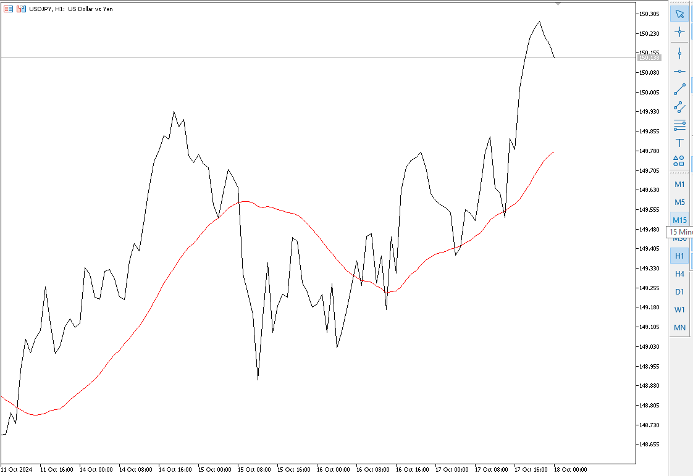

# Major Parabirimlerinden MA30 üzerinde olanlar

Ağırlıklı ortama MA 30 verilik ve 1 saatlik zaman peryodu çizgisinin üzerinde seyreden tüm major para birimlerini listeler.

```mql5
//+------------------------------------------------------------------+
//|                                                      MA_Check.mq5 |
//|                          Created by User                         |
//|                      List symbols above MA(30) in H1             |
//+------------------------------------------------------------------+

// Major döviz çiftlerinin listesini oluştur
string major_pairs[] = {
   "EURUSD",  // Euro / ABD Doları
   "USDJPY",  // ABD Doları / Japon Yeni
   "GBPUSD",  // İngiliz Sterlini / ABD Doları
   "USDCHF",  // ABD Doları / İsviçre Frangı
   "AUDUSD",  // Avustralya Doları / ABD Doları
   "USDCAD",  // ABD Doları / Kanada Doları
   "NZDUSD"   // Yeni Zelanda Doları / ABD Doları
};

// Hareketli ortalama (MA) hesaplaması için parametreler
int ma_period = 30;    // Hareketli ortalamanın hesaplanacağı periyot (örneğin, MA(30))
int ma_shift = 0;      // Hareketli ortalama için kaydırma (varsayılan sıfır)
ENUM_TIMEFRAMES ma_timeperiod = PERIOD_H1;  // 1 saatlik zaman dilimi

//+------------------------------------------------------------------+
//| Programın başlangıç noktası                                      |
//+------------------------------------------------------------------+
void OnStart()
  {
   // Sembol listesini al ve MA kontrolü için sembol listesini hazırla
   string symbols[];  // Sembolleri tutacak dizi
   int total_symbols = ArraySize(major_pairs);  // Major çiftlerin toplam sayısını al
   ArrayResize(symbols, total_symbols);  // Sembol dizisini yeniden boyutlandır

   // Major döviz çiftlerini sembol listesine aktar
   for (int i = 0; i < total_symbols; i++)
   {
      symbols[i] = major_pairs[i]; // Her sembolü listeye ekle
   }

   Print("Checking symbols...");  // Kontrol başladığını gösteren mesaj

   // Her sembol için MA'nın üzerinde olup olmadığını kontrol et
   for (int i = 0; i < ArraySize(symbols); i++)
   {
      string symbol = symbols[i];  // Her sembolü sırayla al
      if (CheckSymbolAboveMA(symbol))  // Eğer sembol MA'nın üzerindeyse
      {
         Print(symbol + " is above MA(30) on H1");  // Sembolün MA'nın üzerinde olduğunu yazdır
      }
   }
  }

//+------------------------------------------------------------------+
//| Sembolün MA(30)'un üzerinde olup olmadığını kontrol eden fonksiyon |
//+------------------------------------------------------------------+
bool CheckSymbolAboveMA(string symbol)
  {
   double ma_value;  // MA değerini tutacak değişken

   // iMA fonksiyonu ile 1 saatlik zaman diliminde MA hesapla
   ma_value = iMA(symbol, ma_timeperiod, ma_period, ma_shift, MODE_SMA, PRICE_CLOSE);
   
   // iClose fonksiyonu ile sembolün son kapanış fiyatını al
   double close_price = iClose(symbol, PERIOD_H1, 0);

   // Eğer kapanış fiyatı MA'nın üzerindeyse true döndür
   if (close_price > ma_value)
   {
      return true;  // Kapanış fiyatı MA'nın üzerindeyse doğru (true) döndür
   }

   return false;  // Aksi halde yanlış (false) döndür
  }
//+------------------------------------------------------------------+
```

### Açıklamalar:
- **Sembol dizisi ve MA hesaplama**: `major_pairs[]` dizisi major döviz çiftlerini içerir. `ma_period` ve `ma_timeperiod` ile MA hesaplama parametreleri belirlenmiştir.
- **`OnStart` fonksiyonu**: Bu fonksiyon, program başladığında çalışır. Önce sembol listesini oluşturur, ardından her sembol için hareketli ortalamanın üzerinde olup olmadığını kontrol eder.
- **`CheckSymbolAboveMA` fonksiyonu**: Belirli bir sembolün MA(30)'un üzerinde olup olmadığını kontrol eden fonksiyondur. Hareketli ortalama ve kapanış fiyatını alır, karşılaştırır ve sonucuna göre `true` veya `false` döndürür.

Bu kod, major döviz çiftlerinin 1 saatlik zaman diliminde MA(30) üzerinde olup olmadığını kontrol eder.

