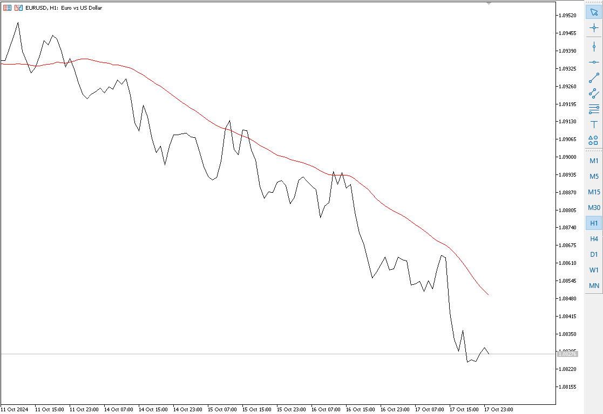

# Major Parabirimlerinden MA30 altında olanlar

Ağırlıklı ortama MA 30 verilik ve 1 saatlik zaman peryodu çizgisinin altında seyreden tüm major para birimlerini listeler.

```mql5
//+------------------------------------------------------------------+
//|                                                      MA_Check.mq5 |
//|                          Created by User                         |
//|              List symbols below MA(30) in H1                     |
//+------------------------------------------------------------------+

// Major döviz çiftlerinin listesini oluştur
string major_pairs[] = {
   "EURUSD",  // Euro / ABD Doları
   "USDJPY",  // ABD Doları / Japon Yeni
   "GBPUSD",  // İngiliz Sterlini / ABD Doları
   "USDCHF",  // ABD Doları / İsviçre Frangı
   "AUDUSD",  // Avustralya Doları / ABD Doları
   "USDCAD",  // ABD Doları / Kanada Doları
   "NZDUSD"   // Yeni Zelanda Doları / ABD Doları
};

int ma_period = 30;    // Hareketli ortalama periyodu
int ma_shift = 0;      // MA kaydırması
ENUM_TIMEFRAMES ma_timeperiod = PERIOD_H1; // 1 saatlik zaman dilimi

void OnStart()
  {
   // Sembol listesini al
   string symbols[];
   int total_symbols = ArraySize(major_pairs);
   ArrayResize(symbols, total_symbols); // Sembol dizisini boyutlandır

   for (int i = 0; i < total_symbols; i++)
   {
      symbols[i] = major_pairs[i]; // Her sembolü diziye ekle
   }

   Print("Checking symbols below MA(30)...");

   // MA'nın altında kalan sembolleri kontrol et
   for (int i = 0; i < ArraySize(symbols); i++)
   {
      string symbol = symbols[i];
      if (CheckSymbolBelowMA(symbol)) // Eğer sembol MA'nın altındaysa
      {
         Print(symbol + " is below MA(30) on H1"); // Sembol MA'nın altında, yazdır
      }
   }
  }

//+------------------------------------------------------------------+
//| Sembolün MA(30)'un altında olup olmadığını kontrol eden fonksiyon |
//+------------------------------------------------------------------+
bool CheckSymbolBelowMA(string symbol)
  {
   double ma_value;       // MA değeri

   // 1 saatlik zaman dilimi için MA hesapla
   ma_value = iMA(symbol, ma_timeperiod, ma_period, ma_shift, MODE_SMA, PRICE_CLOSE);
   
   // Kapanış fiyatını al
   double close_price = iClose(symbol, PERIOD_H1, 0);

   // Eğer kapanış fiyatı MA'nın altındaysa true döndür
   if (close_price < ma_value)
   {
      return true;
   }

   return false;
  }
//+------------------------------------------------------------------+
```

### Açıklamalar:
- **Sembol dizisi ve MA hesaplama**: `major_pairs[]` dizisi major döviz çiftlerini içerir. `ma_period` ve `ma_timeperiod` ile MA hesaplama parametreleri belirlenmiştir.
- **`OnStart` fonksiyonu**: Bu fonksiyon, program başladığında çalışır. Önce sembol listesini oluşturur, ardından her sembol için hareketli ortalamanın üzerinde olup olmadığını kontrol eder.
- **`CheckSymbolAboveMA` fonksiyonu**: Belirli bir sembolün MA(30)'un üzerinde olup olmadığını kontrol eden fonksiyondur. Hareketli ortalama ve kapanış fiyatını alır, karşılaştırır ve sonucuna göre `true` veya `false` döndürür.

Bu kod, major döviz çiftlerinin 1 saatlik zaman diliminde MA(30) üzerinde olup olmadığını kontrol eder.

