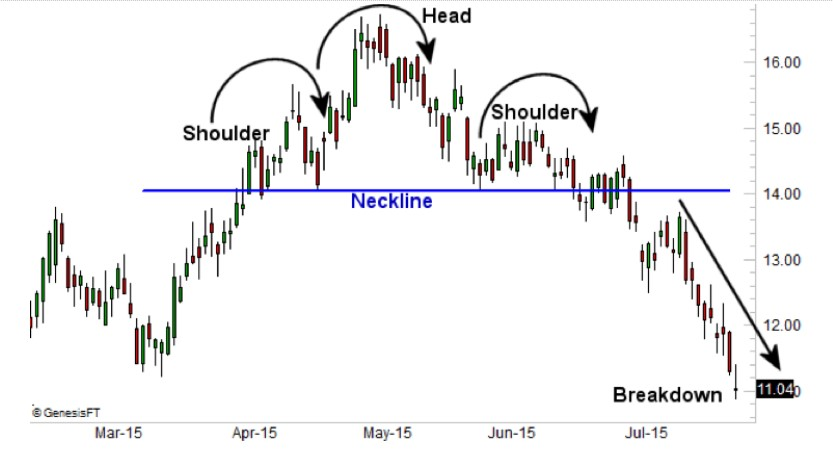

# Omuz-Baş-Omuz Formasyonu (Head and Shoulders)

**Omuz-Baş-Omuz** formasyonu, en popüler ve güvenilir trend dönüş formasyonlarından biridir. Genellikle yükseliş trendinin sona erdiğini ve düşüş trendinin başlayabileceğini gösterir. Bu formasyon, "baş" (head) ve "omuzlar" (shoulders) adı verilen üç ana tepeyi içerir.

## **Formasyonun Yapısı:**

Omuz-Baş-Omuz formasyonu, üç ana noktadan oluşur:

1. **Sol Omuz (Left Shoulder)**: İlk zirve oluşur, fiyat yükselir ve sonra geri çekilir. Bu, trendin devam ettiğini gösteren ilk zirvedir.
2. **Baş (Head)**: Fiyat daha da yükselir ve daha yüksek bir zirveye ulaşır, sonra yine geri çekilir. Baş, formasyonun ortasında yer alır ve daha yüksek olmalıdır.
3. **Sağ Omuz (Right Shoulder)**: Fiyat, başın seviyesine kadar yükselir ancak daha sonra düşer. Sağ omuz, sol omuzla benzer yükseklikte olur.

## **Formasyonun Tamamlanması:**

Formasyon tamamlandığında, **"neckline"** adı verilen destek çizgisi (baş ve omuzlar arasındaki dip noktalarından çizilen çizgi) kırılmalıdır. Bu kırılma, formasyonun doğruluğunu onaylar ve işlem yapılabilir.

## **Adımlar:**

1. **Yükseliş Trendi Başlar**: Fiyat yükselmeye başlar ve ilk zirve (sol omuz) oluşur. Yükseliş devam eder ve fiyat geri çekilir.
2. **Baş Formasyonu**: Yükseliş devam eder ve daha yüksek bir zirve (baş) oluşur. Fiyat geri çekilmeden önce bu zirveye ulaşır.
3. **Sağ Omuz ve Düşüş**: Fiyat, sağ omuzda ikinci zirveyi oluşturur ve sonra belirgin bir geri çekilme yaşar.
4. **Neckline Kırılması**: Fiyat, necklinetan kırıldığında formasyon tamamlanmış olur ve trendin dönüşü onaylanır.

## **Neckline:**

Neckline, baş ile omuzlar arasındaki en düşük seviyeyi temsil eder. Genellikle yatay olabilir ancak bazen hafif bir eğilim de gösterebilir. Bu çizgi, önemli bir destek seviyesini temsil eder.

## **Formasyonun Gücü:**

Formasyonun güvenilirliği, fiyatın neckline'ı ne kadar güçlü bir şekilde kırdığına bağlıdır. Kırılma sert ve belirgin olmalı, ardından fiyatın aşağıya doğru hareket etmesi beklenir.

## **Hedef Fiyat (Price Target):**

Formasyonun hedef fiyatı, başın zirvesi ile neckline arasındaki mesafenin, neckline kırılma noktasına eklendiği bir hesaplamayla bulunabilir. Hedef fiyatın hesaplanması şu şekilde yapılır:

1. Baş ile neckline arasındaki mesafe ölçülür.
2. Bu mesafe, neckline kırıldığı noktanın altına eklenir.
   - **Hedef Fiyat = Neckline Kırılma Noktası - (Baş ile Neckline Arasındaki Mesafe)**

## **Omuz-Baş-Omuz Formasyonunun Özellikleri:**

- **Zamanlaması**: Bu formasyon genellikle uzun bir zaman diliminde, birkaç haftadan birkaç aya kadar sürebilir.
- **Volatilite**: Formasyonun tamamlanması genellikle volatiliteyi arttırır ve işlem hacminde değişiklik olabilir.
- **Güvenilirlik**: Omuz-Baş-Omuz formasyonu, özellikle uzun vadeli grafiklerde güvenilir bir trend dönüşü sinyali olarak kabul edilir.

## **Formasyonun Anlamı:**

Omuz-Baş-Omuz, piyasa katılımcılarının bir yükseliş trendinde yorulduğunu, alıcıların zayıfladığını ve satıcıların gücünü artırmaya başladığını gösterir. Sağ omuz oluşumu, alıcıların son bir kez daha fiyatı yükseltmeye çalıştığını ama başarısız olduklarını ifade eder. Neckline kırıldığında, bu durum düşüşün başladığını ve yeni bir trendin oluşturulacağını gösterir.

## **Örnek:**

Bir yatırımcı, Omuz-Baş-Omuz formasyonunu belirledikten sonra, neckline kırıldığı anda satış pozisyonu açabilir. Ayrıca, formasyonun tamamlanmasından önce fiyat geri çekilmeleri yaparsa, stop loss seviyeleri de doğru şekilde yerleştirilmelidir.

## **Risk ve Dikkat Edilmesi Gerekenler:**

- Omuz-Baş-Omuz formasyonu her zaman doğru bir sinyal vermez. Bazen yanılgılar olabilir. Bu yüzden diğer teknik göstergelerle doğrulama yapmanız önerilir.
- Formasyon tamamlandıktan sonra, fiyatın neckline'ı ne kadar güçlü kırdığına dikkat edilmelidir.
- Fiyat çok hızlı hareket ediyorsa, bu formasyonun tamamlanması zorlaşabilir.