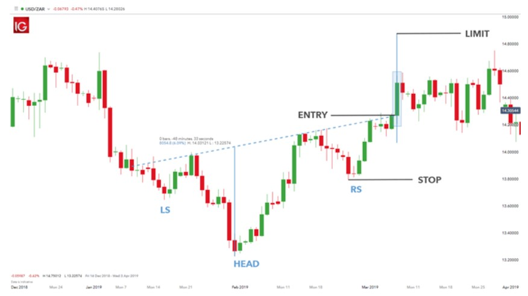

# Ters Omuz-Baş-Omuz Formasyonu (Inverse Head and Shoulders)

**Ters Omuz-Baş-Omuz** formasyonu, **Omuz-Baş-Omuz** formasyonunun tersidir ve genellikle bir **düşüş trendinin sona erdiğini** ve **yükselişin başlayabileceğini** gösterir. Bu formasyon, **boğa piyasası** başlamadan önce oluşan önemli bir trend dönüşü sinyali olarak kabul edilir. 

## **Formasyonun Yapısı:**

Ters Omuz-Baş-Omuz formasyonu, üç ana noktadan oluşur:

1. **Sol Omuz (Left Shoulder)**: İlk dip noktasında oluşan düşüş, fiyat bir süre düşer ve sonra toparlanmaya başlar. Bu dip, düşüş trendinin yavaşladığının bir işaretidir.
2. **Baş (Head)**: Fiyat daha da düşer, daha derin bir dip yapar ve sonra tekrar toparlanır. Bu dip, formasyonun ortasında yer alır ve en derin dip olmalıdır.
3. **Sağ Omuz (Right Shoulder)**: Fiyat, baştaki dip seviyesine yaklaşır ancak tam olarak o seviyeye inmez ve sağ omuzda daha yüksek bir dip yapar. Bu, yükselişin başladığını işaret eden bir sinyaldir.

## **Formasyonun Tamamlanması:**

Formasyon tamamlandığında, **"neckline"** adı verilen direnç çizgisi (baş ve omuzlar arasındaki zirve noktalarından çizilen çizgi) kırılmalıdır. Bu kırılma, formasyonun doğruluğunu onaylar ve işlem yapılabilir.

## **Adımlar:**

1. **Düşüş Trendi Başlar**: Fiyat düşer ve ilk dip (sol omuz) oluşur. Ardından fiyat toparlanmaya başlar.
2. **Baş Formasyonu**: Fiyat, sol omuzun seviyesinin daha altına düşer ve başı oluşturur. Fiyat daha sonra toparlanarak geri yükselir.
3. **Sağ Omuz ve Yükseliş**: Fiyat, sağ omuzda başın seviyesine yakın bir dip yapar, ancak daha sonra yükselmeye başlar.
4. **Neckline Kırılması**: Fiyat neckline'ı yukarı doğru kırarsa, formasyon tamamlanmış olur ve trendin dönüşü onaylanır.

## **Neckline:**

Neckline, baş ile omuzlar arasındaki zirve seviyesini temsil eder. Bu çizgi, önemli bir direnç seviyesini gösterir ve formasyonun tamamlanması için fiyatın bu seviyeyi yukarı doğru geçmesi gerekmektedir. Genellikle yataydır ancak bazen hafif eğilimli olabilir.

## **Formasyonun Gücü:**

Ters Omuz-Baş-Omuz formasyonunun güvenilirliği, fiyatın neckline'ı ne kadar güçlü bir şekilde kırdığına bağlıdır. Kırılma sert ve belirgin olmalı, ardından fiyatın yukarıya doğru hareket etmesi beklenir.

## **Hedef Fiyat (Price Target):**

Formasyonun hedef fiyatı, baş ile neckline arasındaki mesafenin, neckline kırılma noktasına eklendiği bir hesaplamayla bulunabilir. Hedef fiyatın hesaplanması şu şekilde yapılır:

1. Baş ile neckline arasındaki mesafe ölçülür.
2. Bu mesafe, neckline kırıldığı noktanın üzerine eklenir.
   - **Hedef Fiyat = Neckline Kırılma Noktası + (Baş ile Neckline Arasındaki Mesafe)**

## **Ters Omuz-Baş-Omuz Formasyonunun Özellikleri:**

- **Zamanlaması**: Bu formasyon, genellikle daha uzun vadeli grafiklerde güvenilir bir dönüş sinyali verir. Yani, haftalık veya aylık grafiklerde daha güçlü bir sinyal olabilir.
- **Volatilite**: Formasyonun tamamlanmasından sonra volatilite artabilir ve işlem hacminde önemli bir değişiklik gözlemlenebilir.
- **Güvenilirlik**: Ters Omuz-Baş-Omuz formasyonu, güçlü bir trend dönüşü sinyali olarak kabul edilir, ancak doğrulama için diğer teknik analiz araçları da kullanılmalıdır.

## **Formasyonun Anlamı:**

Ters Omuz-Baş-Omuz formasyonu, piyasa katılımcılarının bir düşüş trendinde yorgun düşüp, alıcıların kontrolü ele geçirmeye başladıklarını gösterir. Baş kısmı, piyasadaki en düşük seviyeyi temsil eder ve bu noktada satıcıların gücü tükenir. Sağ omuz, alıcıların piyasayı yeniden yukarıya itmeye başlamalarının işaretidir. Neckline kırıldığında, bu durum yükselişin başladığını ve yeni bir boğa piyasasının oluşmaya başladığını gösterir.

## **Örnek:**

Bir yatırımcı, Ters Omuz-Baş-Omuz formasyonunu belirledikten sonra, neckline kırıldığında alış pozisyonu açabilir. Ayrıca, formasyonun tamamlanmasından önce fiyat geri çekilmeleri yaparsa, stop loss seviyeleri de doğru şekilde yerleştirilmelidir.

## **Risk ve Dikkat Edilmesi Gerekenler:**

- Ters Omuz-Baş-Omuz formasyonu her zaman doğru bir sinyal vermez. Yanılgılar olabilir, bu yüzden başka teknik göstergelerle doğrulama yapmanız önemlidir.
- Fiyatın neckline'ı güçlü bir şekilde kırması gerekir. Zayıf kırılmalar yanıltıcı olabilir.
- Formasyon, fiyatın yatay hareket ettiği ya da trendin çok hızlı olduğu piyasalarda zor oluşabilir.
