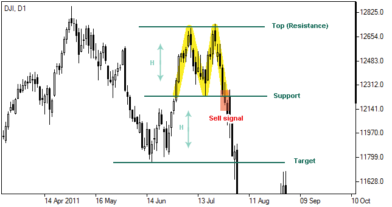

# Çift Tepe (Double Top) Formasyonu

**Çift Tepe (Double Top)** formasyonu, teknik analizde yaygın olarak kullanılan ve genellikle fiyatın zirveye ulaştıktan sonra gerilemeye başladığını ve **düşüş trendinin** başlayabileceğini gösteren önemli bir trend dönüş formasyonudur. Bu formasyon, piyasa katılımcılarının güçlü alım isteği sonrası kar satışlarının başlayacağını ve böylece mevcut yükseliş trendinin sona erdiğini işaret eder.

## **Formasyonun Yapısı:**

Çift Tepe formasyonu, adından da anlaşılacağı gibi **iki zirve** içerir. Bu zirveler, formasyonun güçlü bir şekilde oluşabilmesi için belirli özelliklere sahip olmalıdır. Formasyonun temel bileşenleri şu şekildedir:

1. **İlk Zirve (First Peak)**: Fiyat ilk zirveye ulaşır ve bir geri çekilme başlar. Bu zirve, genellikle trendin gücünün başladığı yeri gösterir.
2. **İkinci Zirve (Second Peak)**: Fiyat, önceki zirve seviyelerine yakın bir noktada ikinci bir zirve yapar, ancak bu zirve daha zayıf olabilir ve aynı seviyeye ya da biraz daha düşük olabilir. İkinci zirve, piyasadaki alıcıların tükenmeye başladığını ve kar satışlarının başladığını gösterir.
3. **Düşüş (Neckline Break)**: İki zirve arasındaki en düşük nokta bir destek çizgisi oluşturur, buna **neckline** denir. Fiyat bu çizgiyi aşağı yönlü kırarsa, formasyon tamamlanmış olur ve düşüş trendinin başladığı kabul edilir.

## **Formasyonun Tamamlanması:**

Formasyon tamamlandığında, fiyatın **neckline** (baş destek çizgisi) seviyesini aşağı yönde kırması gerekir. Bu kırılma, çift tepe formasyonunun doğruluğunu onaylar ve trendin tersine döneceği sinyalini verir.

## **Adımlar:**

1. **İlk Zirve (First Peak)**: Fiyat yükselir ve bir zirveye ulaşır. Ardından fiyat geri çekilir ve bu, formasyonun ilk aşamasıdır.
2. **İkinci Zirve (Second Peak)**: Fiyat, ilk zirveye benzer bir seviyeye çıkar ancak bu zirve daha zayıf veya aynı seviyede olabilir. Bu, alıcıların tükenmeye başladığını gösterir.
3. **Neckline Kırılması**: İki zirve arasındaki dip, yani neckline seviyesinin kırılması formasyonun tamamlanmış olduğunun göstergesidir. Bu kırılma, düşüş trendinin başladığını işaret eder.

## **Formasyonun Gücü:**

Formasyonun gücü, ikinci zirvenin ilk zirveyle benzer seviyelere ulaşmasına ve neckline’ın güçlü bir şekilde kırılmasına dayanır. İkinci zirve çok daha zayıf olursa, bu formasyonun güvenilirliği azalabilir. Ayrıca, volume (işlem hacmi) de önemli bir göstergedir; formasyonun tamamlanma aşamasında yüksek işlem hacmi olması, daha güçlü bir sinyal olarak kabul edilir.

## **Hedef Fiyat (Price Target):**

Çift Tepe formasyonunun hedef fiyatı, formasyonun boyutuna göre hesaplanabilir. Hedef fiyatın hesaplanması şu şekilde yapılır:

1. İlk zirve ile ikinci zirve arasındaki mesafe ölçülür.
2. Bu mesafe, neckline kırılma noktasından çıkarılır.
   - **Hedef Fiyat = Neckline Kırılma Noktası - (İlk Zirve ile İkinci Zirve Arasındaki Mesafe)**

Bu hesaplama, fiyatın formasyon sonrası ne kadar bir mesafe kat edeceğini tahmin etmeye yardımcı olabilir.

## **Çift Tepe Formasyonunun Özellikleri:**

- **Zamanlaması**: Çift Tepe formasyonu genellikle uzun süreli (günlük veya haftalık) grafiklerde daha güvenilir bir sinyal verir. Kısa vadeli grafiklerde bu formasyonun doğruluğu daha düşük olabilir.
- **Volatilite**: Çift Tepe formasyonu, genellikle piyasada güçlü bir yükseliş sonrası gerçekleşen kar satışlarıyla tetiklenir ve volatiliteyi artırabilir.
- **Güvenilirlik**: Formasyon, özellikle uzun vadeli analizlerde güvenilir bir sinyal olarak kabul edilir. Ancak, bu formasyon yalnızca diğer teknik analiz araçlarıyla birlikte kullanılmalıdır.

## **Formasyonun Anlamı:**

Çift Tepe formasyonu, piyasada alıcıların gücünün tükenmeye başladığını ve kar satışlarının arttığını gösterir. İlk zirve, alıcıların piyasayı daha da yükseltme çabalarını gösterirken, ikinci zirve zayıflayan alıcı ilgisini ve satıcıların gücünü işaret eder. Neckline kırıldığında, satış baskısının arttığını ve piyasada bir düşüş trendinin başladığını gösterir.

## **Örnek:**

Bir yatırımcı, Çift Tepe formasyonunu fark ettikten sonra, neckline seviyesinin kırılmasını bekler. Bu noktada, satış pozisyonu açılabilir. Ayrıca, fiyatın neckline’ı kırmadan önce sağladığı geri çekilmeler ile stop loss seviyeleri belirlenebilir.

## **Risk ve Dikkat Edilmesi Gerekenler:**

- **Yanıltıcı Olabilir**: Çift Tepe formasyonu her zaman doğru bir sinyal vermez. Piyasada beklenmeyen haberler ya da anlık dalgalanmalara bağlı olarak yanıltıcı olabilir. Bu nedenle, başka teknik göstergelerle doğrulama yapmanız önemlidir.
- **Fiyatın Hızlı Hareketi**: Çift Tepe formasyonu, hızla gelişen piyasalarda zor oluşabilir. Fiyatın ani yükselişi veya düşüşü bu formasyonun tamamlanmasını engelleyebilir.
- **Volume Kontrolü**: Formasyonun geçerliliği ve gücü, işlem hacmi ile de doğrulanmalıdır. Formasyonun tamamlanmasında yüksek işlem hacmi önemli bir göstergedir.
