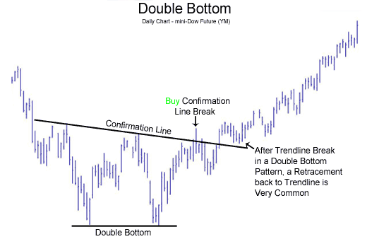

# Çift Dip (Double Bottom) Formasyonu

**Çift Dip (Double Bottom)** formasyonu, teknik analizde **fiyatın iki kez dip yaparak yükselişe geçeceğini** gösteren güçlü bir trend dönüş formasyonudur. Çift Dip formasyonu, genellikle **düşüş trendinin sona erdiğini** ve **yükselişin başlayabileceğini** işaret eder. Bu formasyon, alıcıların piyasa üzerinde kontrolü ele alması ve mevcut düşüş trendine karşı bir dönüş başlatması anlamına gelir.

## **Formasyonun Yapısı:**

Çift Dip formasyonu, **iki ardışık dip** ile karakterize edilir ve genellikle aşağıdaki aşamaları içerir:

1. **İlk Dip (First Bottom)**: Fiyat, düşüş trendi sırasında ilk büyük dibi yapar ve sonra bir toparlanma başlar. Bu dip, satış baskısının zirveye ulaştığı ve piyasada bir toparlanma olabileceğinin sinyalidir.
2. **İkinci Dip (Second Bottom)**: Fiyat, ilk dipten sonra geri çekildikten sonra tekrar düşer ve ikinci dip noktası oluşur. İkinci dip genellikle ilk diple benzer seviyelere ulaşır veya biraz daha yukarıda kalabilir. Ancak, alıcıların piyasaya girmeye başlamasıyla fiyat tekrar yükselmeye başlar.
3. **Yükseliş (Neckline Break)**: İki dip arasındaki en yüksek nokta bir direnç oluşturur, buna **neckline** denir. Fiyat, bu seviyeyi yukarı yönlü kırarsa, formasyon tamamlanmış olur ve yükselişin başladığı kabul edilir.

## **Formasyonun Tamamlanması:**

Formasyonun tamamlandığı, **neckline** seviyesinin yukarı yönlü kırılması ile anlaşılır. Bu kırılma, alıcıların piyasayı kontrol altına aldığını ve fiyatın yükselmeye başlayacağını gösterir.

## **Adımlar:**

1. **İlk Dip (First Bottom)**: Fiyat, düşüş trendiyle ilk büyük dip seviyesine ulaşır. Ardından fiyat toparlanmaya başlar.
2. **İkinci Dip (Second Bottom)**: Fiyat geri çekildikten sonra tekrar düşer, ancak önceki dip seviyelerine yakın veya aynı seviyeye ulaşır. Bu, piyasanın tekrar alıcılar tarafından desteklendiğini ve daha fazla düşüş yaşanmayacağını gösterir.
3. **Neckline Kırılması**: İki dip arasındaki en yüksek nokta olan neckline kırıldığında, formasyon tamamlanmış olur ve trendin tersine dönmeye başladığı kabul edilir.

## **Formasyonun Gücü:**

Formasyonun gücü, ikinci dip ile ilk dip arasındaki farkın azlığına, neckline'ın ne kadar güçlü bir şekilde kırıldığına ve işlem hacminin büyüklüğüne bağlıdır. İkinci dip, genellikle ilk dip seviyelerine yakın olmalı ve neckline kırılması işlem hacmiyle desteklenmelidir. Bu şekilde formasyonun doğruluğu artar.

## **Hedef Fiyat (Price Target):**

Çift Dip formasyonunun hedef fiyatı, formasyonun boyutuna göre hesaplanabilir. Hedef fiyatın hesaplanması şu şekilde yapılır:

1. İlk dip ile ikinci dip arasındaki mesafe ölçülür.
2. Bu mesafe, neckline kırılma noktasından yukarıya eklenir.
   - **Hedef Fiyat = Neckline Kırılma Noktası + (İlk Dip ile İkinci Dip Arasındaki Mesafe)**

Bu hesaplama, fiyatın formasyon sonrası ne kadar mesafe kat edeceği hakkında bir tahmin verir.

## **Çift Dip Formasyonunun Özellikleri:**

- **Zamanlaması**: Çift Dip formasyonu, genellikle daha uzun vadeli grafiklerde güvenilir bir sinyal verir. Örneğin, günlük ya da haftalık grafiklerde bu formasyon daha güçlü bir anlam taşır. Kısa vadeli (5-15 dakika) grafiklerde ise yanılma riski daha yüksektir.
- **Volatilite**: Çift Dip formasyonu genellikle fiyatların dip yaptığı ve alıcıların piyasaya girmeye başladığı noktalarda oluşur. Bu da genellikle volatilitenin arttığı ve yatırımcıların daha dikkatli olduğu bir dönemi işaret eder.
- **Güvenilirlik**: Çift Dip formasyonu, özellikle işlem hacminin yüksek olduğu ve neckline'ın net bir şekilde kırıldığı durumlarda güvenilir bir dönüş sinyali olarak kabul edilir.

## **Formasyonun Anlamı:**

Çift Dip formasyonu, bir düşüş trendinin sona erdiği ve yükselişin başlayabileceği konusunda önemli bir sinyal verir. İlk dip, alıcıların piyasada henüz harekete geçmediği noktada oluşur. İkinci dip ise, daha güçlü alıcı hareketlerinin başladığı ve düşüşün sona erdiğinin işareti olarak görülür. Neckline'ın yukarı yönlü kırılması ise, alıcıların piyasayı kontrol altına aldığının ve yükselişin başladığının göstergesidir.

## **Örnek:**

Bir yatırımcı, Çift Dip formasyonunu fark ettikten sonra neckline seviyesinin yukarı yönde kırılmasını bekler. Bu noktada, alış pozisyonu açılabilir. Ayrıca, fiyatın neckline'ı kırmadan önce sağladığı geri çekilmeler ile stop loss seviyeleri de belirlenebilir.

## **Risk ve Dikkat Edilmesi Gerekenler:**

- **Yanıltıcı Olabilir**: Çift Dip formasyonu her zaman doğru bir sinyal vermez. Özellikle piyasada ani haber akışları veya büyük hareketler varsa, formasyon yanıltıcı olabilir. Bu yüzden, başka teknik analiz araçlarıyla doğrulama yapılmalıdır.
- **Fiyatın Hızlı Hareketi**: Çift Dip formasyonu, hızla gelişen piyasalarda zor oluşabilir. Fiyatın ani yükselişi veya düşüşü, formasyonun tamamlanmasını engelleyebilir.
- **Volume Kontrolü**: Formasyonun geçerliliği ve gücü, işlem hacmi ile de doğrulanmalıdır. Formasyonun tamamlanmasında yüksek işlem hacmi önemli bir göstergedir. Bu, alıcıların piyasaya girmeye başladığını ve trendin gerçekten tersine döneceğini gösterir.
