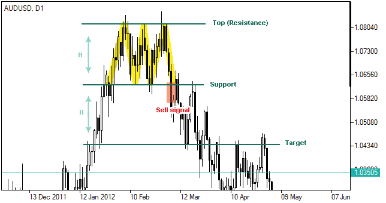

# Üçlü Tepe (Triple Top) Formasyonu

**Üçlü Tepe (Triple Top)** formasyonu, teknik analizde **üç kez test edilen bir zirveden sonra düşüş trendinin başlayabileceğini** gösteren önemli bir trend dönüş formasyonudur. Bu formasyon, bir yükseliş trendinin tükenmek üzere olduğunu ve piyasanın kar satışları ile yeni bir düşüş eğilimine gireceğini işaret eder. Genellikle **çok güçlü bir direnç seviyesi** oluşturur ve alıcıların güç kaybettiği, satıcıların devreye girdiği noktayı gösterir.

## **Formasyonun Yapısı:**

Üçlü Tepe formasyonu, adından da anlaşılacağı gibi **üç ardışık zirve** ile karakterize edilir ve bu zirveler arasındaki düşüşler belirli bir düzeyde olmalıdır. Formasyonun bileşenleri şunlardır:

1. **İlk Zirve (First Peak)**: Fiyat, bir yükseliş trendi sonrası ilk zirveye ulaşır. Ardından, satışlar başlar ve fiyat geri çekilir.
2. **İkinci Zirve (Second Peak)**: Fiyat, önceki zirve seviyesine yakın veya biraz daha yüksek bir seviyeye çıkar, ancak burada alıcılar tükenir ve fiyat tekrar geri çekilir.
3. **Üçüncü Zirve (Third Peak)**: Fiyat tekrar yükselir, ancak bu zirve de önceki zirvelerle aynı veya daha düşük bir seviyede kalır. Bu noktada, alıcılar tamamen tükenmiş ve satıcılar piyasayı kontrol altına almış olabilir.
4. **Düşüş (Neckline Break)**: Üç zirve arasındaki dip noktası, formasyonun **neckline** adı verilen destek seviyesini oluşturur. Bu seviyenin aşağı yönlü kırılması, formasyonun tamamlandığını ve düşüş trendinin başladığını gösterir.

## **Formasyonun Tamamlanması:**

Formasyon tamamlandığında, **neckline** seviyesinin kırılması ile düşüş trendinin başladığı kabul edilir. Fiyatın neckline seviyesini aşağı yönde kırması, formasyonun geçerliliğini onaylar.

## **Adımlar:**

1. **İlk Zirve (First Peak)**: Yükselişin ardından, fiyat bir zirveye ulaşır ve bir geri çekilme yaşanır.
2. **İkinci Zirve (Second Peak)**: Fiyat, önceki zirveye yakın veya aynı seviyelere çıkarsa da, alıcılar zayıflar ve fiyat tekrar geri çekilir.
3. **Üçüncü Zirve (Third Peak)**: Üçüncü zirve de önceki zirvelerle aynı veya biraz daha düşük seviyelere ulaşır. Bu noktada, alıcıların tükenmiş olduğu ve satıcıların piyasada baskın hale geldiği görülür.
4. **Neckline Kırılması**: Üç zirve arasındaki dip noktasının aşağı yönlü kırılması, düşüş trendinin başladığının sinyalini verir.

## **Formasyonun Gücü:**

Üçlü Tepe formasyonu, genellikle uzun vadeli piyasa hareketlerinde güvenilir bir sinyal olarak kabul edilir. İkinci ve üçüncü zirvelerin birbirine yakın olması, alıcıların zayıfladığının ve satıcıların gücünün arttığının bir göstergesidir. Formasyonun tamamlanması için neckline seviyesinin kırılması gereklidir. Bu kırılma, düşüş trendinin gerçek olma olasılığını artırır.

## **Hedef Fiyat (Price Target):**

Üçlü Tepe formasyonunun hedef fiyatı, formasyonun boyutuna göre hesaplanabilir. Hedef fiyat hesaplaması şu şekilde yapılır:

1. İlk zirve ile üçüncü zirve arasındaki mesafe ölçülür.
2. Bu mesafe, neckline kırılma noktasından çıkarılır.
   - **Hedef Fiyat = Neckline Kırılma Noktası - (İlk Zirve ile Üçüncü Zirve Arasındaki Mesafe)**

Bu hesaplama, fiyatın formasyon sonrası ne kadar mesafe kat edeceği hakkında bir tahmin sağlar.

## **Üçlü Tepe Formasyonunun Özellikleri:**

- **Zamanlaması**: Üçlü Tepe formasyonu, genellikle uzun vadeli grafiklerde daha güvenilir bir sinyal verir. Kısa vadeli grafiklerde (örneğin 5-15 dakika) bu formasyonun geçerliliği düşük olabilir.
- **Volatilite**: Çoğu zaman, Üçlü Tepe formasyonu, volatilitenin arttığı ve piyasa katılımcılarının kar satışları yapmaya başladığı noktalarda oluşur. Bu, yatırımcıların dikkatli olmasını gerektirir.
- **Güvenilirlik**: Formasyonun güvenilirliği, özellikle neckline seviyesinin güçlü bir şekilde kırılmasıyla artar. Ayrıca, işlem hacminin de artması bu formasyonun gücünü artırır.

## **Formasyonun Anlamı:**

Üçlü Tepe formasyonu, piyasada alıcıların tükenmeye başladığını ve satıcıların kontrolü elinde tutmaya başladığını gösterir. İlk zirve alıcıların güçlü olduğu noktayı, ikinci zirve alıcıların zayıfladığını ve üçüncü zirve de piyasada satış baskısının arttığını gösterir. Neckline’ın kırılması, alıcıların tamamen kontrolü kaybettiği ve satış baskısının güçlü bir şekilde başladığı noktayı işaret eder.

## **Örnek:**

Bir yatırımcı, Üçlü Tepe formasyonunu fark ettikten sonra neckline seviyesinin kırılmasını bekler. Neckline kırıldığında, satış pozisyonu açılabilir. Ayrıca, fiyatın neckline’ı kırmadan önce sağladığı geri çekilmeler ile stop loss seviyeleri de belirlenebilir.

## **Risk ve Dikkat Edilmesi Gerekenler:**

- **Yanıltıcı Olabilir**: Üçlü Tepe formasyonu her zaman doğru bir sinyal vermez. Özellikle piyasalarda ani haber akışları veya dışsal faktörlerden kaynaklanan dalgalanmalar formasyonu yanıltıcı hale getirebilir. Bu yüzden, diğer teknik analiz araçlarıyla doğrulama yapmanız önemlidir.
- **Fiyatın Hızlı Hareketi**: Üçlü Tepe formasyonu, fiyatın ani yükselişi veya düşüşü ile oluşabilir. Bu da formasyonun geçerliliğini zorlaştırabilir.
- **Volume Kontrolü**: Formasyonun gücü, işlem hacmiyle de doğrulanmalıdır. Eğer neckline kırılmadan önce hacim artarsa, bu formasyonun doğruluğunu artırabilir. Aksi takdirde, formasyon daha az güvenilir olabilir.
