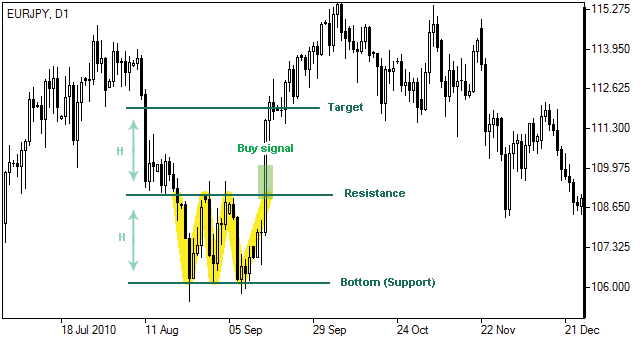

# Üçlü Dip (Triple Bottom) Formasyonu

**Üçlü Dip (Triple Bottom)** formasyonu, teknik analizde **üç kez test edilen bir dipten sonra yükseliş trendinin başlayabileceğini** gösteren önemli bir trend dönüş formasyonudur. Bu formasyon, **düşüş trendinin sona erdiğini** ve **yükselişin başlayabileceğini** işaret eder. Çoğunlukla, fiyatın belirli bir destek seviyesinde üç kez dip yapması ve ardından bu seviyeden güçlü bir şekilde yukarı hareket etmesiyle tanımlanır.

## **Formasyonun Yapısı:**

Üçlü Dip formasyonu, adından da anlaşılacağı gibi **üç ardışık dip** ile karakterizedir ve bu diplerin genellikle birbirine yakın seviyelerde olması gerekir. Formasyonun aşamaları şunlardır:

1. **İlk Dip (First Bottom)**: Fiyat, bir düşüş trendi sırasında ilk büyük dip seviyesine ulaşır. Ardından, bir toparlanma süreci başlar.
2. **İkinci Dip (Second Bottom)**: Fiyat, ilk dipten sonra geri çekildikten sonra tekrar düşer. Bu, alıcıların piyasaya girmeye başladığı ve düşüşün sona erdiğine dair bir işaret olabilir. Ancak fiyat ikinci dipte ilk dibi test eder ya da daha az düşer.
3. **Üçüncü Dip (Third Bottom)**: Fiyat, bir kez daha düşer ve önceki iki diple benzer seviyelere veya biraz daha yukarıya ulaşır. Ancak bu dip, piyasadaki alıcıların destek bulmaya başlaması ve fiyatın yükselmeye başlamasıyla birlikte son dip olur.
4. **Yükseliş (Neckline Break)**: Üç dip arasındaki zirve noktası (neckline) bir direnç seviyesi oluşturur. Fiyat, bu seviyeyi yukarı yönlü kırarsa, formasyon tamamlanmış olur ve yükseliş trendi başlar.

## **Formasyonun Tamamlanması:**

Formasyonun tamamlandığı, **neckline** seviyesinin yukarı yönlü kırılması ile anlaşılır. Bu kırılma, piyasadaki alıcıların kontrolü ele aldığını ve fiyatın yükselmeye başlayacağını gösterir. Neckline kırılması, formasyonun geçerliliğini onaylayan bir sinyaldir.

## **Adımlar:**

1. **İlk Dip (First Bottom)**: Fiyat, düşüş trendi ile önceki dip seviyesine ulaşır. Sonrasında bir toparlanma yaşanır.
2. **İkinci Dip (Second Bottom)**: Fiyat geri çekildikten sonra tekrar düşer ve önceki dip seviyelerine yakın bir seviyeye gelir. Bu dip, piyasadaki alıcıların devreye girmeye başladığını ve daha fazla düşüşün zor olduğunu gösterir.
3. **Üçüncü Dip (Third Bottom)**: Fiyat tekrar düşer, ancak önceki dip seviyelerinden daha az bir geri çekilme yaşar veya aynı seviyeye gelir. Bu noktada, alıcılar güçlü bir şekilde piyasaya girer ve fiyat toparlanmaya başlar.
4. **Neckline Kırılması**: İki dip arasındaki en yüksek nokta olan neckline seviyesinin yukarı doğru kırılması, formasyonun tamamlandığını ve yükseliş trendinin başladığını gösterir.

## **Formasyonun Gücü:**

Üçlü Dip formasyonu, güçlü bir dönüş sinyali olarak kabul edilir. Üçüncü dip, genellikle piyasadaki alıcıların daha fazla baskı yapmaya başladığını ve düşüş trendinin sona erdiğini gösterir. Ancak, formasyonun geçerli olabilmesi için **neckline** seviyesinin net bir şekilde kırılması gerekir. Ayrıca, işlem hacminin artması da formasyonun geçerliliğini artırabilir.

## **Hedef Fiyat (Price Target):**

Üçlü Dip formasyonunun hedef fiyatı, formasyonun boyutuna göre hesaplanabilir. Hedef fiyat hesaplaması şu şekilde yapılır:

1. İlk dip ile üçüncü dip arasındaki mesafe ölçülür.
2. Bu mesafe, neckline kırılma noktasından yukarıya eklenir.
   - **Hedef Fiyat = Neckline Kırılma Noktası + (İlk Dip ile Üçüncü Dip Arasındaki Mesafe)**

Bu hesaplama, fiyatın formasyon sonrası ne kadar mesafe kat edeceği hakkında bir tahmin verir.

## **Üçlü Dip Formasyonunun Özellikleri:**

- **Zamanlaması**: Üçlü Dip formasyonu, genellikle daha uzun vadeli grafiklerde daha güvenilir bir sinyal verir. Kısa vadeli grafiklerde (örneğin 5-15 dakika) bu formasyonun geçerliliği düşük olabilir. Günlük veya haftalık grafiklerde daha sağlam bir sinyal oluşturur.
- **Volatilite**: Üçlü Dip formasyonu, genellikle fiyatların dip yaptığı ve alıcıların piyasaya girmeye başladığı noktalarda oluşur. Bu, piyasa katılımcılarının dikkatli olmalarını gerektirir.
- **Güvenilirlik**: Formasyonun güvenilirliği, özellikle işlem hacminin yüksek olduğu ve neckline'ın net bir şekilde kırıldığı durumlarda artar. Aksi takdirde, formasyon yanıltıcı olabilir.

## **Formasyonun Anlamı:**

Üçlü Dip formasyonu, bir düşüş trendinin sona erdiği ve yükselişin başlayabileceği konusunda önemli bir sinyal verir. İlk dip, alıcıların piyasa üzerinde hâlâ güçlü olmadığını gösterirken, ikinci ve üçüncü diplerde alıcılar devreye girer ve fiyat, düşüş trendinin sona erdiğini gösteren bir destek bulur. Neckline’ın yukarı yönlü kırılması ise, alıcıların piyasayı kontrol altına aldığının ve fiyatın yukarı yönde hareket etmeye başladığının göstergesidir.

## **Örnek:**

Bir yatırımcı, Üçlü Dip formasyonunu fark ettikten sonra, neckline seviyesinin yukarı yönde kırılmasını bekler. Neckline kırılınca, alış pozisyonu açılabilir. Ayrıca, fiyatın neckline’ı kırmadan önce sağladığı geri çekilmelerle stop loss seviyeleri belirlenebilir.

## **Risk ve Dikkat Edilmesi Gerekenler:**

- **Yanıltıcı Olabilir**: Üçlü Dip formasyonu her zaman doğru bir sinyal vermez. Piyasa haberlerinden veya dışsal faktörlerden kaynaklanan ani hareketler, formasyonu yanıltıcı hale getirebilir. Bu yüzden, başka teknik analiz araçlarıyla doğrulama yapılmalıdır.
- **Fiyatın Hızlı Hareketi**: Üçlü Dip formasyonu, hızla gelişen piyasalarda zor oluşabilir. Fiyatın ani yükselişi veya düşüşü, formasyonun tamamlanmasını engelleyebilir.
- **Volume Kontrolü**: Formasyonun gücü, işlem hacmiyle doğrulanmalıdır. Eğer neckline kırılmadan önce işlem hacmi artarsa, formasyonun geçerliliği artar. Aksi takdirde, formasyonun güvenilirliği düşer.
