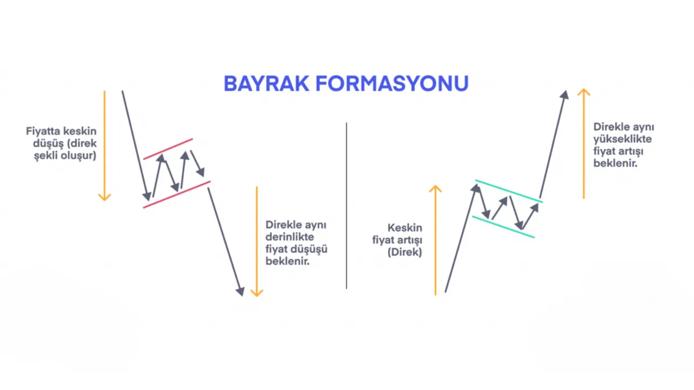

# Bayrak (Flag) Formasyonu

**Bayrak (Flag)** formasyonu, teknik analizde, mevcut trendin **kısa bir duraksamadan sonra devam edeceğini** gösteren güçlü bir devam formasyonudur. Bayrak, **keskin bir fiyat hareketinin ardından gelen kısa vadeli bir konsolidasyon** dönemidir ve genellikle **yükselen ya da düşen bir trendin devam edeceğini işaret eder.** Bu formasyon, piyasada bir tür dinlenme ya da geçici bir güç toplama dönemi olduğunu, ardından trendin kaldığı yerden devam edeceğini belirtir.

Bayrak formasyonu, ismini, **bayrak direğine tutturulmuş bir bayrak gibi** görünen fiyat hareketinden alır. Yükseliş veya düşüş trendi ile oluşan bu formasyonun yapısı, fiyatın önce sert bir şekilde hareket etmesi ve ardından kısa bir süre boyunca daha yatay veya hafif eğimli bir konsolidasyon yaşaması şeklindedir.

## **Formasyonun Yapısı:**

Bayrak formasyonunun yapısı genellikle şu şekilde olur:

1. **Bayrak Direği (Flagpole)**: Bayrak formasyonu oluşmadan önce güçlü bir fiyat hareketi yaşanır. Bu genellikle bir yükseliş ya da düşüş hareketidir ve formasyonun **direği** olarak adlandırılır. Bu hareketin ardından fiyat, kısa bir süre yatay ya da hafif eğimli bir şekilde hareket etmeye başlar.

2. **Bayrak Alanı (Flag Area)**: Fiyat, **bayrak direğinden** sonra bir konsolidasyon dönemi yaşar. Bu dönemde, fiyat küçük bir kanal içinde hareket eder ve genellikle **karakteristik olarak daha yatay veya hafif eğimli** bir yön izler. Bu dönemin sonunda fiyat tekrar ana yönüne geri döner.

3. **Yönün Devamı**: Bayrak formasyonu tamamlandığında, fiyat tekrar formasyonun yönünde hareket etmeye başlar. Yükseliş trendinde oluşan bir bayrak formasyonu, fiyatın yukarı yönlü devam edeceğini gösterirken, düşüş trendinde oluşan bir bayrak formasyonu, fiyatın aşağı yönlü devam edeceğini gösterir.

## **Formasyonun Tamamlanması:**

Bayrak formasyonu, **bayrak alanı** içerisindeki fiyat hareketlerinin ardından, **bayrak direğinin** yönünde bir kırılma yaşandığında tamamlanmış sayılır. Bu kırılma, fiyatın bayrak alanından çıkıp mevcut trend yönüne doğru hareket etmesidir. Örneğin, bir yükseliş trendi sırasında bir bayrak formasyonu oluşmuşsa, fiyatın bayrak formasyonunu yukarı yönde kırması beklenir. Bu, mevcut yükseliş trendinin devam edeceğini işaret eder.

## **Adımlar:**

1. **Bayrak Direği (Flagpole)**: Fiyat, güçlü bir yükseliş ya da düşüş hareketi ile **bayrak direği** oluşturur. Bu hareket genellikle ani bir şekilde ve keskin bir şekilde olur.
2. **Bayrak Alanı (Flag Area)**: Bayrak direği sonrası fiyat yatay veya hafif eğimli bir şekilde konsolide olur. Bu bölge **bayrak alanı** olarak adlandırılır. Bayrak alanı, fiyatın kısa bir süre dinlenme sürecine girdiği bölgedir.
3. **Kırılma**: Fiyat, bayrak alanından **bayrak direğinin yönünde** çıkar ve mevcut trendin devam edeceğini gösterir.

## **Formasyonun Gücü:**

Bayrak formasyonu, özellikle **işlem hacmi** ile doğrulama yapıldığında oldukça güvenilir bir sinyal verebilir. Eğer bayrak alanının kırılması sırasında işlem hacmi artarsa, bu formasyonun doğruluğu artar ve fiyatın, bayrak direğinin yönünde hareket edeceği daha güçlü bir şekilde öngörülebilir. Formasyon, genellikle güçlü ve net trendlerin içinde oluşur, bu da piyasadaki yönün hala baskın olduğunu gösterir.

## **Hedef Fiyat (Price Target):**

Bayrak formasyonunun hedef fiyatı, formasyonun boyutuna göre hesaplanabilir. Hedef fiyat hesaplaması şu şekilde yapılır:

1. **Bayrak Direğinin** uzunluğu ölçülür.
2. Bu uzunluk, **bayrak alanındaki kırılma noktasından** eklenir (yükseliş trendinde yukarı, düşüş trendinde aşağı yönlü).

   - **Hedef Fiyat = Kırılma Noktası + Bayrak Direği Boyutu** 

Bu hesaplama, formasyon sonrası fiyatın ne kadar hareket edebileceği konusunda bir tahmin verir.

## **Bayrak Formasyonunun Özellikleri:**

- **Yükseliş veya Düşüş Trendlerinde Görülür**: Bayrak formasyonu, sadece bir yükseliş ya da düşüş trendinin ortasında oluşur. Yükseliş trendi sırasında **yükselen bayrak** (bullish flag), düşüş trendi sırasında ise **düşen bayrak** (bearish flag) olarak tanımlanır.
  
- **Zamanlaması**: Bayrak formasyonu genellikle kısa vadeli bir düzeltme ya da konsolidasyon sürecini işaret eder. Yükseliş ya da düşüş hareketlerinin ardından kısa bir süre içinde meydana gelir. Uzun vadeli grafiklerde (örneğin günlük ya da haftalık) daha güvenilir sinyaller verebilir.
  
- **Volatilite**: Bayrak formasyonu, **yüksek volatilite** gösteren piyasalarda daha yaygın olarak görülebilir. Fiyatın hızlı bir şekilde yükselmesi veya düşmesi ve ardından daha dar bir kanal içinde hareket etmesi tipiktir.

- **Hacim Artışı**: Formasyon tamamlandığında, fiyatın kırılma yönünde işlem hacminin artması formasyonun gücünü doğrular. Yükselen hacim, fiyatın yönünü destekleyen önemli bir sinyaldir.

## **Formasyonun Anlamı:**

Bayrak formasyonu, fiyatın güçlü bir hareketin ardından dinlendiği ve daha sonra mevcut yönünde devam edeceği anlamına gelir. Bu, piyasadaki **dinlenme ve güç toplama** sürecidir. Eğer formasyon bir yükseliş trendi içinde oluşuyorsa, bayrak formasyonunun kırılması fiyatın daha da yukarıya hareket edeceğini gösterir. Aynı şekilde, bir düşüş trendi sırasında oluşuyorsa, fiyatın aşağı yönlü devam edeceği sinyali verir.

## **Örnek:**

Bir yatırımcı, yükselen bir bayrak formasyonu tespit ettiğinde, fiyatın bayrak alanını yukarı yönde kırmasını bekler. Bu kırılma noktası, yatırımcının alış pozisyonu açması için bir sinyal olabilir. Aynı şekilde, işlem hacmi arttığında, bu kırılmanın geçerliliği daha da güçlenir.

## **Risk ve Dikkat Edilmesi Gerekenler:**

- **Yanıltıcı Olabilir**: Bayrak formasyonu her zaman doğru bir sinyal vermez. Fiyatın bayrak alanından çıkması her zaman güçlü bir trendin devam edeceği anlamına gelmez. Bu yüzden, başka teknik analiz araçlarıyla doğrulama yapılması önemlidir.
- **Fiyatın Hızlı Hareketi**: Bayrak formasyonu, fiyatın hızlı bir şekilde hareket ettiği ve ardından konsolide olduğu bir yapıyı içerir. Bu nedenle, fiyatın ani dalgalanması ya da ani haber akışları formasyonu bozabilir.
- **Volume Kontrolü**: Formasyonun gücünü doğrulamak için işlem hacmi izlenmelidir. Eğer bayrak alanı kırıldığında işlem hacmi artarsa, formasyonun geçerliliği artar. Aksi takdirde, bu formasyon yanıltıcı olabilir.
