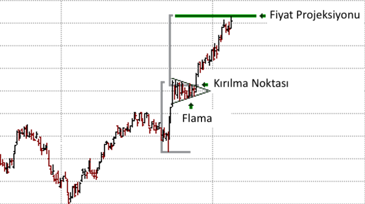

# Flama (Pennant) Formasyonu

**Flama (Pennant)** formasyonu, teknik analizde, **fiyatın güçlü bir hareketin ardından kısa bir konsolidasyon dönemi yaşayıp ardından mevcut trendin devam edeceğini gösteren bir devam formasyonudur**. Bu formasyon, bayrak formasyonuna benzer şekilde **trendin devam edeceğini** işaret eder, ancak yapısal olarak biraz daha farklıdır. Flama formasyonu, genellikle güçlü bir **yükseliş** veya **düşüş** hareketinin ardından gelir ve fiyatın daha dar bir üçgen şeklinde konsolide olması ile oluşur.

Flama formasyonu, fiyat hareketinin keskin bir şekilde başladığı ve ardından **dar bir fiyat aralığında** devam ettiği kısa vadeli bir düzeltme süreci olarak tanımlanabilir. Flama, **bayrak** formasyonuna benzese de, **daha kısa süreli ve daha keskin fiyat hareketlerine** sahip olur ve genellikle bir üçgen veya daralan kanal şeklinde ortaya çıkar.

## **Formasyonun Yapısı:**

Flama formasyonu şu şekilde gelişir:

1. **Flama Direği (Flagpole)**: Fiyat, güçlü bir yükseliş ya da düşüş hareketi gösterir. Bu hareket, flama formasyonunun başlangıç noktasıdır ve genellikle hızlı ve keskin bir fiyat hareketi ile karakterizedir. Bu hareketin ardından fiyat, konsolide olmaya başlar.

2. **Flama Alanı (Pennant Area)**: Flama alanı, fiyatın konsolide olduğu ve daha dar bir aralıkta hareket ettiği bölgedir. Bu bölge, **daha dar bir üçgen veya küçük bir kanal** şeklinde oluşur ve genellikle iki trend çizgisi ile sınırlıdır: bir yükselen alt trend çizgisi ve bir azalan üst trend çizgisi. Bu formasyon, fiyatın ivme kazanmak için güç topladığı bir süreyi simgeler.

3. **Kırılma**: Fiyat, flama alanını yukarı ya da aşağı yönlü kırar. Bu kırılma, **formasyonun tamamlandığı** ve mevcut trendin devam edeceği sinyalini verir. Yükseliş trendinde oluşan flama formasyonu, fiyatın yukarı yönlü kırılması ile tamamlanır ve düşüş trendinde oluşan flama formasyonu, fiyatın aşağı yönlü kırılması ile tamamlanır.

## **Formasyonun Tamamlanması:**

Flama formasyonu, **flama alanındaki konsolidasyonun ardından** fiyatın yukarı veya aşağı yönde kırılması ile tamamlanmış sayılır. Bu kırılma, formasyonun geçerliliğini onaylayan bir sinyaldir ve fiyatın mevcut yönünde devam edeceğini gösterir.

- **Yükseliş Flaması (Bullish Pennant)**: Eğer flama formasyonu bir yükseliş trendi sırasında oluşuyorsa, formasyonun tamamlanması için fiyatın **yukarı doğru kırılması** beklenir. Bu, mevcut yükselişin devam edeceği anlamına gelir.
  
- **Düşüş Flaması (Bearish Pennant)**: Eğer flama formasyonu bir düşüş trendi sırasında oluşuyorsa, formasyonun tamamlanması için fiyatın **aşağı doğru kırılması** beklenir. Bu, mevcut düşüşün devam edeceği anlamına gelir.

## **Adımlar:**

1. **Flama Direği (Flagpole)**: Fiyat, güçlü bir şekilde yükselir ya da düşer ve bir flama direği oluşturur. Bu hareket genellikle sert ve hızlıdır.

2. **Flama Alanı (Pennant Area)**: Fiyat, flama direğinden sonra daha dar bir aralıkta konsolide olmaya başlar. Bu, flama alanı olarak adlandırılır ve genellikle üçgen bir yapıda oluşur.

3. **Kırılma ve Yön**: Fiyat, flama alanından yukarı veya aşağı yönlü kırılma yapar. Kırılma yönü, mevcut trendin devam edeceğini gösterir.

## **Formasyonun Gücü:**

Flama formasyonu, özellikle güçlü bir fiyat hareketinin ardından oluştuğu için genellikle güçlü bir devam sinyali verir. Yükseliş ya da düşüş hareketinin ardından oluşan bu formasyon, **piyasada dinlenme süreci** olduğunu ve daha sonra trendin devam edeceğini gösterir.

Flama formasyonunun doğruluğu, işlem hacmi ile doğrulama yapılması durumunda artar. **Hacim artışı**, flama alanının kırılması sırasında piyasadaki hareketin güçlü olduğunu gösterir ve formasyonun güvenilirliğini artırır.

## **Hedef Fiyat (Price Target):**

Flama formasyonunun hedef fiyatı, formasyonun boyutuna göre hesaplanabilir. Bu hesaplama şu şekilde yapılır:

1. **Flama Direğinin** uzunluğu ölçülür.
2. Bu uzunluk, **flama alanındaki kırılma noktasından** eklenir (yükseliş trendinde yukarı, düşüş trendinde aşağı yönlü).

   - **Hedef Fiyat = Kırılma Noktası + Flama Direği Boyutu**

Bu hesaplama, fiyatın formasyon sonrası ne kadar hareket edebileceği hakkında bir tahmin verir.

## **Flama Formasyonunun Özellikleri:**

- **Yükseliş veya Düşüş Trendlerinde Görülür**: Flama formasyonu, genellikle bir yükseliş ya da düşüş trendinin ortasında oluşur. Yükseliş trendi sırasında bir **yükselen flama** (bullish pennant) ve düşüş trendi sırasında bir **düşen flama** (bearish pennant) oluşur.
  
- **Zamanlaması**: Flama formasyonu genellikle kısa vadeli bir konsolidasyon sürecini simgeler. Bu süre, fiyatın güçlü bir hareketin ardından ivme kazanarak devam edeceğini gösterir.

- **Volatilite**: Flama formasyonu, volatilitesi yüksek piyasalarda daha sık görülür. Fiyatın hızlı bir şekilde hareket etmesi ve ardından dar bir kanal içinde konsolide olması tipiktir.

- **Hacim Artışı**: Formasyonun doğruluğunu artırmak için işlem hacminin izlenmesi önemlidir. Kırılma sırasında işlem hacminin artması, fiyatın yönünde güçlü bir hareket olacağına işaret eder.

## **Formasyonun Anlamı:**

Flama formasyonu, genellikle piyasada **güçlü bir hareketin ardından gelen kısa bir konsolidasyon dönemi** olduğunu gösterir. Bu konsolidasyon, piyasadaki oyuncuların güç toplama ve bir sonraki hareket için pozisyon alması anlamına gelir. Flama formasyonunun tamamlanması, mevcut trendin devam edeceği sinyalini verir. Bu nedenle, yatırımcılar, flama formasyonunu doğru şekilde tespit ederek, piyasada güçlü bir hareketin başlamak üzere olduğunu anlayabilirler.

## **Örnek:**

Bir yatırımcı, yükselen bir flama formasyonunu fark ettiğinde, fiyatın flama alanını yukarı yönde kırmasını bekler. Bu kırılma noktasında alış pozisyonu açabilir. Aynı şekilde, işlem hacminin artması da formasyonun geçerliliğini artıracaktır.

## **Risk ve Dikkat Edilmesi Gerekenler:**

- **Yanıltıcı Olabilir**: Flama formasyonu her zaman doğru bir sinyal vermez. Piyasada beklenmedik bir gelişme, fiyatın yön değiştirmesine neden olabilir. Bu nedenle, formasyon tek başına bir işlem kararı için yeterli olmayabilir. Diğer teknik analiz araçlarıyla doğrulama yapılmalıdır.
  
- **Fiyatın Hızlı Hareketi**: Flama formasyonu, fiyatın hızlı bir şekilde hareket ettiği ve ardından dar bir kanal içinde hareket ettiği bir yapıyı içerir. Ani fiyat hareketleri, formasyonu bozabilir.

- **Volume Kontrolü**: Formasyonun güvenilirliğini doğrulamak için işlem hacmi izlenmelidir. Eğer flama alanı kırıldığında işlem hacmi artarsa, formasyonun geçerliliği daha yüksektir. Aksi takdirde, bu formasyon yanıltıcı olabilir.
