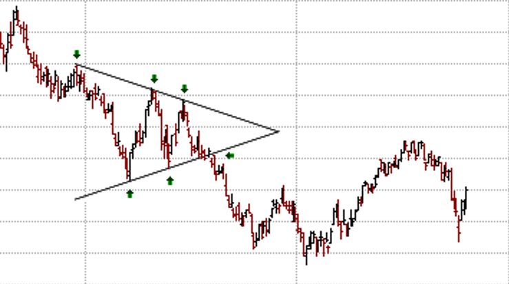

# Simetrik Üçgen (Symmetrical Triangle) Formasyonu

**Simetrik Üçgen** formasyonu, teknik analizde fiyat hareketlerinin sıkıştığı ve ardından güçlü bir kırılma ile trendin devam edeceği bir yapıdır. Bu formasyon, genellikle **bir trendin devamı** olarak kabul edilir, ancak bazen de **dönüş sinyali** verebilir. Fiyat hareketinin dar bir üçgen içinde sıkıştığı bu dönem, yatırımcılara olası bir trend dönüşü veya devamı hakkında ipuçları sunar.

## **Formasyonun Yapısı:**

Simetrik üçgen, fiyat hareketinin zamanla daralan iki trend çizgisi arasında sıkışması ile oluşur. Bu çizgiler şunları temsil eder:

1. **Üst Trend Çizgisi (Resistans)**: Fiyatın zirveleri genellikle bu çizgiye ulaşır, ancak fiyat bu seviyeye geldiğinde aşağıya yönelir. Yani, fiyatın bu çizgiye temas ettiği yer, direnç noktasıdır.

2. **Alt Trend Çizgisi (Destek)**: Fiyatın dipleri ise genellikle bu çizgiye dokunur ve bu seviyede yukarı yönlü hareket eder. Yani, fiyatın bu çizgiye dokunduğu yer, destek noktasıdır.

Simetrik üçgen formasyonu, bu iki çizginin zamanla birbirine yakınlaşmasıyla oluşur ve **sıkışan fiyatlar**, güçlü bir kırılma ile tamamlanır. Bu kırılma, fiyatın üst veya alt trend çizgisinden birine doğru gerçekleşir ve genellikle mevcut trendin devam edeceği anlamına gelir.

## **Formasyonun Gelişimi:**

1. **Başlangıç Aşaması**: Fiyat, belirgin bir yükseliş veya düşüş trendi gösterdikten sonra, bir süre daha dar bir aralıkta hareket etmeye başlar. Bu hareket, genellikle **yatırımcıların belirsizlik yaşadığı** bir dönemi ifade eder.

2. **Sıkışma Aşaması**: Fiyat hareketi, yukarı ve aşağı yönlü dalgalanmalar yaparak her iki trend çizgisinin içine sıkışır. Bu aşama, genellikle **zaman alıcı ve yatay bir hareket** olarak kendini gösterir. Bu aşama ne kadar uzun sürerse, kırılma sonrası oluşacak hareketin de o kadar güçlü olma ihtimali artar.

3. **Kırılma**: Üst trend çizgisi (direnç) ya da alt trend çizgisi (destek) kırılır. Fiyatın yönü, mevcut trendin devam edeceğini işaret eder. Eğer fiyat, **üst trend çizgisini** yukarı doğru kırarsa, **yükseliş trendinin** devam edeceği, **alt trend çizgisini** aşağı doğru kırarsa, **düşüş trendinin** devam edeceği öngörülür.

## **Simetrik Üçgenin İki Ana Yönü:**

1. **Yükseliş Kırılması (Bullish Breakout)**:
   - Fiyat, simetrik üçgenin üst sınırını kırarak yukarı yönlü hareket etmeye başlar.
   - Bu, **yükseliş trendinin devam edeceği** ve yatırımcıların **alım** yapması gerektiği anlamına gelir.
   - Kırılma sonrası fiyat hareketinin doğrulama için işlem hacmi önemlidir; işlem hacminin artması, hareketin güçlendiğini gösterir.

2. **Düşüş Kırılması (Bearish Breakdown)**:
   - Fiyat, simetrik üçgenin alt sınırını kırarak aşağı yönlü bir hareket sergiler.
   - Bu, **düşüş trendinin devam edeceği** ve yatırımcıların **satış** yapması gerektiği anlamına gelir.
   - Yine, kırılma sonrası hacmin artması hareketin devamı için bir teyit olabilir.

## **Formasyonun Gücü ve Doğrulama:**

Simetrik üçgen formasyonu genellikle bir **devam formasyonu** olarak kabul edilir, yani mevcut trendin devam edeceğini işaret eder. Ancak bazen **dönüş sinyali** de verebilir. Bu yüzden simetrik üçgenin doğru bir şekilde analiz edilmesi ve kırılma noktalarının dikkatlice izlenmesi önemlidir.

- **Hacim Takibi**: Kırılma esnasında hacmin artması, formasyonun doğruluğunu artıran önemli bir faktördür. Hacmin düşük olduğu kırılmalar genellikle yanıltıcı olabilir. Yüksek hacim, fiyatın yeni yönünde güçlü bir hareket başlatacağına işaret eder.

- **Zamanlama**: Simetrik üçgen formasyonu, genellikle zaman alıcı bir yapı olabilir. Fiyat hareketinin ne kadar süre sıkıştığı, kırılma sonrası hareketin büyüklüğünü etkileyebilir.

- **Hedef Fiyat**: Simetrik üçgenin hedef fiyatını belirlemek için formasyonun **yüksekliği (fiyat aralığı)** dikkate alınabilir. Bu hedef fiyat, üçgenin başlangıcındaki yüksekliğin kırılma noktasına eklenmesiyle hesaplanabilir.
  - **Hedef Fiyat = Kırılma Noktası + Üçgenin Yüksekliği**

## **Simetrik Üçgen Formasyonunun Özellikleri:**

- **Belirsizlik**: Simetrik üçgen, genellikle bir belirsizlik dönemini temsil eder. Fiyat, iki karşıt yönün arasında sıkışarak yatırımcıları kararsız bırakabilir. Ancak bu sıkışma, sonunda güçlü bir kırılma ile sonlanır.
  
- **Trend Devamı veya Dönüşü**: Simetrik üçgen, genellikle mevcut trendin devamını işaret etse de, bazen de **trend dönüşü** olabilir. Bu yüzden formasyonun kırılma yönü dikkatle izlenmelidir.

- **Hacim Artışı**: Kırılma esnasında işlem hacminin artması, formasyonun geçerliliğini onaylayan bir faktördür. Hacim artışı, kırılma yönünde fiyatın güçlenerek devam edeceğini gösterir.

- **Zamanlama**: Formasyon, uzun bir süre boyunca fiyatın sıkıştığı bir yapıya sahip olduğundan, genellikle **orta vadeli** yatırımcılar için uygun bir fırsat olabilir. Kısa vadeli yatırımcılar için, sıkışma süresi biraz uzun olabilir.

## **Simetrik Üçgenin Avantajları:**

- **Güçlü Kırılmalar**: Simetrik üçgen formasyonu, sıkışan fiyat hareketleri ile güçlü kırılmalar yaratır. Bu kırılmalar, yatırımcılar için önemli ticaret fırsatları sunabilir.
- **Trendin Yönünü Tahmin Etme**: Formasyon, mevcut trendin devamı veya dönüşü hakkında güçlü bir sinyal verebilir.
- **Hacimle Doğrulama**: Kırılmalar, hacim artışı ile doğrulandığında güvenilirliği artar, böylece yanlış sinyallerden kaçınılabilir.

## **Simetrik Üçgenin Zorlukları:**

- **Yanıltıcı Kırılmalar**: Bazı durumlarda, simetrik üçgenin kırılmasının ardından fiyat hareketi beklenen yönde olmayabilir. Bu yüzden kırılma sonrası dikkatli bir şekilde izlenmeli ve diğer teknik analiz araçları ile doğrulama yapılmalıdır.
  
- **Hacim Azalması**: Hacmin az olduğu durumlarda, simetrik üçgenin sağladığı sinyaller yanıltıcı olabilir. Kırılma, düşük hacimle gerçekleştiğinde fiyat hareketinin zayıf kalma ihtimali vardır.
