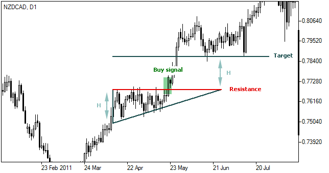

# Yükselen Üçgen (Ascending Triangle) Formasyonu

**Yükselen Üçgen**, fiyat hareketlerinin oluşturduğu bir teknik analiz formasyonudur ve genellikle **yükseliş trendinin devamını** gösterdiği kabul edilir. Bu formasyon, fiyatların belirli bir seviyede dirençle karşılaşırken, aynı zamanda destek noktasının giderek daha yüksek seviyelere çıkmasıyla şekillenir. Bu durum, yatırımcıların bir kırılma noktasında güçlü bir yükseliş beklemelerini sağlar.

## **Formasyonun Yapısı:**

Yükselen üçgen, üçgen formasyonlarından biridir ve genellikle şu özelliklere sahiptir:

1. **Üst Trend Çizgisi (Direnç)**: Fiyatlar, belirli bir direnç seviyesinden birkaç kez geri döner. Bu, formasyonun üst kısmında yatay bir çizgi oluşturur ve bu seviyenin kırılması, fiyatın daha da yükselebileceğini gösterir.

2. **Alt Trend Çizgisi (Destek)**: Fiyatlar, giderek daha yüksek dipler yaparak bir destek çizgisi oluşturur. Bu çizgi, yükselen bir açıyla hareket eder ve üçgenin alt kısmını oluşturur.

Yükselen üçgenin temel özelliği, alt trend çizgisinin (destek) yükselirken, üst trend çizgisinin (direnç) yatay kalmasıdır. Fiyatlar bu sıkışan yapının içinde hareket ederken, sonunda bir kırılma meydana gelir.

## **Formasyonun Gelişimi:**

Yükselen üçgen formasyonu, genellikle şu aşamalardan oluşur:

1. **Başlangıç Aşaması**: Fiyat, belirli bir trendin içinde hareket eder ve yukarı yönlü bir hareket başlatır. Ancak fiyat, direnç seviyesine birkaç kez yaklaşır ve geri döner, bu da yatay bir direnç hattı oluşturur.

2. **Sıkışma Aşaması**: Fiyat hareketi, alt destek çizgisinin yukarı doğru yükselmesiyle devam ederken, üst direnç çizgisine birkaç kez dokunur. Bu aşama sırasında fiyatlar her defasında daha yüksek dipler yaparak sıkışmaya başlar. Bu, piyasadaki belirsizliği ve potansiyel kırılma noktasını gösterir.

3. **Kırılma Aşaması**: Sonunda, fiyat üst direnç çizgisini yukarı doğru kırarak yeni bir yükselişe geçer. Bu kırılma, genellikle bir **yükseliş trendinin devam edeceği** anlamına gelir.

## **Yükselen Üçgenin Yönü ve Hedef Fiyatı:**

- **Kırılma Yönü**: Yükselen üçgen formasyonu, genellikle **yükseliş trendinin devamını** gösterir. Fiyat, üst direnç çizgisini kırdıktan sonra daha yüksek seviyelere doğru hareket eder.
- **Hedef Fiyat**: Kırılma noktasının ardından, formasyonun yüksekliği (fiyat aralığı) dikkate alınarak bir hedef fiyat hesaplanabilir. Bu hedef fiyat, üçgenin yüksekliğinin kırılma noktasına eklenmesiyle belirlenir.
  - **Hedef Fiyat = Kırılma Noktası + Üçgenin Yüksekliği**

## **Yükselen Üçgenin Özellikleri:**

- **Yükselen Destek Çizgisi**: Yükselen üçgenin en önemli özelliği, alt destek çizgisinin sürekli olarak daha yüksek dipler yapmasıdır. Bu, piyasanın daha güçlü bir alım baskısına sahip olduğunu ve trendin yukarı yönlü devam etme potansiyelinin arttığını gösterir.

- **Yatay Direnç Çizgisi**: Üst direnç çizgisi genellikle yataydır ve fiyat, bu çizgiye birkaç kez yaklaşır ancak geçemez. Fakat fiyatın sonunda bu çizgiyi kırması, güçlü bir alım sinyali oluşturur.

- **Devam Formasyonu**: Yükselen üçgen, genellikle mevcut yükseliş trendinin devamı olarak kabul edilir. Ancak, her zaman kesin değildir ve bazen formasyonun kırılma yönü tersine de olabilir. Bu yüzden dikkatli bir analiz ve doğrulama gereklidir.

## **Yükselen Üçgenin Hacimle İlişkisi:**

- **Hacim Artışı**: Yükselen üçgen formasyonunun güvenilirliğini artırmak için hacmin artması önemlidir. Fiyatın, direnç seviyesini kırdığı sırada hacmin artması, kırılmanın gücünü onaylar ve fiyatın yeni yönüne güçlü bir hareket başlatması için bir teyit sağlar.
- **Hacim Düşüşü**: Eğer kırılma düşük hacimle gerçekleşirse, bu genellikle yanıltıcı olabilir. Kırılmanın hacimle doğrulanması, formasyonun doğru bir şekilde çalışması için gereklidir.

## **Yükselen Üçgenin Avantajları:**

1. **Trendin Devamını Gösterir**: Yükselen üçgen formasyonu genellikle mevcut trendin devamını işaret eder. Bu, yatırımcılar için olumlu bir sinyal olabilir, çünkü mevcut yükseliş trendinin güçlü bir şekilde devam etme olasılığı vardır.
2. **Ticaret Fırsatları**: Formasyonun kırılma noktası, güçlü bir ticaret fırsatı yaratabilir. Yatırımcılar, kırılma sonrasında **uzun (alım) pozisyonu** açmayı tercih edebilirler.
3. **Hacimle Teyit**: Hacim artışı ile kırılmanın doğrulanması, yatırımcılara daha güvenilir bir sinyal sunar.

## **Yükselen Üçgenin Zorlukları:**

1. **Yanıltıcı Kırılmalar**: Bazı durumlarda, fiyatlar formasyonun üst direnç çizgisini kırarak yukarı doğru hareket etmeye başlar, ancak bu hareket kısa sürede geri dönebilir. Bu, yanıltıcı bir kırılma olarak adlandırılır ve dikkatle izlenmelidir.
2. **Kısa Vadeli Bozulmalar**: Yükselen üçgen, genellikle uzun vadeli bir formasyon olarak kabul edilir. Kısa vadede yanlış sinyaller verebilir. Bu yüzden formasyonun süresi ve fiyat hareketinin izlenmesi önemlidir.
