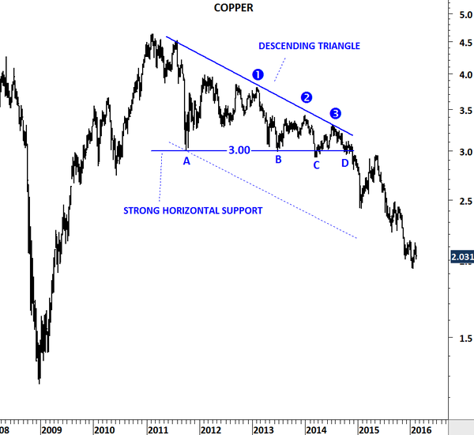

# Alçalan Üçgen (Descending Triangle) Formasyonu

**Alçalan Üçgen** formasyonu, teknik analizde genellikle **düşüş trendinin devamını** gösteren bir fiyat yapısı olarak kabul edilir. Bu formasyon, fiyat hareketlerinin zamanla daha düşük zirveler yaparken, belirli bir seviyede dirençle karşılaştığı ve sonunda güçlü bir düşüş hareketinin gerçekleşebileceği sinyalini verir. Alçalan üçgen, genellikle mevcut bir düşüş trendinin devam edeceğini işaret eder.

## **Formasyonun Yapısı:**

Alçalan üçgen, iki ana trend çizgisinden oluşur:

1. **Üst Trend Çizgisi (Direnç)**: Fiyatların sürekli olarak daha düşük zirveler yaparken, bu zirveler belirli bir seviyede sıkışır. Bu seviyede, fiyatlar genellikle geri çekilerek yatay bir direnç hattı oluşturur.

2. **Alt Trend Çizgisi (Destek)**: Fiyatlar, daha düşük dipler yaparak bir destek çizgisi oluşturur. Bu çizgi, zamanla daha yatay hale gelir veya yavaşça yükselir. Fiyat, bu alt destek seviyesinde sıkışmaya devam eder.

Alçalan üçgenin en belirgin özelliği, **üst direnç çizgisinin** daha eğimli bir şekilde aşağıya doğru ilerlemesi ve **alt destek çizgisinin** genellikle yatay kalmasıdır. Fiyatlar bu sıkışma alanı içinde hareket ederken, en sonunda bir kırılma yaşanır.

## **Formasyonun Gelişimi:**

Alçalan üçgen formasyonu, genellikle şu adımlardan oluşur:

1. **Başlangıç Aşaması**: Fiyatlar belirli bir düşüş trendinde hareket etmeye başlar. Bu aşamada, fiyatlar giderek daha düşük zirveler yapar ve üst direnç çizgisine birkaç kez dokunur. Ancak bu çizgi, genellikle daha aşağıya doğru eğilim gösterir.

2. **Sıkışma Aşaması**: Fiyatlar, alt destek çizgisine yaklaşırken daha düşük dipler yapar. Aynı zamanda, üst direnç çizgisine de daha düşük zirvelerle yaklaşır. Bu sıkışma, piyasadaki belirsizliği ve fiyatların hangi yönde hareket edeceği konusundaki kararsızlığı gösterir.

3. **Kırılma Aşaması**: Sonunda, fiyat alt destek çizgisini kırarak güçlü bir düşüş hareketi başlatır. Bu kırılma, genellikle **düşüş trendinin devam edeceği** ve fiyatın daha düşük seviyelere doğru ilerleyeceği anlamına gelir.

## **Alçalan Üçgenin Yönü ve Hedef Fiyatı:**

- **Kırılma Yönü**: Alçalan üçgen formasyonu, genellikle **düşüş trendinin devamını** gösterir. Fiyat, alt destek çizgisini kırdıktan sonra daha düşük seviyelere inmeye devam eder.
- **Hedef Fiyat**: Kırılma sonrası, formasyonun yüksekliği (fiyat aralığı) dikkate alınarak bir hedef fiyat hesaplanabilir. Bu hedef fiyat, üçgenin yüksekliğinin kırılma noktasına eklenmesiyle belirlenir.
  - **Hedef Fiyat = Kırılma Noktası - Üçgenin Yüksekliği**

## **Alçalan Üçgenin Özellikleri:**

- **Düşüş Eğilimi**: Alçalan üçgenin en önemli özelliği, üst direnç çizgisinin aşağıya doğru eğilmesidir. Bu, piyasanın giderek daha zayıf hale geldiğini ve satış baskısının arttığını gösterir. Alt destek çizgisi, fiyatları desteklemeye çalışırken, zirveler giderek daha düşük seviyelere iner.
  
- **Devam Formasyonu**: Alçalan üçgen, genellikle mevcut düşüş trendinin devamını gösteren bir **devam formasyonu** olarak kabul edilir. Bununla birlikte, her zaman bu şekilde gelişmeyeceği için dikkatli bir analiz gereklidir. Bazen formasyon, piyasanın dönüşünü de işaret edebilir.

- **Sıkışan Fiyatlar**: Alçalan üçgen, genellikle sıkışan fiyat hareketlerini gösterir. Fiyatlar, sürekli olarak daha düşük zirveler yaparken, bir noktada bu sıkışma sona erer ve güçlü bir kırılma ile yeni bir hareket başlar.

## **Alçalan Üçgenin Hacimle İlişkisi:**

- **Hacim Artışı**: Kırılma anında hacmin artması, alçalan üçgenin güvenilirliğini artıran bir faktördür. Hacmin artması, kırılmanın güçlü olduğunu ve fiyatın yeni yönde hızla hareket etmeye başlayacağını gösterir. Yatırımcılar, kırılma noktasında hacmin artmasını dikkatle izlemelidir.

- **Hacim Düşüşü**: Eğer kırılma düşük hacimle gerçekleşirse, bu genellikle yanıltıcı olabilir. Düşük hacimli bir kırılma, fiyatın geri dönme olasılığını artırır. Bu nedenle, alçalan üçgenin doğruluğunu artırmak için hacimle birlikte doğrulama yapılması önemlidir.

## **Alçalan Üçgenin Avantajları:**

1. **Trendin Devamını Gösterir**: Alçalan üçgen formasyonu, genellikle mevcut düşüş trendinin devam edeceğini gösterir. Bu, yatırımcılar için **satış fırsatları** yaratabilir.
2. **Ticaret Fırsatları**: Formasyonun kırılma noktasından sonra güçlü bir düşüş hareketi meydana gelebilir. Yatırımcılar, kırılma sonrasında **kısa (satış) pozisyonları** açarak kazanç sağlayabilirler.
3. **Hacimle Doğrulama**: Hacim artışı ile kırılmanın doğrulanması, kırılmanın güçlü ve doğru olduğunu gösterir, bu da daha güvenilir ticaret kararları almayı sağlar.

## **Alçalan Üçgenin Zorlukları:**

1. **Yanıltıcı Kırılmalar**: Alçalan üçgen formasyonu, bazı durumlarda yanıltıcı kırılmalara neden olabilir. Fiyat, alt destek çizgisini kırdıktan sonra beklenen düşüş yerine, geri dönebilir. Bu nedenle kırılma sonrası dikkatli bir izleme gereklidir.
  
2. **Kısa Vadeli Yanılgılar**: Alçalan üçgen, genellikle **orta vadeli** bir formasyon olarak kabul edilir. Kısa vadeli analizlerde, formasyonun doğru çalışıp çalışmayacağını öngörmek zor olabilir. Bu yüzden formasyonun uzun süreli gelişimi dikkate alınmalıdır.
