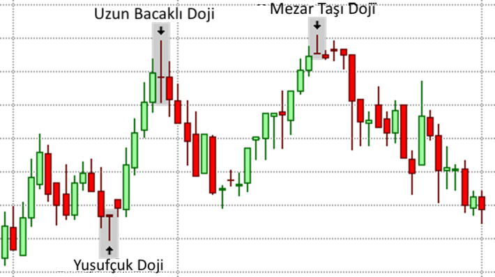

# Doji Formasyonu

**Doji**, Forex ve diğer finansal piyasalarda, fiyatların belirli bir zaman diliminde kararsızlık gösterdiğini ve genellikle bir trend dönüşünün habercisi olabileceğini gösteren bir mum formasyonudur. Doji'nin oluşumu, alıcılar ve satıcılar arasında denge olduğunu, ancak piyasanın hangi yönde hareket edeceği konusunda net bir karar verilmediğini simgeler. Bu nedenle, Doji genellikle **piyasanın kararsız olduğunu ve trend dönüşü olabileceğini** işaret eden önemli bir formasyon olarak kabul edilir.

## **Doji'nin Yapısı:**

Doji'nin tanınan en önemli özelliği, **açılış fiyatı ile kapanış fiyatının neredeyse aynı** veya çok yakın olmasıdır. Bu, fiyatın o zaman dilimi içinde büyük ölçüde sabit kaldığı anlamına gelir. Doji mumunun tipik özellikleri şunlardır:

- **Cisim (Body):** Doji'nin cismi çok incedir ya da tamamen yoktur, çünkü açılış ve kapanış fiyatları neredeyse eşittir.
- **Gölge (Wick):** Doji'nin gövdesinin üstünde ve altında belirgin **uzun gölgeler** olabilir. Bu, fiyatın o dönem boyunca yüksek ve düşük seviyelere doğru hareket ettiğini, ancak sonunda piyasanın dengeye ulaştığını gösterir.

Doji'nin birkaç çeşidi vardır:

- **Çapraz Doji (Cross Doji):** Gövde yoktur ve sadece uzun üst ve alt gölgeler vardır.
- **Yıldız Doji (Star Doji):** Hem üst hem de alt gölgeler vardır, ancak genellikle daha kısa gövdeli olur.
- **İnverted Doji (Ters Doji):** Uzun bir üst gölge ve kısa bir alt gölgeye sahip olabilir.

## **Doji'nin Anlamı ve Kullanımı:**

Doji, piyasanın kararsız olduğunu ve fiyatın genellikle aşağı ve yukarı yönlü hareketler gösterdikten sonra dengeye geldiğini ifade eder. Bu durum, alıcılar ve satıcılar arasında bir **dengelenme** olduğunu ve herhangi bir tarafın diğerine üstünlük sağlayamadığını gösterir.

Doji'nin en yaygın olarak kullanıldığı bağlam, **trend dönüşü** veya **piyasada kararsızlık** dönemleridir. Özellikle güçlü bir trendin ardından oluşan Doji, mevcut trendin zayıfladığına ve bir dönüşün olabileceğine dair bir sinyal olabilir.

## **Doji'nin Oluşum Alanları:**

- **Yükseliş Trendinde Doji:** Eğer bir yükseliş trendi sırasında bir Doji oluşursa, bu genellikle **satıcıların piyasada güç kazandığı** anlamına gelir. Bu, alıcıların yeterince güçlü olmadığı ve fiyatların yataylaşabileceği veya düşmeye başlayabileceği anlamına gelir.
  
- **Düşüş Trendinde Doji:** Bir düşüş trendi sırasında oluşan Doji, genellikle **alıcıların piyasaya girmeye başladığının** bir işaretidir. Bu, trendin zayıfladığı ve fiyatların yatay hareket etmeye ya da yükselmeye başlayabileceği bir durumu gösterir.

## **Doji ve Trend Dönüşü:**

Doji'nin en güçlü anlamı, genellikle **trend dönüşü** ile ilişkilendirilmesidir. Yükseliş veya düşüş trendi boyunca bir Doji'nin ortaya çıkması, mevcut trendin bitmek üzere olduğu ve fiyatın yön değiştirmeye başlayabileceği anlamına gelir.

Doji formasyonunun tek başına güçlü bir sinyal olarak kullanılmaması gerektiği unutulmamalıdır. Diğer teknik analiz araçlarıyla doğrulama yapılması önemlidir. Örneğin:

- **Hacim:** Doji'nin ardından yüksek hacimle bir kırılma olursa, bu dönüşün daha güçlü olabileceğini gösterebilir.
- **Destek/Direnç Seviyeleri:** Doji'nin, önemli bir destek ya da direnç seviyesinde oluşması, dönüş sinyalini daha güçlü hale getirebilir.

## **Doji'nin Çeşitleri:**

1. **Çapraz Doji (Cross Doji):** En yaygın Doji türüdür. Genellikle piyasanın kararsız olduğu ve ileride büyük bir hareketin olabileceği sinyalini verir.
2. **İnverted Doji (Ters Doji):** Üst gölge uzun, alt gölge kısa olan bu formasyon, fiyatların yukarı doğru hareket etme eğiliminde olduğunu gösterebilir.
3. **Yıldız Doji:** Yıldız Doji, piyasanın çok hızlı bir şekilde dengesizleştiğini ve büyük bir değişim öncesi sıkıştığını ifade eder.

## **Doji'nin Stratejik Kullanımı:**

- **Ticaret Stratejisi:** Doji, genellikle ticaret stratejilerinin başlangıcında veya devamında kullanılır. Örneğin:
  - **Yükseliş Trendinde Doji:** Yükseliş trendinin sonunda oluştuğunda, satıcıların baskı yapmaya başladığının bir işareti olabilir ve satım fırsatı arayışında olunabilir.
  - **Düşüş Trendinde Doji:** Düşüş trendinin sonlarında oluştuğunda, alıcıların piyasa üzerinde etkili olmaya başladığını ve alım fırsatlarının oluşabileceğini gösterebilir.
  
- **Diğer Teknik Göstergelerle Kombinasyonu:** Doji'yi daha güvenilir kılmak için, genellikle **gösterge**, **hacim** ve **destek/direnç** seviyeleri ile kombine edilir. Örneğin, Doji'nin ardından gelen güçlü bir **MACD** sinyali, bu formasyonun dönüş sinyali verdiğini doğrulayabilir.

## **Doji'nin Avantajları:**

1. **Kararsızlık Göstergesi:** Doji, piyasanın kararsız olduğunu ve önemli bir değişimin eşiğinde olduğunu gösterir.
2. **Dönüş Sinyali:** Doji, özellikle güçlü bir trendin sonunda oluştuğunda, potansiyel bir trend dönüşünü işaret edebilir.
3. **Esnek Kullanım:** Doji, hem yükseliş hem de düşüş trendlerinde kullanılabilir ve çeşitli zaman dilimlerinde etkili olabilir.

## **Doji'nin Zorlukları:**

1. **Yanıltıcı Olabilir:** Doji, bazen sadece piyasanın geçici bir kararsızlık durumunu yansıtabilir ve hemen ardından trend devam edebilir. Bu nedenle, tek başına güvenilir bir sinyal olmayabilir.
2. **Gecikmeli Sinyaller:** Doji, piyasanın kararsız olduğunun bir göstergesi olduğundan, genellikle birkaç mumluk bir süreyi kapsar. Bu da ticaret fırsatlarını kaçırma riskini artırabilir.
