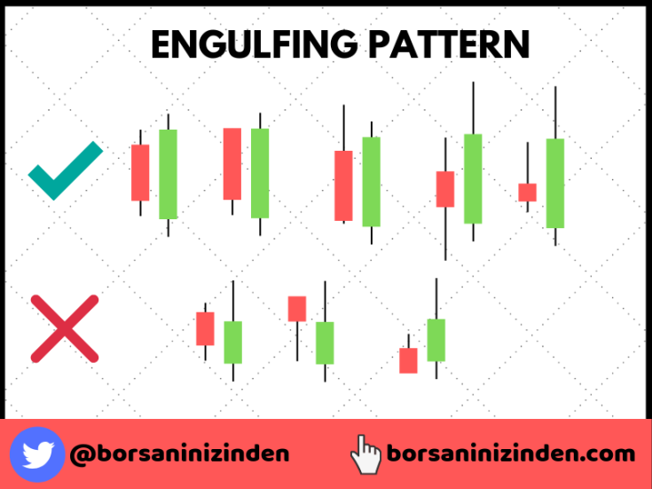

# Yutan Mum (Engulfing Candle) Formasyonu

**Yutan Mum (Engulfing Candle)**, Forex ve diğer finansal piyasalarda önemli bir trend dönüş formasyonudur. Bu formasyon, bir mumun tamamen önceki mumun "içine" girmesiyle oluşur. Yutan Mum formasyonu, güçlü **trend dönüş sinyalleri** verir ve genellikle bir **boğa** ya da **ayı trendinin** sona erdiğini ve tersine hareketin başlayabileceğini gösterir.

## **Yutan Mum Formasyonunun Yapısı:**

Yutan Mum, iki mumdan oluşur:

- **İlk Mum (İç Mum):** Yutan Mum'un ilk mumudur ve genellikle küçük bir cisme sahip olabilir.
- **İkinci Mum (Dış Mum):** İkinci mum, ilk mumun tamamen içine alacak şekilde daha büyük bir cisme sahip olmalıdır. Bu mum, önceki mumun maksimum ve minimum seviyelerinin her ikisini de aşmalıdır.

Yutan Mum, hem **boğa** (yükseliş) hem de **ayı** (düşüş) trendlerinde oluşabilir. Yutan Mum formasyonunun iki çeşidi vardır:

1. **Boğa Yutan Mumu (Bullish Engulfing):**
   - **Boğa Yutan Mumunun Oluşumu:** Bu formasyon, bir düşüş mumunun (kırmızı) ardından gelen bir yükseliş mumunun (yeşil) önceki düşüş mumunu tamamen kapsaması ile oluşur.
   - **Anlamı:** Boğa Yutan Mumu, düşüş trendinin son bulduğunu ve fiyatın yukarı yönlü hareket etmeye başlayabileceğini gösterir. Bu formasyon, alıcıların baskın hale geldiğini ve satıcıların zayıfladığını işaret eder.

2. **Ayı Yutan Mumu (Bearish Engulfing):**
   - **Ayı Yutan Mumunun Oluşumu:** Bu formasyon, bir yükseliş mumunun (yeşil) ardından gelen bir düşüş mumunun (kırmızı) önceki yükseliş mumunu tamamen kapsaması ile oluşur.
   - **Anlamı:** Ayı Yutan Mumu, yükseliş trendinin sona erdiğini ve fiyatın aşağı yönlü hareket etmeye başlayabileceğini gösterir. Bu formasyon, satıcıların baskın hale geldiğini ve alıcıların zayıfladığını işaret eder.

## **Yutan Mum Formasyonunun Anlamı:**

Yutan Mum, güçlü bir **trend dönüşü sinyali** olarak kabul edilir. İki mumun birbirini yutması, piyasada önemli bir değişim olduğunu ve yönün tersine dönme olasılığının arttığını gösterir. Bu formasyon, fiyatın büyük bir değişim yapmaya hazır olduğuna dair güçlü bir işaret olabilir.

- **Boğa Yutan Mumunun (Bullish Engulfing)** oluşumu, düşüş trendinin sona erdiğini ve alıcıların piyasaya girdiğini gösterir. Bu durumda, yatırımcılar alım pozisyonlarına girebilir.
- **Ayı Yutan Mumunun (Bearish Engulfing)** oluşumu, yükseliş trendinin sona erdiğini ve satıcıların piyasada hakim olduğunu gösterir. Bu durumda, yatırımcılar satış pozisyonlarına girebilir.

## **Yutan Mumunun Stratejik Kullanımı:**

Yutan Mum, genellikle fiyat hareketi ve hacimle birlikte değerlendirilerek daha güçlü bir sinyal haline gelir. Yutan Mum'un başarılı bir şekilde kullanılabilmesi için aşağıdaki noktalar dikkate alınmalıdır:

1. **Trendin Durumu:** Yutan Mum, genellikle güçlü bir trendin sonlarında oluşur. Yükselen bir piyasada Ayı Yutan Mumu veya düşen bir piyasada Boğa Yutan Mumu, önemli bir dönüş sinyali olabilir.

2. **Destek ve Direnç Seviyeleri:** Yutan Mum'un önemli destek veya direnç seviyelerinde oluşması, formasyonun gücünü artırır. Bu seviyelerde oluşan Yutan Mum, fiyatın bu seviyeleri kıracağı ve büyük bir hareket başlatacağı anlamına gelebilir.

3. **Hacim (Volume):** Yutan Mum'un ardından gelen yüksek hacim, bu formasyonun geçerliliğini artırır. Yüksek hacim, piyasanın yeni yönü desteklediğini ve daha büyük hareketlerin beklenebileceğini gösterir.

## **Yutan Mum Formasyonunun Güçlü Yönleri:**

- **Trend Dönüşü Sinyali:** Yutan Mum, genellikle güçlü bir trend dönüşü sinyali verir. Özellikle kısa vadeli ticaret stratejilerinde kullanılabilecek etkili bir formasyondur.
- **Basit ve Kolay Tanınabilir:** Yutan Mum formasyonu, kolayca tanınabilen ve yorumlanabilen bir yapıya sahiptir. Bu, yatırımcılar için kullanımını kolaylaştırır.
- **Yüksek Güvenilirlik:** Özellikle güçlü bir trendin sonunda oluştuğunda, Yutan Mum formasyonu güvenilir bir sinyal olarak kabul edilebilir.

## **Yutan Mum Formasyonunun Zayıf Yönleri:**

- **Yanıltıcı Olabilir:** Yutan Mum formasyonu, bazı durumlarda yanlış sinyaller verebilir. Özellikle düşük hacimli piyasalarda, Yutan Mum'un geçerliliği düşük olabilir.
- **Daha Fazla Doğrulama Gerektirir:** Yutan Mum tek başına bir işlem sinyali olarak yeterli olmayabilir. Diğer teknik analiz araçları (örneğin, destek/direnç seviyeleri, göstergeler gibi) ile doğrulama yapmak, daha sağlam bir strateji oluşturulmasına yardımcı olur.
- **Kısa Vadeli Oynaklık:** Yutan Mum kısa vadeli piyasa dalgalanmalarını işaret edebileceğinden, uzun vadeli işlem stratejileri için her zaman uygun olmayabilir.

## **Yutan Mum Formasyonunun Ticaret Stratejileri:**

1. **Boğa Yutan Mumu Stratejisi (Bullish Engulfing Strategy):**
   - Bir düşüş trendi sırasında, **Boğa Yutan Mumu** oluştuğunda, alım pozisyonu açılabilir. Ancak, bu sinyalin geçerliliğini artırmak için yüksek hacim veya yakın bir destek seviyesinde oluşması göz önünde bulundurulmalıdır.
   - Stop-loss seviyesi, formasyonun altındaki bir düşük seviyeye yerleştirilebilir.

2. **Ayı Yutan Mumu Stratejisi (Bearish Engulfing Strategy):**
   - Bir yükseliş trendi sırasında, **Ayı Yutan Mumu** oluştuğunda, satış pozisyonu açılabilir. Yüksek hacim veya yakın bir direnç seviyesinde oluşması durumunda, bu sinyal daha güçlü hale gelir.
   - Stop-loss seviyesi, formasyonun üstündeki bir yüksek seviyeye yerleştirilebilir.
