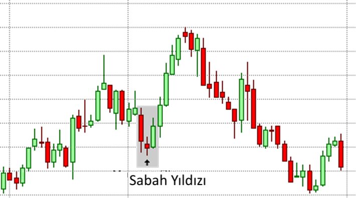

# Sabah Yıldızı (Morning Star) Formasyonu

**Sabah Yıldızı (Morning Star)**, Forex ve diğer finansal piyasalarda sıkça karşılaşılan ve genellikle **düşüş trendinin sona erdiğini ve yükselişin başlayabileceğini** gösteren bir trend dönüş formasyonudur. Bu formasyon, üç mumdan oluşur ve genellikle **trend dönüşü** sinyali olarak güçlü bir işaret kabul edilir.

## **Sabah Yıldızı (Morning Star) Formasyonunun Yapısı:**

Sabah Yıldızı formasyonu, üç ardışık mumdan oluşur:

1. **İlk Mum (Düşüş Mumudur):** Bu mum, güçlü bir düşüş trendinin devamını gösterir ve genellikle uzun bir kırmızı (düşüş) mumdur. Bu mum, piyasanın hala satış baskısı altında olduğunu ve düşüş trendinin sürdüğünü işaret eder.

2. **İkinci Mum (Yıldız Mumudur):** Bu mum, genellikle daha küçük bir mumdur ve **gölgesi çok kısa** olabilir. Bu mumun gövdesi genellikle önceki muma göre daha kısa olur. İkinci mum, piyasanın kararsız olduğunu ve alıcıların ve satıcıların eşit güçte olduğunu gösterir. Bu mum, piyasada **geçici bir duraklama veya konsolidasyon** dönemine işaret eder. Bu mum bazen **doji** veya **çekiç (hammer)** gibi mum formasyonları olabilir.

3. **Üçüncü Mum (Yükseliş Mumudur):** Üçüncü mum, güçlü bir **yeşil (yükseliş) mumudur** ve ilk mumu tamamen tersine çevirerek yükselir. Bu mum, alıcıların piyasaya hakim olmaya başladığını ve fiyatın yukarı yönlü hareket edeceğini gösterir. Genellikle, üçüncü mum önceki iki mumun yüksek seviyesinin üzerinde kapanır.

## **Sabah Yıldızı (Morning Star) Formasyonunun Anlamı:**

Sabah Yıldızı formasyonu, piyasada belirgin bir **trend dönüşü** sinyali olarak kabul edilir. Bu formasyon, önceki düşüş trendinin sona erdiğini ve **yükseliş trendinin başlayabileceğini** işaret eder. Formasyon, özellikle güçlü bir düşüş trendinin sonunda ortaya çıkarsa, bu piyasanın yön değiştirdiğine dair güçlü bir sinyaldir.

- **Düşüş Trendinin Sona Erdiği:** İlk mumdaki güçlü düşüş, satış baskısının devam ettiğini gösterse de, ikinci mumdaki daralma ve üçüncü mumun güçlü yükselişi, alıcıların piyasaya girmeye başladığının işaretidir.
- **Yükseliş Trendinin Başlangıcı:** Üçüncü mum, alıcıların baskın hale geldiğini ve piyasada yükseliş hareketinin başladığını gösterir. Bu, yatırımcılar için **alım fırsatlarını** işaret eder.

## **Sabah Yıldızı (Morning Star) Formasyonunun Güçlü Yönleri:**

1. **Trend Dönüşü Sinyali:** Sabah Yıldızı, güçlü bir düşüş trendinin ardından **yükselişin** başlayacağını gösterir ve bu nedenle trend dönüşünü takip etmek isteyen yatırımcılar için güçlü bir sinyal olabilir.

2. **Fiyatın Yükselmesi:** Üçüncü mum, fiyatın yukarı yönlü hareket edeceğine dair net bir gösterge sağlar. Bu, özellikle yükselişin güçlü bir şekilde başladığı ve piyasada **alıcıların** gücünün arttığı anlamına gelir.

3. **Görsel Olarak Kolay Tanınabilir:** Sabah Yıldızı formasyonu, özellikle ilk mumun büyük bir düşüş, ikinci mumun küçük ve dar bir işlem aralığı, üçüncü mumun ise güçlü bir yükseliş göstermesi ile görsel olarak tanınması kolaydır.

## **Sabah Yıldızı (Morning Star) Formasyonunun Zayıf Yönleri:**

1. **Yanıltıcı Olabilir:** Sabah Yıldızı formasyonu, bazen sadece geçici bir fiyat toparlanmasını işaret ediyor olabilir. Yükseliş, sadece kısa vadeli olabilir ve piyasa yeniden düşüş trendine girebilir. Bu nedenle, formasyon tek başına her zaman güvenilir olmayabilir.

2. **Düşük Hacimle Oluşabilir:** Eğer formasyon düşük işlem hacmi ile oluşuyorsa, bu sinyalin doğruluğu azalabilir. Yükselişin gerçek olup olmadığını belirlemek için daha yüksek hacimle doğrulama yapılması önemlidir.

3. **Diğer Teknik Araçlarla Desteklenmeli:** Sabah Yıldızı formasyonu, tek başına kullanılmamalıdır. Diğer teknik analiz araçları (örneğin, destek/direnç seviyeleri, hareketli ortalamalar, hacim göstergeleri gibi) ile doğrulama yapılması gereklidir.

## **Sabah Yıldızı (Morning Star) Formasyonunun Ticaret Stratejisi:**

- **Alım Pozisyonu:** Eğer Sabah Yıldızı formasyonu bir düşüş trendinin sonunda güçlü bir şekilde oluşuyorsa ve ardından hacimli bir yükseliş geliyorsa, bu, alım pozisyonu açmak için uygun bir sinyal olabilir. Üçüncü mumun kapanış fiyatı, önceki mumların seviyelerini aşmalıdır.
  
- **Stop-Loss Seviyesi:** Eğer alım pozisyonu açılacaksa, stop-loss seviyesi genellikle ikinci mumun düşük seviyesine yakın bir yerde yerleştirilir. Bu, piyasanın tekrar düşüş trendine girme olasılığına karşı bir güvenlik önlemi sağlar.

- **Doğrulama ve Hacim:** Formasyonun doğruluğunu artırmak için, yüksek hacimle desteklenen bir Sabah Yıldızı formasyonu daha güçlü bir sinyal olabilir. Ayrıca, önemli destek seviyelerinde oluşması da bu sinyalin gücünü artırır.

## **Sabah Yıldızı (Morning Star) Formasyonunun Oluşum Alanları:**

- **Destek Seviyelerinde:** Sabah Yıldızı formasyonu, fiyatın **destek seviyelerinde** oluştuğunda daha güçlü bir sinyal olabilir. Bu seviyelerde alıcıların devreye girmesi ve piyasanın yukarı yönlü hareket etmesi olasılığı artar.
  
- **Güçlü Düşüş Trendlerinin Sonunda:** Sabah Yıldızı genellikle uzun süreli ve güçlü bir düşüş trendinin ardından oluşur. Bu formasyonun ardından, fiyatın toparlanma göstermesi beklenebilir.
