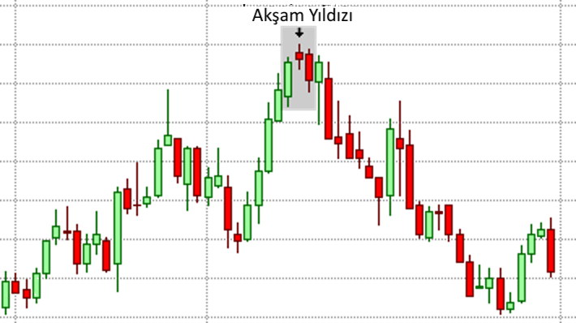

# Akşam Yıldızı (Evening Star) Formasyonu

**Akşam Yıldızı (Evening Star)**, finansal piyasalarda sıkça görülen ve güçlü bir **trend dönüş formasyonu** olarak kabul edilen bir yapılandırmadır. Bu formasyon, **yükseliş trendinin sona erdiğini ve düşüşün başlayabileceğini** işaret eder. Akşam Yıldızı, genellikle **yükselişin bitişi ve düşüşün başlangıcı** olarak yorumlanır ve yatırımcılar için önemli bir **satış fırsatı** oluşturabilir.

## **Akşam Yıldızı (Evening Star) Formasyonunun Yapısı:**

Akşam Yıldızı formasyonu, üç ardışık mumdan oluşur:

1. **İlk Mum (Yükseliş Mumudur):** İlk mum, güçlü bir **yükseliş** hareketini gösteren uzun bir **yeşil (yükseliş) mumudur**. Bu mum, piyasanın alıcılar tarafından kontrol edildiğini ve fiyatın yukarı yönlü hareket ettiğini gösterir. Yükseliş trendinin devam ettiğini işaret eder.

2. **İkinci Mum (Yıldız Mumudur):** İkinci mum, **küçük ve dar** bir mumdur ve **gölgesi kısadır**. Bu mum, piyasanın kararsız olduğu ve alıcılar ile satıcıların arasında dengede bir durum oluştuğunu gösterir. Bu mum, genellikle **doji**, **yıldız (star)** veya **çekiç (hammer)** gibi formasyonlara sahip olabilir. İkinci mum, piyasanın konsolide olduğu veya duraklama aşamasına geçtiği bir dönemi işaret eder.

3. **Üçüncü Mum (Düşüş Mumudur):** Üçüncü mum, güçlü bir **kırmızı (düşüş) mumudur** ve önceki iki mumun yüksek seviyelerinin üzerine çıkarak düşüşe geçer. Bu mum, piyasanın **satıcılar tarafından kontrol edildiğini** ve fiyatın aşağı yönlü hareket etmeye başladığını gösterir. Genellikle, üçüncü mum önceki iki mumun yüksek seviyesinin üzerinde kapanarak fiyatın düşüşe geçeceğini teyit eder.

## **Akşam Yıldızı (Evening Star) Formasyonunun Anlamı:**

Akşam Yıldızı, özellikle **yükseliş trendinin sonunda oluştuğunda**, piyasanın **dönüş sinyali** verdiğini gösterir. Bu formasyon, bir yükseliş trendinin **son bulduğunu** ve fiyatın **aşağı yönlü hareket etmeye başlayabileceğini** işaret eder. Akşam Yıldızı, **düşüşün** başlayacağına dair güçlü bir sinyaldir.

- **Yükselişin Sonu:** Akşam Yıldızı, fiyatın daha önce yukarı yönlü hareket ettiği bir dönemde, bir duraklama ve ardından keskin bir düşüş hareketi başladığını gösterir. Bu, alıcıların piyasayı terk ettiğini ve satıcıların baskın hale geldiğini gösterir.
  
- **Düşüşün Başlangıcı:** Üçüncü mum, satış baskısının arttığını ve fiyatın düşüş yönünde hareket etmeye başladığını teyit eder. Bu, piyasa için **satış fırsatları** yaratabilir ve yatırımcılar, düşüş yönünde pozisyon açmayı düşünebilir.

## **Akşam Yıldızı (Evening Star) Formasyonunun Güçlü Yönleri:**

1. **Trend Dönüşü:** Akşam Yıldızı formasyonu, bir yükseliş trendinin sona erdiği ve fiyatın düşüşe geçmeye başladığına dair güçlü bir sinyal verir. Bu, özellikle uzun vadeli yatırımcılar ve trend takipçileri için önemli bir sinyaldir.

2. **Görsel Olarak Kolay Tanınabilir:** Akşam Yıldızı formasyonu, üç mumdan oluştuğu için görsel olarak tanınması kolaydır. İlk mum, güçlü bir yükselişi, ikinci mum bir kararsızlığı, üçüncü mum ise güçlü bir düşüşü gösterir.

3. **Satış Fırsatları:** Akşam Yıldızı, piyasa dönüşü sinyali verdiği için yatırımcılara **satış pozisyonu açmak** için fırsat sunar. Bu formasyonun ardından düşüş yaşanabileceği beklentisiyle **kısa pozisyon açılabilir**.

## **Akşam Yıldızı (Evening Star) Formasyonunun Zayıf Yönleri:**

1. **Yanıltıcı Olabilir:** Akşam Yıldızı formasyonu, bazen sadece kısa vadeli fiyat hareketlerini işaret ediyor olabilir. Yükselişin bitişi olarak görünen bir hareket, sadece geçici bir düzeltme olabilir ve piyasa yeniden yükselmeye devam edebilir. Bu nedenle, formasyon tek başına her zaman güvenilir olmayabilir.

2. **Düşük Hacimle Oluşabilir:** Eğer formasyon düşük hacimle oluşuyorsa, bu durum formasyonun doğruluğunu azaltabilir. Yükselişin ardından gelen düşüşün gerçek olup olmadığına karar vermek için hacim takibi yapmak önemlidir.

3. **Doğrulama Gerekliliği:** Akşam Yıldızı formasyonu, diğer teknik analiz araçları ile desteklenmeli ve doğrulanmalıdır. Destek/direnç seviyeleri, hareketli ortalamalar veya hacim göstergeleri gibi araçlar, formasyonun doğruluğunu artırabilir.

## **Akşam Yıldızı (Evening Star) Formasyonunun Ticaret Stratejisi:**

- **Satış Pozisyonu:** Akşam Yıldızı formasyonu, bir yükselişin sona erdiğini ve düşüşün başlayabileceğini işaret ettiğinden, satış pozisyonu açmak için iyi bir fırsat olabilir. Üçüncü mumun kapanışı, satıcıların piyasayı kontrol etmeye başladığının ve düşüşün başladığının göstergesidir.
  
- **Stop-Loss Seviyesi:** Eğer satış pozisyonu açılacaksa, stop-loss seviyesi genellikle formasyonun ilk mumunun yüksek seviyesinin biraz üzerine yerleştirilir. Bu, piyasada yanlış bir hareket olduğunda pozisyonun korunmasına yardımcı olur.

- **Doğrulama:** Akşam Yıldızı'nın doğruluğunu artırmak için, formasyonun oluştuğu bölgedeki **direnç seviyeleri** göz önünde bulundurulmalıdır. Ayrıca, hacim göstergeleri ve diğer teknik analiz araçları ile formasyonun teyit edilmesi gerekmektedir.

## **Akşam Yıldızı (Evening Star) Formasyonunun Oluşum Alanları:**

1. **Direnç Seviyelerinde:** Akşam Yıldızı formasyonu, **direnç seviyelerinde** oluştuğunda güçlü bir sinyal olabilir. Bu seviyelerde oluşan Akşam Yıldızı, piyasanın bu seviyeyi aşamayacağını ve düşüşün başlayacağını gösterebilir.

2. **Güçlü Yükseliş Trendlerinin Sonunda:** Akşam Yıldızı formasyonu, genellikle güçlü bir yükseliş trendinin sonlarında oluşur. Bu, piyasanın bir dönüş yapmak üzere olduğunun güçlü bir göstergesidir.
