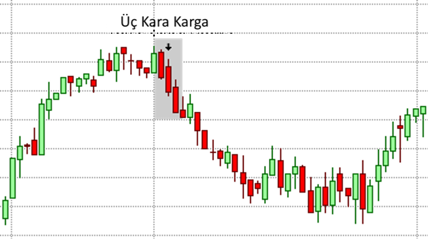

# Üç Kara Karga (Three Black Crows) Formasyonu

**Üç Kara Karga (Three Black Crows)**, finansal piyasalarda sıkça görülen ve güçlü bir **trend dönüş formasyonu** olarak kabul edilen bir yapıdır. Bu formasyon, **yükseliş trendinin sona erdiğini ve düşüşün başladığını** gösterir. "Üç Kara Karga" adı, üç ardışık **kırmızı mum** (düşüş) oluşumunu ifade eder ve bu mumlar, piyasanın satıcılar tarafından kontrol altına alındığını ve fiyatın aşağı yönlü hareket ettiğini işaret eder.

## **Üç Kara Karga (Three Black Crows) Formasyonunun Yapısı:**

**Üç Kara Karga**, ardışık olarak üç düşüş mumunun sırasıyla açılmasıyla oluşan bir formasyondur. Formasyonun doğru şekilde çalışabilmesi için aşağıdaki özelliklere sahip olmalıdır:

1. **Birinci Mum:** İlk mum, önceki yükselişin sonunda oluşur ve uzun bir kırmızı (düşüş) mumdur. Bu mum, fiyatın zirveye yaklaştığını ve düşüşün başladığını gösterir.

2. **İkinci Mum:** İkinci mum, önceki mumun içinde başlar ve yine uzun bir kırmızı (düşüş) mumdur. Bu, piyasanın satıcılar tarafından kontrol edildiğini ve alıcıların piyasadan çekildiğini gösterir.

3. **Üçüncü Mum:** Üçüncü mum da bir kırmızı (düşüş) mumdur ve önceki mumdan daha uzun olabilir. Bu mum, düşüşün devam ettiğini ve piyasanın satıcılar tarafından tamamen kontrol altına alındığını gösterir.

## **Üç Kara Karga (Three Black Crows) Formasyonunun Anlamı:**

**Üç Kara Karga**, piyasa üzerinde güçlü bir düşüş sinyali verir ve genellikle **yükseliş trendinin sona erdiği** ve **düşüşün başladığı** anlamına gelir. Bu formasyonun oluşumu, yatırımcılar için bir **satış fırsatı** olabilir. İşte formasyonun anlamı:

- **Yükselişin Sonu:** Üç Kara Karga formasyonu, daha önce güçlü bir yükseliş trendi görülen bir dönemin sonunda ortaya çıkar. Bu, alıcıların piyasadan çekildiğini ve satıcıların piyasa üzerinde kontrol kurduğunu gösterir. Yükseliş trendi sona erer ve piyasa düşüşe geçer.

- **Düşüşün Başlangıcı:** Üç Kara Karga formasyonu, ardışık olarak üç güçlü düşüş mumunun oluşmasıyla, düşüşün ivme kazandığını gösterir. Bu, piyasa üzerindeki satış baskısının arttığını ve fiyatların aşağı yönlü hareket etmeye başladığını işaret eder.

- **Güçlü Satış Sinyali:** Formasyon, yatırımcılar için güçlü bir **satış fırsatı** olabilir. Üç Kara Karga, düşüşün derinleşeceğini ve piyasanın daha fazla aşağıya kayacağını öngören bir sinyaldir. Yatırımcılar, formasyonun gerçekleştiği bölgelerde satış pozisyonları açmayı düşünebilirler.

## **Üç Kara Karga (Three Black Crows) Formasyonunun Anlamlı Olabilmesi İçin Şartlar:**

1. **Önceki Yükselişin Gücü:** Üç Kara Karga formasyonunun daha anlamlı olabilmesi için, önceki dönemde belirgin bir **yükseliş trendi** olmalıdır. Yükselişin bitişi ve düşüşün başlangıcı çok daha güçlü bir sinyal verir. 

2. **Hacim Artışı:** Üç Kara Karga formasyonu, genellikle **yüksek işlem hacmi** ile birlikte meydana gelir. Hacmin artması, satıcıların baskısının arttığını ve piyasada güçlü bir düşüş hareketinin başladığını doğrular.

3. **Kapanış Fiyatlarının Önemli Seviyelere Ulaşması:** Formasyonun sonunda, üçüncü mumun kapanış fiyatı önceki mumun en düşük seviyesinin altında olmalıdır. Bu durum, düşüşün daha da derinleşeceğini gösteren bir teyit sağlar.

## **Üç Kara Karga (Three Black Crows) Formasyonunun Güçlü Yönleri:**

1. **Trend Dönüşü:** Üç Kara Karga formasyonu, güçlü bir **yükseliş trendinin sona erdiğini** ve düşüşün başladığını işaret eden bir formasyondur. Bu, özellikle **trend takipçileri** ve **kısa pozisyon açmayı planlayan** yatırımcılar için önemli bir sinyaldir.

2. **Görsel Olarak Kolay Tanınabilir:** Üç Kara Karga formasyonu, üç ardışık düşüş mumunun görünür şekilde ortaya çıkmasıyla kolayca tanınabilir. Bu, piyasanın kontrolünün satıcılara geçtiği ve fiyatların düşüşe geçeceğini gösterir.

3. **Düşüş Sinyali:** Bu formasyon, piyasada güçlü bir düşüş yaşanabileceğine dair **satış sinyali** verir. Yatırımcılar, bu sinyali dikkate alarak **kısa pozisyonlar** açabilirler.

## **Üç Kara Karga (Three Black Crows) Formasyonunun Zayıf Yönleri:**

1. **Yanıltıcı Olabilir:** Her zaman güvenilir olmayabilir. Üç Kara Karga formasyonu bazen yalnızca geçici bir düzeltmeyi işaret ediyor olabilir. Yani, piyasa çok hızlı bir şekilde toparlanabilir ve fiyat yeniden yükselmeye başlayabilir.

2. **Yanıltıcı Bozulmalar:** Üç Kara Karga formasyonunun içinde bazen küçük geri çekilmeler veya alıcıların yeniden piyasaya girmesi gibi kısa süreli değişiklikler olabilir. Bu, formasyonun gücünü zayıflatabilir.

3. **Hacim Kontrolü:** Hacmin düşük olduğu durumlarda, formasyon daha az geçerli olabilir. Hacimle doğrulanmayan bir Üç Kara Karga formasyonu, yanlış bir sinyal verebilir.

## **Üç Kara Karga (Three Black Crows) Formasyonunun Ticaret Stratejisi:**

1. **Satış Pozisyonu Açma:** Üç Kara Karga formasyonu genellikle **satış pozisyonları** açmak için iyi bir fırsat sağlar. Bu formasyonun ardından, piyasanın düşüşe geçeceğini düşündüğünüzde, **kısa pozisyonlar** açılabilir. Üçüncü mumun kapanışından sonra satış yapmak iyi bir strateji olabilir.

2. **Stop-Loss Seviyesi:** Satış pozisyonu açarken, stop-loss seviyesi genellikle formasyonun ilk mumunun yüksek seviyesinin biraz üzerinde olmalıdır. Bu, yanlış bir sinyal durumunda pozisyonun korunmasını sağlar.

3. **Doğrulama:** Formasyonun doğruluğunun artırılması için, **hacim göstergeleri** ve **destek/direnç seviyeleri** gibi diğer teknik analiz araçları ile formasyonun teyit edilmesi gerekir. Hacim artışı, formasyonun gerçek bir düşüş trendi başlatma olasılığını artırır.

## **Üç Kara Karga (Three Black Crows) Formasyonunun Oluşum Alanları:**

1. **Yüksek Direnç Seviyelerinde:** Üç Kara Karga, genellikle piyasanın **yüksek direnç seviyelerinde** oluştuğunda güçlü bir sinyal olabilir. Bu seviyelerde, fiyatın yukarı yönlü hareketi zorlaşır ve satıcılar piyasaya hakim olmaya başlar.

2. **Yükseliş Trendinin Sonunda:** Formasyon, genellikle güçlü bir yükselişin ardından oluşur. Yükselişin son bulduğu ve piyasanın düşüşe geçmeye başladığı bir dönemde bu formasyon güçlü bir satış sinyali oluşturur.
