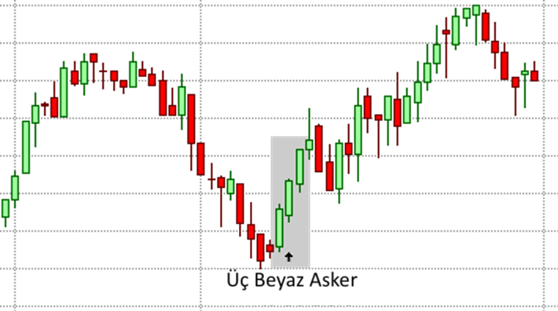

# Üç Beyaz Asker (Three White Soldiers) Formasyonu

**Üç Beyaz Asker (Three White Soldiers)**, finansal piyasalarda görülen güçlü bir **trend dönüş formasyonudur**. Bu formasyon, **düşüş trendinin sona erdiğini ve yükselişin başladığını** gösterir. "Üç Beyaz Asker" adı, üç ardışık **yeşil mum** (yükseliş) oluşumunu ifade eder. Bu mumlar, piyasanın alıcılar tarafından kontrol altına alındığını ve fiyatların yukarı yönlü hareket ettiğini gösterir.

## **Üç Beyaz Asker (Three White Soldiers) Formasyonunun Yapısı:**

**Üç Beyaz Asker**, ardışık olarak üç **yükselen mumun** sırasıyla oluşmasıyla meydana gelir. Formasyonun güçlü bir şekilde çalışabilmesi için aşağıdaki özelliklere sahip olmalıdır:

1. **Birinci Mum:** İlk mum, önceki düşüşün sonunda oluşur ve genellikle uzun bir yeşil (yükseliş) mumdur. Bu, piyasanın bir süreliğine alıcılar tarafından kontrol edilmeye başlandığını ve yükselişin ilk sinyallerini verdiğini gösterir.

2. **İkinci Mum:** İkinci mum da genellikle uzun bir yeşil (yükseliş) mumdur ve önceki mumun içinden başlar. Bu mum, alıcıların piyasaya hakim olmaya devam ettiğini ve yükselişin güçlendiğini işaret eder.

3. **Üçüncü Mum:** Üçüncü mum da bir yeşil (yükseliş) mumdur ve genellikle ikinci mumdan daha uzun olabilir. Bu mum, yükselişin devam ettiğini ve piyasa üzerinde alıcıların baskın olduğunu gösterir.

## **Üç Beyaz Asker (Three White Soldiers) Formasyonunun Anlamı:**

**Üç Beyaz Asker**, piyasada güçlü bir **yükselişin başladığını** ve düşüş trendinin sona erdiğini işaret eden bir formasyondur. Bu formasyonun anlamı şudur:

- **Düşüşün Sonu:** Üç Beyaz Asker formasyonu, daha önce güçlü bir düşüş trendi görülen bir dönemin sonunda ortaya çıkar. Bu, alıcıların piyasaya hakim olmaya başladığını ve fiyatların yükselmeye başladığını gösterir.

- **Yükselişin Başlangıcı:** Formasyonun oluşumu, düşüş trendinin sona erdiğini ve piyasanın yeni bir yükseliş trendine girdiğini gösterir. Üç ardışık yeşil mum, alıcıların kontrolü elinde tutmaya devam edeceğini işaret eder.

- **Güçlü Alım Sinyali:** Üç Beyaz Asker formasyonu, yatırımcılara güçlü bir **alım fırsatı** sunar. Bu formasyon, piyasada yükselişin devam etme olasılığının yüksek olduğunu gösterdiği için alım pozisyonları açmak için ideal bir sinyal olabilir.

## **Üç Beyaz Asker (Three White Soldiers) Formasyonunun Anlamlı Olabilmesi İçin Şartlar:**

1. **Önceki Düşüşün Gücü:** Üç Beyaz Asker formasyonunun geçerli olabilmesi için, önceki dönemde belirgin bir **düşüş trendi** olmalıdır. Bu, piyasanın güçlü bir şekilde satıcılar tarafından kontrol edilmesinin ardından, alıcıların devreye girmesiyle yükselişin başladığını gösterir.

2. **Hacim Artışı:** Üç Beyaz Asker formasyonu genellikle **yüksek işlem hacmi** ile birlikte meydana gelir. Hacmin artması, alıcıların piyasa üzerinde güçlü bir baskı kurduğunu ve fiyatların yükselmeye devam edeceğini doğrular.

3. **Kapanış Fiyatlarının Önemli Seviyelere Ulaşması:** Formasyonun sonunda, üçüncü mumun kapanış fiyatı önceki mumun en yüksek seviyesinin üzerinde olmalıdır. Bu, yükselişin devam edeceğini gösteren bir teyit sağlar.

## **Üç Beyaz Asker (Three White Soldiers) Formasyonunun Güçlü Yönleri:**

1. **Yükselişin Başlangıcı:** Üç Beyaz Asker formasyonu, piyasanın **yükseliş trendine girdiği** ve fiyatların yukarı yönlü hareket etmeye başladığı bir dönemde oluşur. Bu, özellikle **alıcılar** için güçlü bir alım sinyali olabilir.

2. **Görsel Olarak Kolay Tanınabilir:** Üç Beyaz Asker formasyonu, üç ardışık yükselen mumla kolayca tanınabilir. Bu, piyasada alıcıların baskın olduğunu ve fiyatların artmaya devam edeceğini gösterir.

3. **Güçlü Alım Sinyali:** Bu formasyon, piyasa üzerinde alıcıların baskın olduğu ve fiyatların artış göstereceği yönünde güçlü bir **alım sinyali** verir. Yatırımcılar, bu sinyali dikkate alarak **uzun pozisyonlar** açmayı düşünebilirler.

## **Üç Beyaz Asker (Three White Soldiers) Formasyonunun Zayıf Yönleri:**

1. **Yanıltıcı Olabilir:** Her zaman güvenilir olmayabilir. Üç Beyaz Asker formasyonu bazen yalnızca geçici bir düzeltmeyi işaret ediyor olabilir. Yani, piyasa çok hızlı bir şekilde geri çekilebilir ve fiyat yeniden düşmeye başlayabilir.

2. **Yanıltıcı Bozulmalar:** Üç Beyaz Asker formasyonunun içinde bazen küçük geri çekilmeler veya satıcıların yeniden piyasaya girmesi gibi kısa süreli değişiklikler olabilir. Bu, formasyonun gücünü zayıflatabilir.

3. **Hacim Kontrolü:** Hacmin düşük olduğu durumlarda, formasyon daha az geçerli olabilir. Hacimle doğrulanmayan bir Üç Beyaz Asker formasyonu, yanlış bir sinyal verebilir.

## **Üç Beyaz Asker (Three White Soldiers) Formasyonunun Ticaret Stratejisi:**

1. **Alım Pozisyonu Açma:** Üç Beyaz Asker formasyonu, genellikle **alım pozisyonları** açmak için iyi bir fırsat sağlar. Bu formasyonun ardından, piyasanın yükselişe devam edeceğini düşündüğünüzde, **uzun pozisyonlar** açılabilir. Üçüncü mumun kapanışından sonra alım yapmak iyi bir strateji olabilir.

2. **Stop-Loss Seviyesi:** Alım pozisyonu açarken, stop-loss seviyesi genellikle formasyonun ilk mumunun düşük seviyesinin biraz altında olmalıdır. Bu, yanlış bir sinyal durumunda pozisyonun korunmasını sağlar.

3. **Doğrulama:** Formasyonun doğruluğunun artırılması için, **hacim göstergeleri** ve **destek/direnç seviyeleri** gibi diğer teknik analiz araçları ile formasyonun teyit edilmesi gerekir. Hacim artışı, formasyonun gerçek bir yükseliş trendi başlatma olasılığını artırır.

## **Üç Beyaz Asker (Three White Soldiers) Formasyonunun Oluşum Alanları:**

1. **Düşük Destek Seviyelerinde:** Üç Beyaz Asker formasyonu, genellikle piyasanın **düşük destek seviyelerinde** oluştuğunda güçlü bir sinyal olabilir. Bu seviyelerde, fiyatın yukarı yönlü hareket etme olasılığı artar.

2. **Düşüş Trendinin Sonunda:** Formasyon, genellikle güçlü bir düşüşün ardından oluşur. Düşüşün son bulduğu ve piyasanın yükselmeye başladığı bir dönemde bu formasyon güçlü bir alım sinyali oluşturur.
