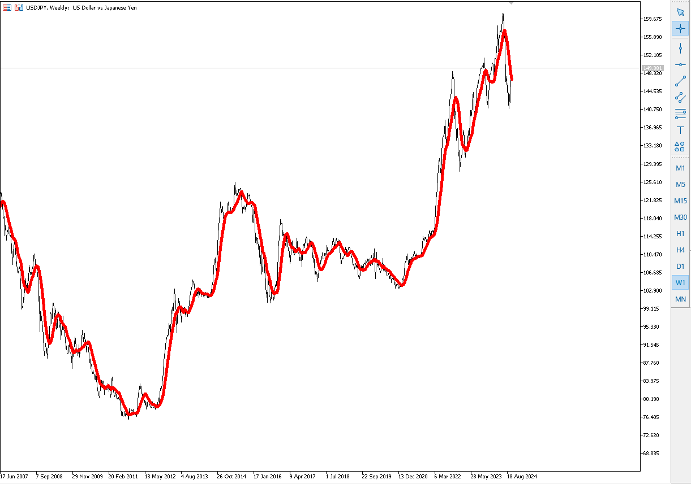
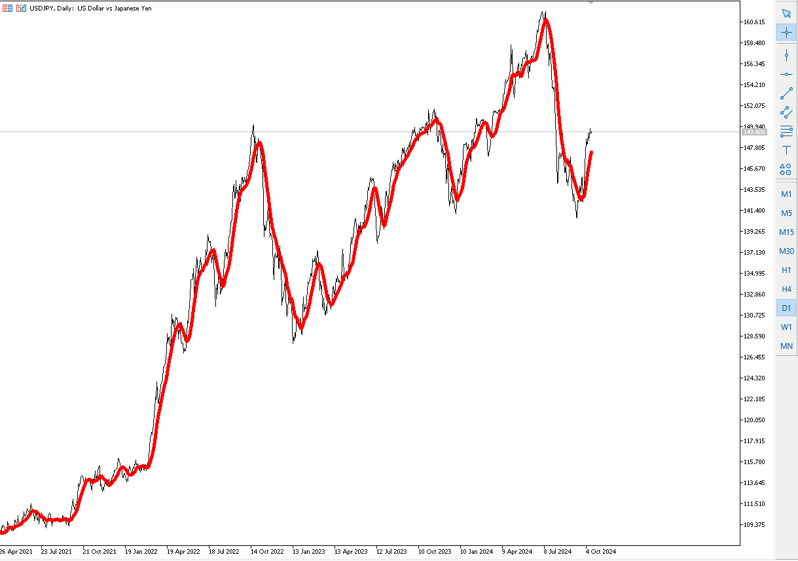

# Piyasaya giriş çıkış kararı almak

Bir para çifti üzerinde alım kararı vermek için öncelikle kağıdın uzun süreli davranışını analiz etmek gerekir. Bunu grafikler ile analiz edelim.

İnceleme için USD/JPY para çiftini kullanalım.

## Aylık USD/JPY

Bu grafikte aylık bakış sağlanış ve yıllar içinde USD/JPY performansı görülüyor. Hızlı bir analiz ile, Doların Japon Yeni karşısında hızla eridiği görülüyor. Aslında daha iyi anlayabilmek için aynı grafiğe şöyle bakabilirsiniz:

Zaman içinde inen grafik şöyle de yorumlanabilir:
1 Dolar ile 350 Yen alınabiliyorken, zaman içinde  70 yen alınabilecek kadar değer kaybetmiş. Değer kaybeden USD. Çünkü geçmişte 1 dolar ile 340 Yen alınabiliyorken, grafiğin dip noktasında 1 dolar ile 70 Yen'ler seviyesine geldiğini görüyoruz. Diğer bir bakış açısı ile, Japonya parlayan yıldız. Sürekli değer kazanmış Amerikan para birimi karşısında.

Günümüzde biraz değer kaybetmiş Japoan yeni, bunu grafiğin sağdaki en on durumuna bakarak söyleyebiliyoruz. Çünkü 1 dolar şu an 150 Yen seviyelerinde.

Peki çok hızlı bir bakış ile bu grafikten Yen'in Dolar karşısında değer kaybetmeye başladığını söyleyebilirmiyiz. Evet bu grafiğe göre söyleyebiliriz. Ama bu bakış açısı bizi finansal çöküşe götürebilir. Pek çok açıdan forex piyasası nasıl analiz edilir, birlikte göreceğiz.

## Haftalık USD/JPY

Aynı grafiğe haftalık bakış sağladığımızda Doların Yen karşısında değerlendiğini görüyoruz. Aylık bakışa göre zoom yaparak baktığımız piyasa bize doların zaferini gösteriyor. Çünkü 1 dolar ile 76 Yen'den 150 Yen'e varan bir satın alma gücü. 2011 kasım ayında 76 yen alabilen dolar, günümüzde 150 yen seviyelerinde. Demekki günümüzde dolar kazanan taraf. Ama hala piyasayı kavramak ve yorumlama noktasından çok uzağız. Çünkü paramızı yatırıp 15 yıl bekleyemeyiz. Burası fore piyasası ve saniyelerin bile öneli olduğu dünya.

Şimdi bir adım daha öteye gidip günlük grafiğe bakalım.

## Günlük USD/JPY

Buradaki hızlı analize göre 2022 yılında 1 Dolar 108 Yen alabiliyorken, 2024 temmuz ayında 160 yen alabilir duruma gelmiş. Yani bir amerikalı cebindeki 1 dolar ile 108 yen yerine 160 yenlik satın alma yapabilecek. Demekki Doların satın alma değeri artmış.

Bu grafikleri 4 saatlik, 1 saatlik, 30 dakikalık, 15 dakikalık ve hatta 5 dakika, 1 dakika seviyelerine kadar indirip çok detaylı analiz yapabilir.

Önemli olan biz hangi vadede işleme girip çıkacağız. 1 saat mi, 10 yıl mı?

İşte forex dünyasındaki en değerli soru bu, vaden ne olmalı.

## Kaldıraç

Eğer aylık bakış açısı ile bakarsak, 1970 yılından 2012 yılına kadar Japon Yeni çok güçlenmiş. Ama biz 100 doları 40 yıl bekleyecek değiliz. Zaten forex dünyası böyle işlemiyor. Bu dünyada kaldıraçlar var. 1'e yüz kaldıraç. Yani 100 dolar ile girdiğiniz piyasada 10.000 dolarlık alım yapıyorsunuz. Yani 1970 yılında cebinizdeki 100 dolar yerine size açılan kredi sayesinde 10.000'lık yen alıyorsunuz. Tabi katlanacağınız spreadler size maliyet. Ama şimdi bu konuyu göz ardı edelim. Bizim forex kaldıracını anlamamız gerekiyor. 1970 yılında 10.000 dolar ile alım yaptığımızda o gün cebimizdeki para ile (1 Dolar 350 Yen olsun) 3.500.000 yen alabiliyorduk. 2012 yılında satıpcebimize dolar koymak istersek (1 Dolar 70 Yen olsun), hesapladığımızda 50.000 Dolar geriyen cebimize koyabildik. Peki ne oldu şimdi.

Aslında 1970 yılında cebimizde 100 dolar vardı. 2012 yılına hesabımızda 50.000 dolar oldu. 49900 dolar kazanılan ek para oldu. 100 dolara karşılık cebimizde artık 50.000 dolar paramız var. Ana para dahil toplamda 50.000 dolar sahibiyiz. Kaldıraç kuvveti sayesinde paramızı 100 kat daha yüksek kazandık.

Ama kaybedebilirdikte, eğer piyasadaki aldığımız 10.000 dolar 9.900'a düşseydi, teminatımız 100 dolar olduğu için piyasadan atılırdık. Yani 100 dolarımızı kaybederdik.

Yukarıdaki hikaye sizlere sadece kaldıraç kuvvetini anlamanız için anlatıldı. Fakat gerçek çok daha  derin ve acı. Forex iş dünyasında evet kurallar bu kadar basit ama derinliklerinde çok daha detay var. Hepsini kavramak uzmanlık ve deneyim gerektirecek.

## Kaybedeceksiniz

Size tavsiyem herkesin tersi olacak, eğitiminizi gerçek piyasada minik paralar ile yapın. Kaybedeceksiniz. Ama kaybettiğiniz para sizi üzmeyecek kadar olsun. Kaybedeceğinizi bilerek piyasaya girin. Çünkü deneyim sadece formüller ya da kurallar ile olmaz, mutlaka deneyimlemeniz gerekiyor. Bunu eğitim masrafları olarak görürseniz, en iyi eğitmenden alacağınız eğitimden daha iyi olacaksınız.

Tekrar söylüyorum, kazanmak için bu piyasaya girilmez, kaybedeceksiniz gibi hazırlanmanız gerekli. Bu forex iş adamlarının büyük kısmının hazırlık tekniğidir. Ne kadar kaybedeceksiniz, bu pozisyon için ne kadar kaybetmeye hazırsınız, ama kazanırsanız ne kadar kazanacaksınız. Oran 1/3 ise, yani 1 kaydbederken 3 kazanmak üzerine hazırlık yaptıysanız, kardasınız demektir. Burayı size biraz anltayım.

Aylık haftalık günlük ve hatta saatlik analizlerinizi tamamladınız. Herşey tam sizin istediğiniz gibi. Göstergeler teknik analizleriniz, haber akışları, haftanın günü, hatta gün içerisindeki saat bile artık herşeyin hazır olduğunu size söylüyor. Hatta şanslı kolyeniz ve dularınız ya da pek çok matranız tamamlandı. Unutmayın, forex piyasası piara çiftleri devletlerin savaşıdır. Siz aslında onların savaşına dahil oluyorsunuz. Herşey tam sizin istediğiniz gibi olacakken, bir anda o ülkede bir işçi ayaklanması oldu, grev çıktı, iki devlet görevlisi televizyonda kavga etti, bir anda sizin para birimlerinizden birisini etkileyecek bir gelişme oldu. Elinizdeki tüm sermayeyi kaybetme riskiniz ortaya çıkabilir. Eğer kaybetmeye hazır olarak hazırlık yapmanız durumunda, öngörülemez koşullar olması ihtimalini her zaman hazır tutarsanız ve dersinize kedin kaybedeceğim diye çalışarak başlarsanız, kaybetme riskini düşünerek  hazırlık yaparsınız. Yani piyasadan çıkış kurallarını hazırlamış olursunuz. Riski minimize etmek önemli.

## Kurgunuz önemli, kaybedeksiniz, bunu bilin

Kayıp kazanç oranı 1 e 3 oldun dedik. Aslında siz her şeyi mükemmel hazırladınız. Hatta evdeki en şanslı kişi olarak hazırsınız. Unutmayın, bu piyasada sizin gücünüz denizde damla kadar anlamsız. Çünkü günlük 8 trilyon doarlık bir piyasa hareketleri içerisinde, devletlerin savaş verdiği bir ortamda ortaya koyduğunuz 100 dolar denizdki fındık kabuğu bile değil. Piyasadaki en küçük dalgalanmada denizin dibini boylarsınız. Ama denizin dalgalı olduğunu kabul ederseniz, fındık kabuğuna az ürün koyar riskinizi azaltırsınız. Zaten her gün dalga olmayacak. Arada olacak. Önemli olan o dalga geldiğinde tüm sermayenin fındık kabuğunda olmaması. Kaybetmeniz durumunda biraz kaybedin. Riski en aza indirin. Kazançlarınızı dışarı güvenceye alın ve sabırlı olun. Unutmayın sizi her zaman izleyen yapay zeka algoritmaları var ve sizi her zaan izliyorlar. Sizi iştahkaldırmak için her şeyi yapıyorlar. İlk büyük oyununuzda başka bir etki sayesinde manüplasyon olabilir ve elinizdekini yine kaybedebilirsiniz. Her zaman kaybedeceksiniz gibi kurgunuzu tamamlayın. Riski minimize edin. Her 10 pozisyondan  5'ini kaybedeceğinizi bilin. Çünkğ sonsuz olasılıklar evreninde %50 yazı %50 tura gelir. Kazancınız 3 lira kaybınız 1 lira ise, sonsuz olasılıklar evreninde 2 lira kardasınız demektir. Bu bir oyun değil, pisikoloji savaşı, hatta hayatınız. Çok dikkatli olun. Kaybedeceksiniz gibi akıllı olun, canlı piyasada kendinizi ufak paralar ile eğitin, eğitim masrafı olarak düşünün, ama sonsuz cesaretle ve kararlılıkta olun. Bu bir kumar değil, bir strateji platfomu. Akıllı kurgular sayesinde her zaman kazanan siz olacaksınız.

## Cesaret Riske girmek değildir. Aptallık etmeyin

Asla cesareti riske girmek olarak değerlendirmeyin. Aptallar bu hatayı yapar.

Öncelikle forex piyasasını videolardan dinleyin, öğrenin, risk analizlerini anlayın, kar zarar hesaplamalarını ve bütçe yönetimini iyi kavrayın. Sonra aşağıdaki adımları inceleyin.

Şimdi 10 dolar ile bir piyasa girişi yapalım ve 4-5 saatte piyasadan çıkalım. Mini bir simulasyon gibi. Burada kaybetmek değil kazanmak üzerine bir süreci izleyeceğiz.

10 dolar ve 100 kaldıraç ile piyasaya girdim. Benim teminatım 10 dolar. 100 kaldıraç ile 1000 dolarlık piyasa işlem yapabilme hakkım var. Eğer 10 doların tümüyle Japon Yeni alırsam (dolar/yen paritesi 150 olsun, yani 1 dolar 150 yen alabilsin), benim 150.000 yen param olacak. Ben piyasada BUY ile girdim. Ne demek bu BUY SELL. Kısaca BUY dediğimde DOLAR/YEN işleminde doların artacağını düşünerek paramı yukarı çıkacak diyerek işleme giriyorum. Eğer 150.000 yen ilerleyen saatlerde minik hareketler ile 150.300 yene yükselirse 300 yen para kazandım demektir. Yani 1 dolar 150 yenden hesaplarsak yaklaşık 2 dolar olacak kazancım. Yaklaşık diyorum, çünkü şu anda artık 1 dolar 150.300 yen oldu. Yani tam rakam ile 1.996 dolar karım var. Spread için de 5 cent ödemem durumunda 1.496 dolar cebime girdi. Herkes butun kıvırdı değil mi :) Şöyle bakın, bankamdaki 10 dolarım bir kaç saat içinde 11.496 dolar oldu. 2-3 saatin içinde %14.96 kazanç elde ettim. Eğer profesyonel olsaydınız, 10.000 teminat ile 1 işlemde yaklaşık 1500 dolar cebinize kar girecekti. Haftanın 5 günü 24 saatlik bir piyasa. Akıl alır gibi değil.

## Bileşik Kazanç

Eğer her gün yani haftanı 5 günü 2 pozisyona girseniz ve 1'inde başarılı işleminiz olsa, her işlemde de %3 kar hedefi koysanız, girişteki paranızdan elde edeceğiniz karın bit kısmını belirli seviyelere geldiğinizde dışarı alsanız; bakın 1 yılda neler olacak. Aşağıda minik bir analiz.

Her işleme girdiğimizde binde 1 işleme giriş parası ödüyoruz olarak kabul edelim (sperad).

Girişte 1000 dolarım var 100 kaldıraç kullanacağım.

İlk giriş 100.000 dolar ile olacak. İki işlem yapacağım günde. Giriş seviyelerini analiz eden bu yardımcı araçları kulanacağım. Hedefim işlemde %3. İştahımı kapalı tutacağım. Riske fazla girmeyeceğim. %50 gibi riskli bir hedef koyup paramı fazla riske atmayacağım. Yani her işlemde hedefim 30 dolar kar ya da 10 dolar zarar. Yani kazanırsam 1030 dolarım olacak, aksi durumda param 990 dolara inecek. Çünkü 1/3 oranında kar zarar edecek şekilde kurgumu planlıyorum.

Birinci işlemden %3 ile 30 dolar kar realize ediyorum. Buradaki işlemleri anlamanız için anlatıyorum. Gerçek buna yakın olsa da hikayeyi iyi anlamanız önemli. Piyasaya kaybedecek gibi girmeniz ve ona göre hazırlanmanız önemli. Çünkü piyasanın hangi tarafındayız bilmiyoruz. Riski minimize etmek ve paranın dalgalanmasında riski en aza indirmek istiyoruz.

Unutmayın, paranın 3 birim bizim istediğiniz yöne doğru hareket etmesine karşılık, bizim tahminimizin tersine 1 birim hareketi söz konusu. Eüer iyi hazırlanmazsak, paranın 1 birim tahminimizin tersine yol alabilmesi ve bizim 10 dolar zarar görürsek piyasadan çık emrimizin olması ihtimali daha yüksek. Aslında beklentimiz 3 birim bizim yönümüzde harekte etmesi durumunda 30 dolar kari aksi durumda 10 dolar zarar ile işlemi sonlandıracağız. Ama mutlaka sonlandıracağız. Kar ya da zarar.

Şimdi işlemdeki paramız hep 1000 dolar olacak şekilde kurgumuza devam edelim ve 1 yılda ne olacak bakalım. Aslında yıl içerisinde de piyasanın 200 gün açık olduğunu düşünelim, 2 işleme girdiğimizi ve 1 işlemi kaydetttiğimizi düşünelim. Hadi başlayalım.

200 günde 400 işlem açacağız. Bunun 200 tanesi başarılı olacak ve bunlardan 30 dolar kar edeceğiz. Diğer 200 tanesi zarar olacak ve işlem başına 10 dolar kaybedeceğiz. Yani 200 * 30 = 6000 dolar ek gelir, başarısız işlemlerden dolayı 200 * 10 = 2000 dolar kayıp. Kısaca yıl sonunda 4000 dolar net kar. Tabi şunuda ekleyelim, her seferinde 1000 dolarla girdiğimizi varsayıyoruz. Fazla parayı diğer heaplara alıyoruz. 1000 doların altına düştüğümüzde de hemen eksikleri kapatıp 1000 dolar seviyesinde tutmaya devam ediyoruz. En basitinden ana paramız dahil günde iki işleme girerek paramızı 1 yılda 1000 dolara ana para + 4000 dolar kazanç ve sonuç olarak 5000 dolar paramız oldu. 1000 doların 5000 dolara yükselmesi %500 faiz kazancı gibi yorumlanabilir. Harika. EN basit yöntemi ile kazanç bu. Ama bu anlamanız için çok basit anlatıldı.

Eğer kasadaki paranızın tümüyle hep aynı algoritmayı kullansaydık, yani 1/3 oranında kaz zarar ve piyasaya giriş ve çıkış için sürekli çalışan bir algoritma ve paramızı birden fazla uygun parabirimine sürekli dağıtan, alım satım yapan bir yapay zeka yardımcınız devrede olsaydı, bannalar gibi sizde sürekli kazanır olabilrdiniz. Gelin bileşik kazanç hesabı ile biraz önceki durumu forex piyasaı için yeniden hesaplayalım. Bir cümle daha, piyasada her zaman kazanabilirsiniz. O kadar çok yöntem var ki :) Ama doğru öğrenmeniz gerekiyor.

1000 dolar ile işleme giriyoruz. Algoritmalar bu sefer analizleri sonucu bizi günde 10 belki 20 pozisyona soktu. Birincisi süreç artık bilgisayarlar tarafından işleniyor. Yan 10 kadar ya da 20 kat kadar daha fazla işleme girebiliriz. Ya da daha az, bilemiyorum. Şimdi biz yine eski hesaplama ile aynı kalması için günde 2 pozisyon açtığını düşünelim. Ama elimizdeki karlar da işleme giriyor. Yani 1000 dolar, 1030 dolar, 1019.7 dolar, 1050.291 dolar, ...

Peki nasıl hesapladığımızı anlayalım. %3 kar için 1.03 , %1 zarar için .099 ile çarparak işlemleri basitleştireceğim.

1000 dolar: %3 kar ile 1030 dolar (1000 * 1.03)
1030 dolar: %1 zarar ile 1019.7 dolar  (1030 * 0.99)
1019.7 dolar: %3 kar ile 1050.291 dolar (1019.7 * 1.03)

bu işlemleri 10 adım inceleyelim. 5 günün sonuda yani 1 haftada.

Tüm adımlarda %3 kar ve %1 zarar oranları sabit tutulduğunda sonuçlar şu şekilde oluşur:

İşlemdeki kar ve zarar oranlarını sabit tutarak 10 adım ilerleyelim. Başlangıç değeri olarak 1000 dolardan başlayarak her adımda %3 kar ve %1 zarar oranlarını uygulayacağız.

1. **Adım 0:** 1000.00 dolar
2. **Adım 1:** 1000.00 * 1.03 = 1030.00 dolar
3. **Adım 2:** 1030.00 * 0.99 = 1019.70 dolar
4. **Adım 3:** 1019.70 * 1.03 = 1050.29 dolar
5. **Adım 4:** 1050.29 * 0.99 = 1039.79 dolar
6. **Adım 5:** 1039.79 * 1.03 = 1070.09 dolar
7. **Adım 6:** 1070.09 * 0.99 = 1059.39 dolar
8. **Adım 7:** 1059.39 * 1.03 = 1091.15 dolar
9. **Adım 8:** 1091.15 * 0.99 = 1080.24 dolar
10. **Adım 9:** 1080.24 * 1.03 = 1111.84 dolar
11. **Adım 10:** 1111.84 * 0.99 = 1100.73 dolar

Toplamda 400 adım gittiğimizde, yani 200 gün ve iki işlem olarak, yıl sonunda ne olur :) bakın rakam bu şekilde olacak.

- **399. adım**: 49,986.03 dolar
- **400. adım**: 49,486.17 dolar

%3 kar ve %1 zarar oranları sabit tutularak yapılan işlemler sonucunda başlangıçtaki 1000 dolar 400 adım sonunda **49,486.17 dolar** oldu.

Evet bileşik işlemlerde robot yazılımlarında paramızı bu şekilde yönetmesini istediğimizde paramız yıl sonunda yaklalık 50 kat arttı. Yani %5000 kar. İnanılmaz değil mi?

Geliştirdiğimiz strateji günde 10 pozisyona girseydi rakam nasıl olurdu :) 10 kat fazla diyenler olacak, ama yanlıııııııııııış. Bakın ne olacak. Toplamda 200 gün ve 2000 işleme girecekti. 1000 zarar 1000 kar olacaktı. Hadi sonuca bakalım.

**49142.90 dolar**

Hatta yazının sonu olarak tüm listeyi de hemen alta ekliyorum. İncelemek isteyen piskopatlar için listenin tamamına buradan ulaşabilirsiniz.

[400 işlem iterasyon incelemek için](400-islem-iterasyon.md)
