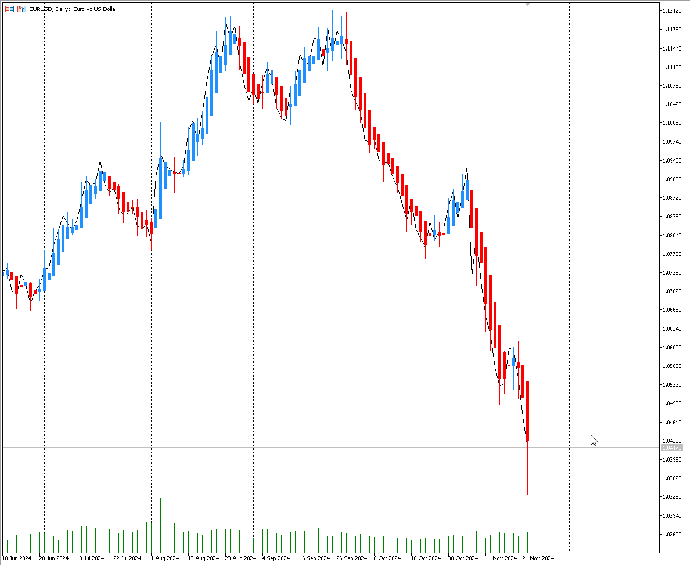

# **Heiken Ashi**

Heiken Ashi, Japonca kökenli bir teknik analiz göstergesidir ve genellikle finansal piyasalarda, özellikle de borsa ve döviz piyasalarında fiyat hareketlerini anlamak ve ticaret kararları almak için kullanılır. Heiken Ashi, "Heiken" (ortalama) ve "Ashi" (şerit) kelimelerinin birleşiminden türetilmiştir ve bu gösterge, genellikle geleneksel mum çubuklarına benzer şekilde, fiyat hareketlerini görsel olarak sunar ancak daha pürüzsüz ve düzenli bir görünüm elde etmek için fiyatların ortalamalarını alır.

## Heiken Ashi'nin Temel Özellikleri

Heiken Ashi'nin temel amacı, fiyat hareketlerini daha net bir şekilde analiz etmek ve trendleri daha rahat görebilmek için standart mum çubuklarının göstergesini iyileştirmektir. Heiken Ashi çubukları genellikle daha az "gürültü" içerir ve piyasa yönünü takip etmeyi kolaylaştırır.

Heiken Ashi'nin normal mum çubuklarından farkı, çubuğun her zaman tamamen yeni bir hesaplama ile oluşturulmasıdır. Geleneksel mum çubukları, belirli bir zaman dilimindeki açılış, kapanış, yüksek ve düşük fiyatları baz alırken, Heiken Ashi, bu fiyatların ortalamalarını kullanır.

## Heiken Ashi Hesaplaması

Heiken Ashi'nin her bir çubuğu, şu şekilde hesaplanır:

1. **Heiken Ashi Kapanışı (Close):**
   \[
   \text{Heiken Ashi Close} = \frac{\text{Açılış} + \text{Yüksek} + \text{Düşük} + \text{Kapanış}}{4}
   \]
   Bu formül, o periyodun ortalama fiyatını hesaplar.

2. **Heiken Ashi Açılışı (Open):**
   \[
   \text{Heiken Ashi Open} = \frac{\text{Heiken Ashi Açılışı (önceki periyot)} + \text{Heiken Ashi Kapanışı (önceki periyot)}}{2}
   \]
   Bu, bir önceki Heiken Ashi çubuğunun açılışı ve kapanışının ortalamasıdır.

3. **Heiken Ashi Yüksek (High):**
   \[
   \text{Heiken Ashi High} = \text{Max}(Yüksek, Heiken Ashi Açılışı, Heiken Ashi Kapanışı)
   \]
   Bu, o periyodun en yüksek fiyatıdır.

4. **Heiken Ashi Düşük (Low):**
   \[
   \text{Heiken Ashi Low} = \text{Min}(Düşük, Heiken Ashi Açılışı, Heiken Ashi Kapanışı)
   \]
   Bu, o periyodun en düşük fiyatıdır.

## Heiken Ashi Göstergesinin Yorumlanması

Heiken Ashi mum çubukları, geleneksel mum çubuklarına göre daha pürüzsüz bir görünüme sahip olduğu için, trendleri daha net bir şekilde gösterir. Aşağıda Heiken Ashi çubuklarının nasıl yorumlanacağına dair bazı temel işaretler bulunmaktadır:

1. **Yeşil (Beyaz) Mum Çubuğu:**
   - Kapanış, açılış fiyatından yüksekse ve çubuğun üst kısmı belirgin şekilde uzun ve alt kısmı kısa ise, bu genellikle güçlü bir *yukarı trendin* göstergesidir.
   - Uzun bir yeşil mum, piyasada alıcıların hakim olduğunu ve fiyatın yukarı doğru hareket ettiğini gösterir.

2. **Kırmızı (Siyah) Mum Çubuğu:**
   - Kapanış, açılış fiyatından düşükse ve çubuğun alt kısmı belirgin şekilde uzun ve üst kısmı kısa ise, bu genellikle güçlü bir *aşağı trendin* göstergesidir.
   - Uzun bir kırmızı mum, piyasada satıcıların hakim olduğunu ve fiyatın aşağı yönlü hareket ettiğini gösterir.

3. **Doji veya Düzgün Kısa Mumlar:**
   - Eğer mumun gövdesi kısa ve fitilleri uzun ise, bu genellikle *belirsiz* bir piyasa durumu ve *trend değişimi* olasılığına işaret eder. Bu durum, piyasanın dengeye geldiğini ve alıcılar ile satıcılar arasında bir belirsizlik olduğunu gösterir.

4. **Trend Tersine Dönüşü:**
   - Trend tersine dönerken, Heiken Ashi mumlarında kısa yeşil veya kırmızı çubukların ardından büyük mumlar oluşabilir. Bu, piyasada bir yön değişikliğini işaret eder.

## Heiken Ashi ile Kullanılabilecek Stratejiler

1. **Trend Takip Stratejisi:**
   - Piyasada güçlü bir trend oluştuğunda, Heiken Ashi mumları genellikle uzun süre boyunca tek renkli (sürekli yeşil veya kırmızı) olabilir. Bu durumda, pozisyon açma stratejisi olarak, fiyatın belirli bir yönde trendi izleyerek pozisyon almak uygundur.

2. **Zıt Yönlü Yüksek/Alçak Stratejisi:**
   - Eğer Heiken Ashi çubukları sıklıkla küçük gövdeler oluşturuyorsa ve fitiller uzun oluyorsa, piyasa belirsizdir ve bu durumda işlem yapmaktan kaçınılabilir.
   
3. **Zamanlama ve Giriş Stratejileri:**
   - Heiken Ashi, genellikle zamanlama konusunda yardımcı olabilir. Örneğin, bir kırmızı mumdan sonra yeşil bir mum başlarsa, bu bir alım sinyali olabilir. Aynı şekilde, bir yeşil mumdan sonra kırmızı bir mum başlayabilir, bu da satış sinyali verebilir.

## Heiken Ashi'nin Avantajları ve Dezavantajları

**Avantajları:**

- **Trend Takibi Kolaylığı:** Heiken Ashi göstergesi, fiyat hareketlerini daha düzgün bir şekilde gösterdiği için trendleri takip etmek daha kolaydır.
- **Yanıltıcı Sinyalleri Azaltır:** Diğer teknik analiz araçlarına göre daha az yanıltıcı sinyal verir ve ticaretin doğruluğunu artırır.
- **Sadeleştirilmiş Görünüm:** Grafiklerdeki "gürültü"yü azaltır, böylece trader'lar daha net kararlar alabilir.

**Dezavantajları:**

- **Gecikme:** Heiken Ashi, fiyatın ortalamasını alarak hesaplandığı için, fiyat değişikliklerine karşı gecikmeli tepki verir.
- **Kesin Giriş Çıkış Zamanı:** Heiken Ashi genellikle net bir giriş ve çıkış noktası sunmaz, çünkü fiyatların ortalaması alınır ve dolayısıyla bazen çok geç tepki verebilir.

## Heiken Ashi'yi Nasıl Kullanmalısınız?

Heiken Ashi göstergesi genellikle diğer teknik analiz araçları ile birlikte kullanılır. Örneğin:

- **RSI (Relative Strength Index)** veya **MACD** gibi momentum göstergeleri ile birlikte Heiken Ashi kullanarak trendin gücünü doğrulayabilirsiniz.
- Heiken Ashi'yi, fiyatın destek ve direnç seviyelerinden nasıl tepki verdiğini görmek için kullanabilirsiniz.
