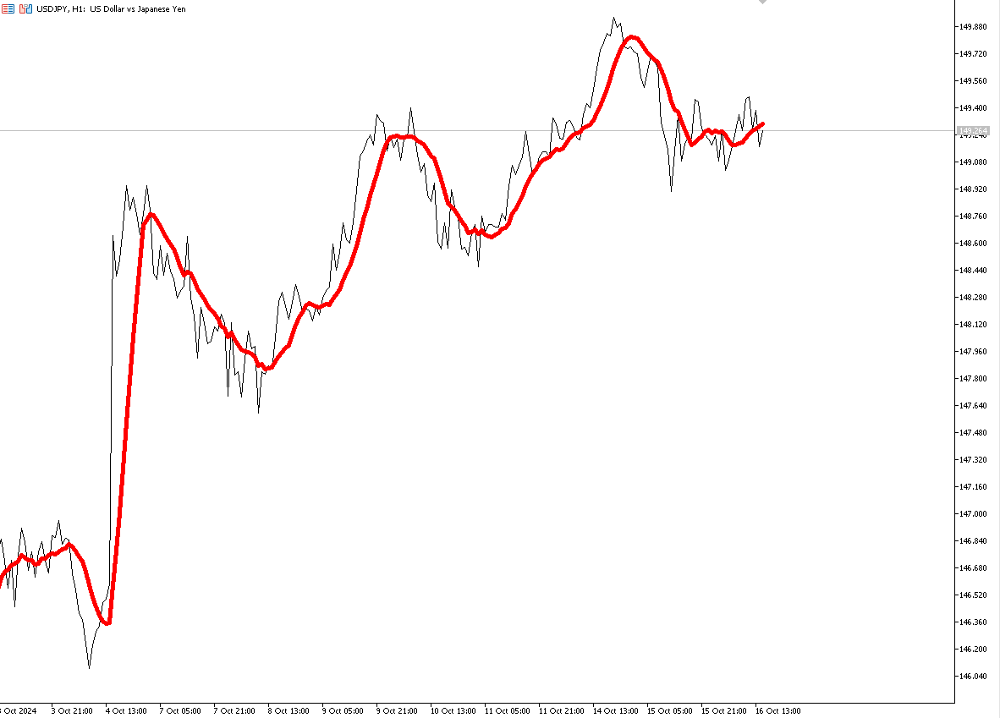
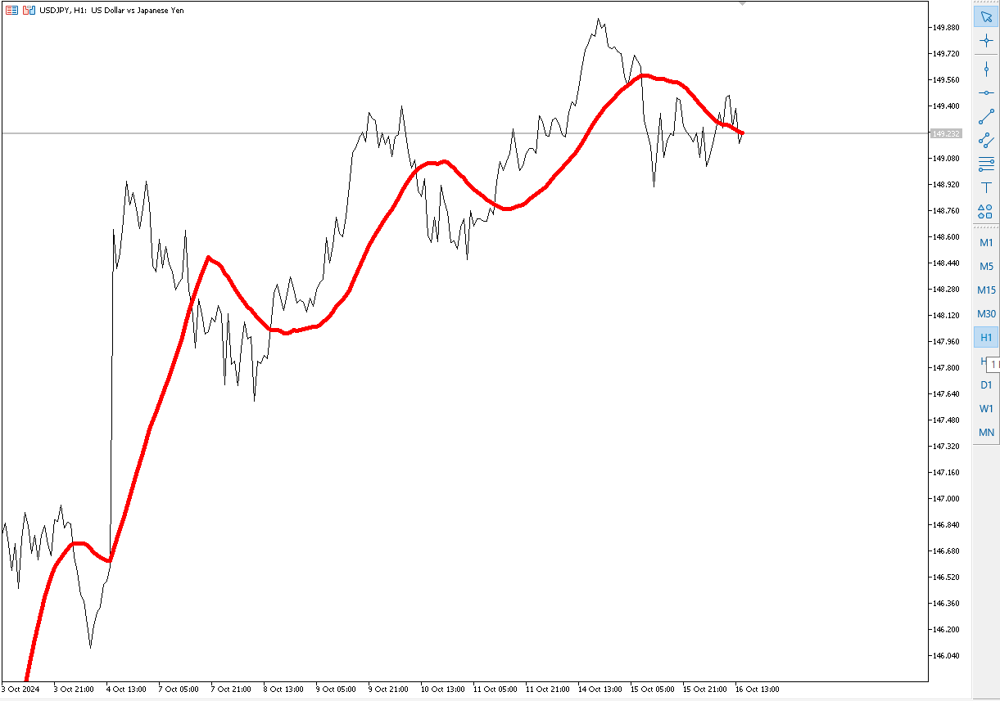
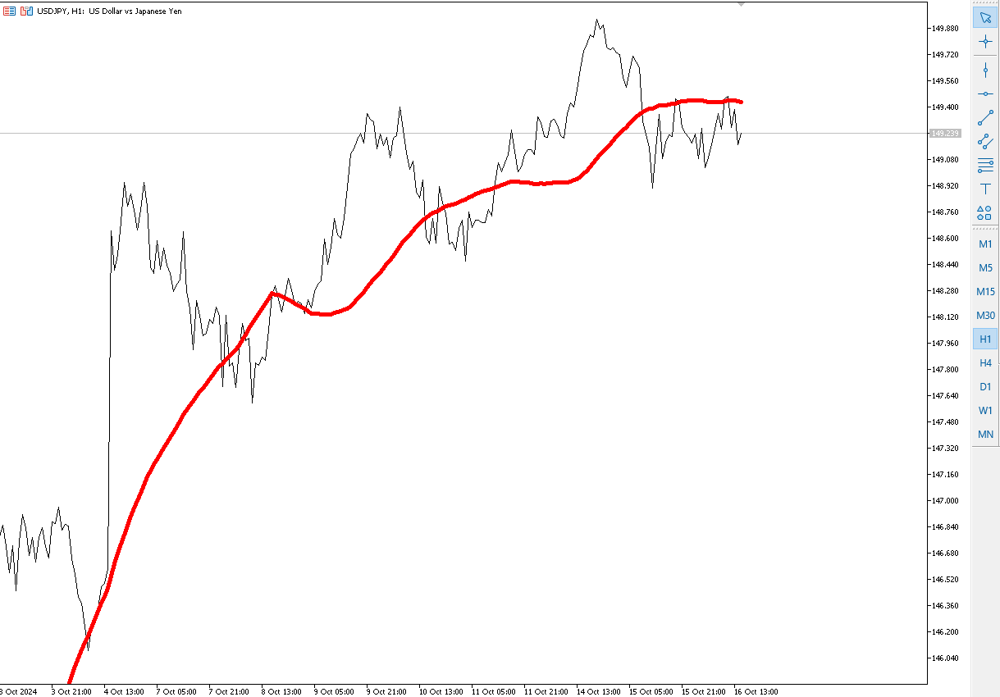

# MA, Moving Avarage, Ağırlıklı Ortalama

**Hareketli Ortalama (Moving Average) Nedir?**

Hareketli ortalama, bir finansal varlığın fiyatlarının belirli bir süre boyunca ortalamasını alarak trendleri ve yönleri belirlemek için kullanılan bir teknik analiz aracıdır. Genellikle, piyasalarda alım-satım sinyalleri oluşturmak ve fiyat dalgalanmalarını düzeltmek için kullanılır.

[MA Python Code](ma.py)

**Hareketli Ortalama Türleri:**

1. **Basit Hareketli Ortalama (SMA):** Belirli bir dönem içerisindeki fiyatların aritmetik ortalamasını alır.
   
   Varsayalım ki son 5 günün kapanış fiyatları: 20, 22, 24, 21, 23

   $$
   \text{SMA} = \frac{20 + 22 + 24 + 21 + 23}{5} = \frac{110}{5} = 22
   $$

   Burada \(P_i\), ilgili dönemdeki fiyatları ve \(n\) ise dönem sayısını ifade eder.

2. **Ağırlıklı Hareketli Ortalama (WMA):** Daha yeni fiyatlara daha fazla ağırlık vererek hesaplanır.

   $$
   \text{WMA} = \frac{\sum_{i=1}^{n} (P_i \cdot W_i)}{\sum_{i=1}^{n} W_i}
   $$

   Burada \(W_i\), ilgili dönemdeki ağırlıkları temsil eder.

3. **Üssel Hareketli Ortalama (EMA):** En son fiyatlara daha fazla ağırlık vererek hesaplanan bir hareketli ortalamadır. EMA, SMA’ya göre daha hızlı tepki verir.

   $$
   \text{EMA}_t = \left( \frac{P_t - \text{EMA}_{t-1}}{N} \right) + \text{EMA}_{t-1}
   $$

   Burada \(N\), süreyi belirtir (genellikle 2, 5, 10, 20, 50, 100 veya 200 gün olarak seçilir).

**Adım Adım Hareketli Ortalama Hesaplama:**

1. **Veri Toplama:** İlk olarak, belirli bir zaman diliminde (örneğin, son 20 gün) varlığın kapanış fiyatlarını toplayın.

2. **Hesaplama:**
   - **SMA için:** Tüm kapanış fiyatlarını toplayın ve toplamı gün sayısına bölün.
   - **WMA için:** Her fiyat için bir ağırlık belirleyin (örneğin, en son fiyat için en yüksek ağırlık) ve formülü uygulayın.
   - **EMA için:** İlk olarak bir SMA hesaplayın ve ardından yukarıdaki EMA formülünü kullanarak her gün için güncelleyin.

3. **Grafik Üzerinde Görselleştirme:** Hesapladığınız hareketli ortalamayı fiyat grafiği üzerine çizin. Böylece, fiyat hareketleri ile hareketli ortalama arasındaki ilişkiyi görebilirsiniz.

**Piyasa Giriş ve Çıkış Yorumları:**

- **Giriş Noktaları:**
  - **Kısa Vadeli SMA/EMA:** Eğer fiyat, kısa vadeli hareketli ortalamanın üzerinde kalıyorsa, alım sinyali olarak değerlendirebilirsiniz. Örneğin, 10 günlük EMA, 50 günlük EMA'yı yukarıdan kesiyorsa bu bir alım sinyali olabilir.
  - **Destek ve Direnç:** Hareketli ortalamalar, destek ve direnç seviyeleri olarak da kullanılabilir. Fiyat, bir hareketli ortalamayı test ettiğinde, buradan geri dönebilir veya bu seviyeden devam edebilir.

- **Çıkış Noktaları:**
  - **Kısa Vadeli SMA/EMA:** Eğer fiyat, hareketli ortalamanın altında kalıyorsa, satış sinyali olarak değerlendirilebilir. Örneğin, 10 günlük EMA, 50 günlük EMA'yı aşağıdan kesiyorsa bu bir satış sinyali olabilir.
  - **Zarar Durdurma:** Hareketli ortalamayı, zarar durdurma seviyeleri belirlemek için kullanabilirsiniz. Eğer fiyat belirli bir hareketli ortalamanın altına düşerse, pozisyonunuzu kapatabilirsiniz.

**Örnek Hesaplama:**

Varsayalım ki son 5 günün kapanış fiyatları: 20, 22, 24, 21, 23

1. **SMA Hesaplama:**

   $$
   \text{SMA} = \frac{20 + 22 + 24 + 21 + 23}{5} = \frac{110}{5} = 22
   $$

2. **EMA Hesaplama:** İlk olarak, 5 günlük SMA'yı kullanarak EMA hesaplamaya başlayabilirsiniz. Ardından, gün gün devam edin.

Hareketli ortalamalar, yatırım kararlarınızı desteklemek için güçlü araçlar sunar. Ancak, tek başlarına kullanılmamalıdırlar; diğer göstergelerle ve analizlerle birleştirilmelidir.

## Saatlikde Ağırlıklı Ortalama

Ağırlıklı ortalamanın daha iyi anlaşılabilmesi için size 3 periyotta grafik ekleyeceğim ve anlamanızı sağlayacağım.

### Period 10

1. Yani hesaplama için şu anda 10 saat geriye git ortalama al
2. sonraki adımda 1 saat öncesinden başla ve o andan 10 saat geriye doğru verileri alıp ağırlıklı ortalamasını al
3. sonraki adımda 2 saat öncesinden başla ve o andan 10 saat geriye doğru verileri alıp ağırlıklı ortalamasını al

adımları 100 defa geriye takip et, aslında 100 - 10 = 90 defa geriye takip edip hesapla. ÇÜnkü 91. adımda geri okunabilecek 10 veri kalmayacak.

### Period 30

1. Yani hesaplama için şu anda 30 saat geriye git ortalama al
2. sonraki adımda 1 saat öncesinden başla ve o andan 30 saat geriye doğru verileri alıp ağırlıklı ortalamasını al
3. sonraki adımda 2 saat öncesinden başla ve o andan 30 saat geriye doğru verileri alıp ağırlıklı ortalamasını al

adımları 100 defa geriye takip et, aslında 100 - 30 = 70 defa geriye takip edip hesapla. ÇÜnkü 71. adımda geri okunabilecek 30 veri kalmayacak.

### Period 50

1. Yani hesaplama için şu anda 50 saat geriye git ortalama al, 
2. sonraki adımda 1 saat öncesinden başla ve o andan 50 saat geriye doğru verileri alıp ağırlıklı ortalamasını al
3. sonraki adımda 2 saat öncesinden başla ve o andan 50 saat geriye doğru verileri alıp ağırlıklı ortalamasını al

adımları 100 defa geriye takip et, aslında 100 - 50 = 50 defa geriye takip edip hesapla. ÇÜnkü 51. adımda geri okunabilecek 10 veri kalmayacak.

## Aralarındaki Fark, Nasıl yorumlamalıyım

Yukarıdaki 3 grafiğe baktığınızda, hesaplamadaki periyod büyüdükçe ortamalama çizgisi ile piyasa çizgisi daha az kesişiyor. Yani bizim için daha doğru piyasaya giriş çıkış verileri üretmeye başlıyor. 10 saatlik ortalama bize sürekli gir çık emirleri üretirken, 50 ortalama çok az sinyal üretiyor. Gün içesindeki başlayan hareketler piyasa koşulları değişmediği sürece aynı davranışları sergiler. Kısaca ne demek istediğime bakalım.

Amerika forex piyasasındali işlem hacminin tek başına %74 gibi işlem hacmine sahip. Diğer %26 tüm forex entrümanları arasında paylaşılıyor. Bizim para birimimiz bu dünyadaki işlem hacminin belkide en küçüklerinden birisi. Aslında forex işlemlerinin işlem hacminin nasıl hesaplandığını inceleyen başka bir dosyayı inceleyerek doğru anlamanızı sağlayabilirsiniz. 

[Forex Piyasasını Etkileyen Faktörler](../forex/forex-piyasasi-işlem-hacmi-nasil-hesaplanir.md)