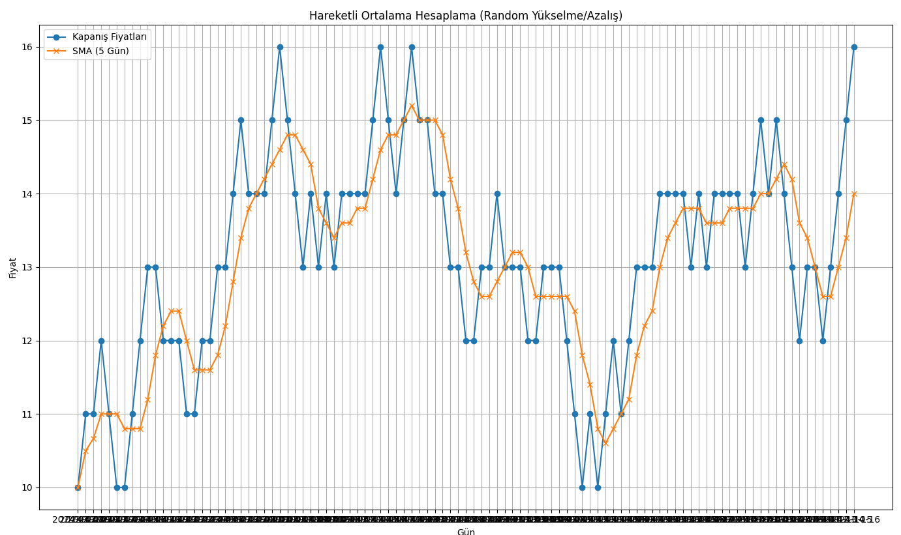

# MA, Moving Avarage, Ağırlıklı Ortalama

**Hareketli Ortalama (Moving Average) Nedir?**

Hareketli ortalama, bir finansal varlığın fiyatlarının belirli bir süre boyunca ortalamasını alarak trendleri ve yönleri belirlemek için kullanılan bir teknik analiz aracıdır. Genellikle, piyasalarda alım-satım sinyalleri oluşturmak ve fiyat dalgalanmalarını düzeltmek için kullanılır.

**Hareketli Ortalama Türleri:**

1. **Basit Hareketli Ortalama (SMA):** Belirli bir dönem içerisindeki fiyatların aritmetik ortalamasını alır.
   
   Varsayalım ki son 5 günün kapanış fiyatları: 20, 22, 24, 21, 23

   $$
   \text{SMA} = \frac{20 + 22 + 24 + 21 + 23}{5} = \frac{110}{5} = 22
   $$

   Burada \(P_i\), ilgili dönemdeki fiyatları ve \(n\) ise dönem sayısını ifade eder.

2. **Ağırlıklı Hareketli Ortalama (WMA):** Daha yeni fiyatlara daha fazla ağırlık vererek hesaplanır.

   $$
   \text{WMA} = \frac{\sum_{i=1}^{n} (P_i \cdot W_i)}{\sum_{i=1}^{n} W_i}
   $$

   Burada \(W_i\), ilgili dönemdeki ağırlıkları temsil eder.

3. **Üssel Hareketli Ortalama (EMA):** En son fiyatlara daha fazla ağırlık vererek hesaplanan bir hareketli ortalamadır. EMA, SMA’ya göre daha hızlı tepki verir.

   $$
   \text{EMA}_t = \left( \frac{P_t - \text{EMA}_{t-1}}{N} \right) + \text{EMA}_{t-1}
   $$

   Burada \(N\), süreyi belirtir (genellikle 2, 5, 10, 20, 50, 100 veya 200 gün olarak seçilir).

**Adım Adım Hareketli Ortalama Hesaplama:**

1. **Veri Toplama:** İlk olarak, belirli bir zaman diliminde (örneğin, son 20 gün) varlığın kapanış fiyatlarını toplayın.

2. **Hesaplama:**
   - **SMA için:** Tüm kapanış fiyatlarını toplayın ve toplamı gün sayısına bölün.
   - **WMA için:** Her fiyat için bir ağırlık belirleyin (örneğin, en son fiyat için en yüksek ağırlık) ve formülü uygulayın.
   - **EMA için:** İlk olarak bir SMA hesaplayın ve ardından yukarıdaki EMA formülünü kullanarak her gün için güncelleyin.

3. **Grafik Üzerinde Görselleştirme:** Hesapladığınız hareketli ortalamayı fiyat grafiği üzerine çizin. Böylece, fiyat hareketleri ile hareketli ortalama arasındaki ilişkiyi görebilirsiniz.

**Piyasa Giriş ve Çıkış Yorumları:**

- **Giriş Noktaları:**
  - **Kısa Vadeli SMA/EMA:** Eğer fiyat, kısa vadeli hareketli ortalamanın üzerinde kalıyorsa, alım sinyali olarak değerlendirebilirsiniz. Örneğin, 10 günlük EMA, 50 günlük EMA'yı yukarıdan kesiyorsa bu bir alım sinyali olabilir.
  - **Destek ve Direnç:** Hareketli ortalamalar, destek ve direnç seviyeleri olarak da kullanılabilir. Fiyat, bir hareketli ortalamayı test ettiğinde, buradan geri dönebilir veya bu seviyeden devam edebilir.

- **Çıkış Noktaları:**
  - **Kısa Vadeli SMA/EMA:** Eğer fiyat, hareketli ortalamanın altında kalıyorsa, satış sinyali olarak değerlendirilebilir. Örneğin, 10 günlük EMA, 50 günlük EMA'yı aşağıdan kesiyorsa bu bir satış sinyali olabilir.
  - **Zarar Durdurma:** Hareketli ortalamayı, zarar durdurma seviyeleri belirlemek için kullanabilirsiniz. Eğer fiyat belirli bir hareketli ortalamanın altına düşerse, pozisyonunuzu kapatabilirsiniz.

**Örnek Hesaplama:**

Varsayalım ki son 5 günün kapanış fiyatları: 20, 22, 24, 21, 23

1. **SMA Hesaplama:**

   $$
   \text{SMA} = \frac{20 + 22 + 24 + 21 + 23}{5} = \frac{110}{5} = 22
   $$

2. **EMA Hesaplama:** İlk olarak, 5 günlük SMA'yı kullanarak EMA hesaplamaya başlayabilirsiniz. Ardından, gün gün devam edin.

Hareketli ortalamalar, yatırım kararlarınızı desteklemek için güçlü araçlar sunar. Ancak, tek başlarına kullanılmamalıdırlar; diğer göstergelerle ve analizlerle birleştirilmelidir.

[MA Python Code](ma.py)
