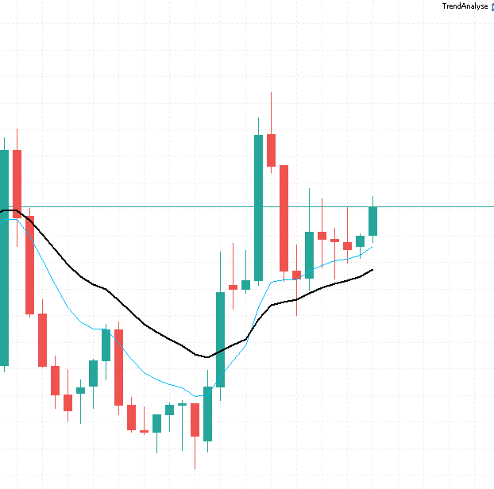

# **Yükselen Trend Analizi**

Son 20 candle ortalaması ile SMA hesaplaması yapılır. Son candle SMA20 üzerindeyse ve son 3 candle sırayla yükselen bir sıradaysa fonksiyon true döner.



## **Yükselen Trend Analizi**
```mql5

bool IsUpwardTrend(string symbol, int periods = 20)
{
    // H1 zaman dilimi için dizi oluşturma
    double closes[];
    double highs[];
    double lows[];
    
    // Dizileri yeniden boyutlandırma
    ArraySetAsSeries(closes, true);
    ArraySetAsSeries(highs, true);
    ArraySetAsSeries(lows, true);
    
    // H1 mum verilerini alma
    if(CopyClose(symbol, PERIOD_H1, 0, periods, closes) <= 0) return false;
    if(CopyHigh(symbol, PERIOD_H1, 0, periods, highs) <= 0) return false;
    if(CopyLow(symbol, PERIOD_H1, 0, periods, lows) <= 0) return false;
    
    // 20 periyotluk SMA hesaplama
    double sma = 0;
    for(int i = 0; i < periods; i++)
    {
        sma += closes[i];
    }
    sma /= periods;
    
    // Son 3 kapanışın SMA üzerinde olması kontrolü
    bool isLastThreeAboveSMA = true;
    for(int i = 0; i < 3; i++)
    {
        if(closes[i] <= sma)
        {
            isLastThreeAboveSMA = false;
            break;
        }
    }
    
    // Son 3 kapanışın yükselen sırada olması kontrolü
    bool isLastThreeAscending = (closes[0] > closes[1] && closes[1] > closes[2]);
    
    // Tüm koşulların sağlanması kontrolü
    return (isLastThreeAboveSMA && isLastThreeAscending);
}

```

## **ema10 ve ema20 son 3 candle kapanışı ema10 üzerinde trend yukarı analizi**

```mql5

bool IsUpwardTrend(string symbol)
{
    // H1 zaman dilimi için dizi oluşturma
    double closes[];
    double ema10[];
    double ema20[];
    
    // Dizileri yeniden boyutlandırma
    ArraySetAsSeries(closes, true);
    ArraySetAsSeries(ema10, true);
    ArraySetAsSeries(ema20, true);
    
    // H1 mum verilerini alma
    if(CopyClose(symbol, PERIOD_H1, 0, 30, closes) <= 0) return false;
    
    // EMA değerlerini hesaplama
    if(CopyBuffer(iMA(symbol, PERIOD_H1, 10, 0, MODE_EMA, PRICE_CLOSE), 0, 0, 30, ema10) <= 0) return false;
    if(CopyBuffer(iMA(symbol, PERIOD_H1, 20, 0, MODE_EMA, PRICE_CLOSE), 0, 0, 30, ema20) <= 0) return false;
    
    // Son 3 kapanışın EMA10 üzerinde olması kontrolü
    bool isLastThreeAboveEMA10 = true;
    for(int i = 0; i < 3; i++)
    {
        if(closes[i] <= ema10[i])
        {
            isLastThreeAboveEMA10 = false;
            break;
        }
    }
    
    // EMA10'un EMA20'nin üzerinde olması kontrolü
    bool isEMA10AboveEMA20 = (ema10[0] > ema20[0]);
    
    // Tüm koşulların sağlanması kontrolü
    return (isLastThreeAboveEMA10 && isEMA10AboveEMA20);
}

```

## **3 Kara Karga son 3 candle karga formasyonu analizi**

```mql5

bool IsThreeBlackCrows(string symbol, int minimumBodySize = 10)
{
    // Fiyat dizileri
    double opens[];
    double closes[];
    double highs[];
    double lows[];
    
    // Dizileri yeniden boyutlandırma
    ArraySetAsSeries(opens, true);
    ArraySetAsSeries(closes, true);
    ArraySetAsSeries(highs, true);
    ArraySetAsSeries(lows, true);
    
    // Son kapanmış olan 3 H1 mum verilerini alma
    if(CopyOpen(symbol, PERIOD_H1, 1, 3, opens) <= 0) return false;  // 1'den başlayarak son kapanan mumlardan alır
    if(CopyClose(symbol, PERIOD_H1, 1, 3, closes) <= 0) return false;
    if(CopyHigh(symbol, PERIOD_H1, 1, 3, highs) <= 0) return false;
    if(CopyLow(symbol, PERIOD_H1, 1, 3, lows) <= 0) return false;
    
    // Son kapanan 3 mumun düşüş mumu olup olmadığını kontrol et
    for(int i = 0; i < 3; i++)
    {
        // Mum gövdesi büyüklüğü (pip cinsinden)
        double bodySize = MathAbs(opens[i] - closes[i]) / _Point;
        
        // Düşüş mumu değilse veya gövde yeterince büyük değilse
        if(closes[i] >= opens[i] || bodySize < minimumBodySize)
        {
            return false;
        }
        
        // Her mumun gölgeleri küçük olmalı
        double upperShadow = (highs[i] - opens[i]) / _Point;
        double lowerShadow = (closes[i] - lows[i]) / _Point;
        
        if(upperShadow > bodySize * 0.3 || lowerShadow > bodySize * 0.3)
        {
            return false;
        }
    }
    
    // Her mum bir öncekinden daha düşük açılış ve kapanışa sahip olmalı
    if(opens[0] >= opens[1] || opens[1] >= opens[2] ||
       closes[0] >= closes[1] || closes[1] >= closes[2])
    {
        return false;
    }
    
    return true;
}

```

## **3 Beyaz Asker, son 3 candle beyaz asker formasyonu analizi**

```mql5

bool IsThreeWhiteSoldiers(string symbol, int minimumBodySize = 10)
{
    // Fiyat dizileri
    double opens[];
    double closes[];
    double highs[];
    double lows[];
    
    // Dizileri yeniden boyutlandırma
    ArraySetAsSeries(opens, true);
    ArraySetAsSeries(closes, true);
    ArraySetAsSeries(highs, true);
    ArraySetAsSeries(lows, true);
    
    // H1 mum verilerini alma
    if(CopyOpen(symbol, PERIOD_H1, 0, 3, opens) <= 0) return false;
    if(CopyClose(symbol, PERIOD_H1, 0, 3, closes) <= 0) return false;
    if(CopyHigh(symbol, PERIOD_H1, 0, 3, highs) <= 0) return false;
    if(CopyLow(symbol, PERIOD_H1, 0, 3, lows) <= 0) return false;
    
    // Son 3 mumun yükseliş mumu olup olmadığını kontrol et
    for(int i = 0; i < 3; i++)
    {
        // Mum gövdesi büyüklüğü (pip cinsinden)
        double bodySize = MathAbs(opens[i] - closes[i]) / _Point;
        
        // Yükseliş mumu değilse veya gövde yeterince büyük değilse
        if(closes[i] <= opens[i] || bodySize < minimumBodySize)
        {
            return false;
        }
        
        // Her mumun gölgeleri küçük olmalı
        double upperShadow = (highs[i] - closes[i]) / _Point;
        double lowerShadow = (opens[i] - lows[i]) / _Point;
        
        if(upperShadow > bodySize * 0.3 || lowerShadow > bodySize * 0.3)
        {
            return false;
        }
    }
    
    // Her mum bir öncekinden daha yüksek açılış ve kapanışa sahip olmalı
    if(opens[0] <= opens[1] || opens[1] <= opens[2] ||
       closes[0] <= closes[1] || closes[1] <= closes[2])
    {
        return false;
    }
    
    return true;
}

```

## **CCI -300 den sonra -100'ü yukarı yönlü kırdığını tespit eden fonksiyon**

CCI -300 değerine indikten sonra -100 seviyesi ile yukarı yönlü trend başlaması anını ölçen fonksiyon

```mql5

//+------------------------------------------------------------------+
//| CCI reaches -300 within last 10 candles and breaks -100 upwards  |
//+------------------------------------------------------------------+
bool isCCIBreakRecent(int symbol, int timeframe, int cciPeriod) {
    double cciCurrent = iCCI(symbol, timeframe, cciPeriod, PRICE_TYPICAL, 0);
    bool reachedMinus300 = false;

    // Check the last 10 candles for any CCI value reaching -300
    for (int i = 1; i <= 10; i++) {
        double cciValue = iCCI(symbol, timeframe, cciPeriod, PRICE_TYPICAL, i);
        if (cciValue < -300) {
            reachedMinus300 = true;
            break;
        }
    }

    // Check if CCI was below -300 in the last 10 candles and current CCI breaks above -100
    if (reachedMinus300 && cciCurrent > -100) {
        return true;
    }

    return false;
}

```

RSI Ortalaması Yükselen Trend Analizi

````mql5

//+------------------------------------------------------------------+
//| Check if MA10 of RSI14 is rising for the last 3 candles          |
//+------------------------------------------------------------------+
bool isRisingMA10ofRSI14(string symbol, ENUM_TIMEFRAMES timeframe) {
    int rsiPeriod = 14;
    int maPeriod = 10;
    double rsiValues[13]; // We need at least 13 values to calculate MA10 for the last 3 candles

    // Get RSI values
    int rsiHandle = iRSI(symbol, timeframe, rsiPeriod, PRICE_CLOSE);
    if (CopyBuffer(rsiHandle, 0, 0, 13, rsiValues) <= 0) {
        Print("Error copying RSI data");
        return false;
    }

    // Calculate MA10 for the last 3 candles
    double maValues[3];
    for (int i = 0; i < 3; i++) {
        double sum = 0.0;
        for (int j = 0; j < maPeriod; j++) {
            sum += rsiValues[i + j];
        }
        maValues[i] = sum / maPeriod;
    }

    // Check if MA10 is rising for the last 3 candles
    if (maValues[2] > maValues[1] && maValues[1] > maValues[0]) {
        return true;
    }

    return false;
}


```

cci14 için sma10 ve sma20 değerlerini hesaplayıp sma10 yukarı yönlü sma20 kestiği anda true dönen fonksiyon

```mql5

//+------------------------------------------------------------------+
//| Check if SMA10 of CCI14 crosses above SMA20                      |
//+------------------------------------------------------------------+
bool isSMA10CrossAboveSMA20(string symbol, ENUM_TIMEFRAMES timeframe) {
    int cciPeriod = 14;
    int smaPeriod10 = 10;
    int smaPeriod20 = 20;
    double cciValues[21]; // We need at least 21 values to calculate SMA20 and SMA10

    // Get CCI values
    int cciHandle = iCCI(symbol, timeframe, cciPeriod, PRICE_TYPICAL);
    if (CopyBuffer(cciHandle, 0, 0, 21, cciValues) <= 0) {
        Print("Error copying CCI data");
        return false;
    }

    // Calculate SMA10 and SMA20
    double sma10Current = 0.0, sma10Previous = 0.0, sma20Current = 0.0, sma20Previous = 0.0;
    for (int i = 0; i < smaPeriod10; i++) {
        sma10Current += cciValues[i];
        sma10Previous += cciValues[i + 1];
    }
    sma10Current /= smaPeriod10;
    sma10Previous /= smaPeriod10;

    for (int i = 0; i < smaPeriod20; i++) {
        sma20Current += cciValues[i];
        sma20Previous += cciValues[i + 1];
    }
    sma20Current /= smaPeriod20;
    sma20Previous /= smaPeriod20;

    // Check if SMA10 crosses above SMA20
    if (sma10Current > sma20Current && sma10Previous <= sma20Previous) {
        return true;
    }

    return false;
}


```