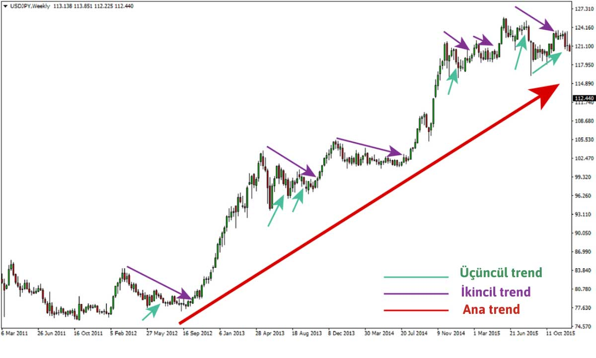
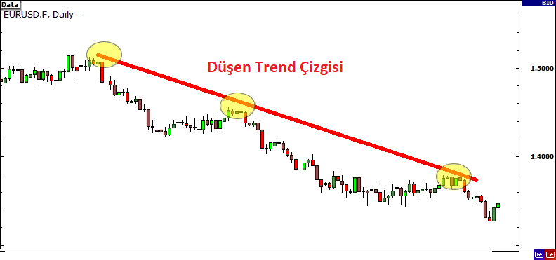
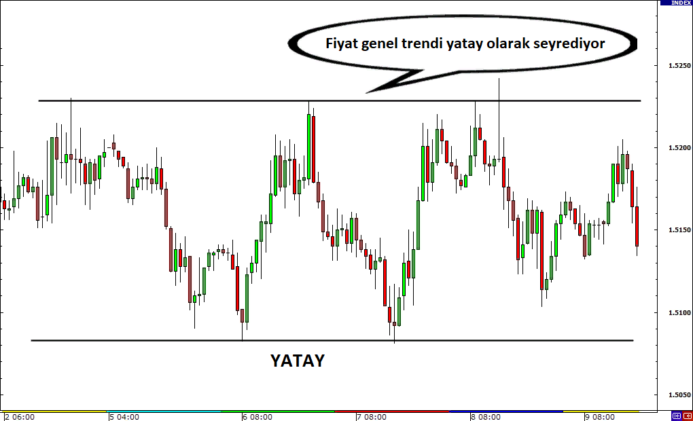

# İndikatörler ile Piyasaya Giriş Çıkış Analizleri

Şu meşhur sözü unutmayın. Hiç ağaç cennete kadar uzamaz. Hadi bu sözün kaynağına ve anlamına bir bakalım.

***"Hiç bir ağaç cennete kadar uzamaz"*** sözü, genellikle finans ve yatırım dünyasında, özellikle borsa ve forex piyasalarında risk ve kazanç dengesini vurgulamak için kullanılır. Bu ifadenin anlamını ve bağlamını inceleyelim:

### Anlamı

1. **Sınırlılık:** Bu ifade, her şeyin bir sınırı olduğu anlamına gelir. Yüksek kazançlar ve sürekli yükselen fiyatlar beklenemez. Her yatırımın riskleri ve getiri potansiyeli sınırlıdır.
  
2. **Doğal Döngü:** Ağaçların belirli bir yüksekliğe kadar büyüyebileceği gibi, piyasalardaki fiyatların da belli bir noktadan sonra düşüşe geçebileceği ya da düzeltme yapabileceği anlamını taşır. Yatırımcılar, fiyatların sürekli artacağına dair bir beklentiye girmemelidir.

3. **Gerçekçilik:** Yatırımcıların gerçekçi bir yaklaşım benimsemeleri gerektiğini vurgular. Aşırı iyimserlik, kayıplara yol açabilir. Yatırımların her zaman istikrarlı bir kazanç sağlaması beklenemez.

### Bağlamı

1. **Yatırım Stratejileri:** Bu söz, yatırımcılara risk yönetimi ve çeşitlendirme yapmaları gerektiğini hatırlatır. Uzun süreli yükseliş trendleri sonunda bir düzeltmeye tabi olacaktır, bu yüzden yatırımcılar, hedef fiyatlarına ulaşmadan önce piyasa dalgalanmalarını göz önünde bulundurmalıdır.

2. **Psikolojik Etkiler:** Yatırımcılar, kazançların sürekli artacağını düşündüklerinde, daha fazla risk alma eğiliminde olabilirler. Ancak bu düşünce yanılgısı, yatırım kayıplarına yol açabilir. Bu nedenle, yatırımcıların kararlarını mantıklı ve veriye dayalı olarak almaları önemlidir.

3. **Piyasa Duyarlılığı:** Piyasa trendleri genellikle aşırı duyarlılıkla etkilenir. Eğer bir hisse ya da döviz sürekli yükseliyorsa, bunun sürdürülebilir olup olmadığını sorgulamak gerekir. Bu bağlamda, "hic bir ağaç cennete kadar uzamaz" sözü, yatırımcıları aşırı iyimserlikten kaçınmaya ve piyasa koşullarını dikkatlice değerlendirmeye teşvik eder.

### Sonuç

Kısacası, bu söz yatırım dünyasında sağduyulu bir yaklaşımı simgeler. Yatırımcıların, olası kayıplar ve piyasa düzeltmeleri konusunda dikkatli olmaları gerektiğini hatırlatır. Uzun süreli kazançlar arayışında, riskleri ve sınırlamaları göz önünde bulundurmak kritik öneme sahiptir. Bu nedenle, yatırım stratejileri oluştururken gerçekçi ve dikkatli olmak her zaman faydalıdır.

## Düzeltme Nedir?

Finans ve yatırım dünyasında "düzeltme" (ya da "piyasa düzeltmesi"), bir varlık fiyatının veya genel bir piyasanın belirli bir zaman dilimi içinde önemli bir artış sonrasında yaşadığı geri çekilmeyi ifade eder. Düzeltmeler genellikle aşağıdaki gibi özellikler taşır:

### Düzeltmenin Özellikleri

1. **Kısa Süreli Geri Çekilme:** Düzeltmeler, genellikle birkaç gün ile birkaç hafta arasında sürebilir. Uzun süreli trendlerden (bull market) sonra oluşurlar.

2. **Yüzde Hesabı:** Genellikle, bir varlık fiyatının veya endeksin %5 ila %20 oranında düşmesi düzeltme olarak kabul edilir. %20 veya daha fazla bir düşüş genellikle "bear market" (ayı piyasası) olarak tanımlanır.

3. **Sağlıklı Bir Piyasa İşlevi:** Düzeltmeler, piyasa dengesini sağlamak ve aşırı değerlenmiş varlıkların normal değerlerine dönmesine yardımcı olmak için önemlidir. Piyasalardaki düzeltmeler, aşırı alım veya aşırı satım durumlarının düzelmesine yardımcı olur.

4. **Piyasa Duyarlılığı:** Düzeltmeler, yatırımcı psikolojisi üzerinde önemli bir etkiye sahiptir. Kısa süreli kayıplar, yatırımcıların piyasalara olan güvenini zedeleyebilir. Ancak düzeltmeler aynı zamanda uygun alım fırsatları da sunabilir.

### Düzeltme Nedenleri

Düzeltmeler çeşitli nedenlerden kaynaklanabilir:

1. **Ekonomik Veriler:** Zayıf ekonomik veriler veya olumsuz haberler, yatırımcıların güvenini zedeleyebilir ve fiyatların düşmesine neden olabilir.

2. **Faiz Oranları:** Faiz oranlarındaki artış, borçlanma maliyetlerini artırır ve yatırımcıların riskli varlıklardan çıkmasına neden olabilir.

3. **Piyasa Aşırı Değeri:** Uzun bir yükseliş trendi sonrası fiyatların aşırı değerlendiği durumlarda düzeltmeler yaşanabilir. Yatırımcılar, kazançlarını realize etmek amacıyla satış yapabilirler.

4. **Teknik Göstergeler:** Teknik analiz yapan yatırımcılar, fiyatların belirli seviyelere ulaşmasının ardından düzeltme bekleyebilirler. Örneğin, destek ve direnç seviyeleri gibi teknik göstergeler düzeltmeleri tetikleyebilir.

### Sonuç

Düzeltmeler, finansal piyasalarda kaçınılmaz bir olgudur. Yatırımcılar için fırsatlar yaratabilir ve piyasa dengesinin sağlanmasına yardımcı olur. Bu nedenle, düzeltmeleri anlamak ve onlara karşı hazırlıklı olmak, yatırım stratejileri geliştirmek açısından önemlidir.

## Giriş Seviyesi Analizleri

Yukarıdaki iki kavram bizim hazırlık yapacağımız yerler olabilir. Yani pusuya yatacağımız yerler. Bir piyasa bir trend içerisindeyse ve kendi halinde salınıyorsa, bu değerli bir an olabilir. Bu trend içerisinde hareketi anladığımız an değerli bir an olabilir.

### Yükselen Piyasa Trendi

Piyasa yukarı doğru salınarak çıkarken bir aşağı bir yukarı hareket halindedir. 3 birim yukarı gider, 1 ya da 2 birim aşağı gelir. Ama bu periyodik hareket olarak 3-5 adım devam edecektir. İşte bu salınımlar sırasında düzeltme hareketlerini yakalayıp long pozisyon için doğru an yakalanır ve piyasaya girilebilir.

### Düşen Piyasa Trendi

Piyasa aşağı doğru salınarak inerken bir aşağı bir yukarı hareket halindedir. 3 birim aşağı gider, 1 ya da 2 birim yukarı çıkar. Ama bu periyodik hareket olarak 3-5 adım devam edecektir. İşte bu salınımlar sırasında düzeltme hareketlerini yakalayıp short pozisyon için doğru an yakalanır ve piyasaya girilebilir.

Piyasa trendleri ile ilgili görseller aşağıda verildi. inceleyebilirsiniz. Ama konumuz trendleri öğrenmek değil, piayasa giriş ya da çıkış anları için önemli olduklarını anlamaktan geçiyor.

Yükselen Trend

---
 
Düşen Trend

---

Yatay Trend

